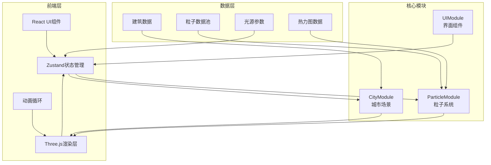

## 1. 架构设计



---

## 2. 技术描述

- **前端框架**：React@18 + TypeScript
- **3D引擎**：Three.js@0.160
- **状态管理**：Zustand@4.4
- **构建工具**：Vite@5.0
- **动画库**：@tweenjs/tween.js@18.6
- **类型定义**：@types/three@0.160
- **渲染方式**：WebGL 2.0 + 点精灵 + CanvasTexture

---

## 3. 目录结构

```
auto104/
├── package.json
├── vite.config.js
├── tsconfig.json
├── index.html
└── src/
    ├── main.ts              # 入口文件，初始化场景、渲染器、相机、控制器
    ├── App.tsx              # React根组件
    ├── store/
    │   └── useLightStore.ts # Zustand状态管理（光源参数）
    ├── CityModule/
    │   ├── BuildingGenerator.ts   # 建筑生成器
    │   └── RoadGridSystem.ts      # 道路网格系统
    ├── ParticleModule/
    │   ├── ParticleEmitter.ts     # 粒子发射器
    │   ├── HeatmapLayer.ts        # 热力图层
    │   └── types.ts               # 粒子类型定义
    ├── UI/
    │   ├── LightControlPanel.tsx  # 光源控制面板
    │   └── PerformanceMonitor.tsx # 性能监控器
    ├── utils/
    │   ├── colorUtils.ts          # 颜色/色温转换工具
    │   └── mathUtils.ts           # 数学工具函数
    └── styles/
        └── global.css             # 全局样式
```

---

## 4. 核心模块设计

### 4.1 BuildingGenerator.ts

**职责**：生成400-600个随机高度的建筑，包含窗格纹理生成

**核心方法**：
- `generateBuildings(count: number): Mesh[]` - 生成建筑数组
- `createWindowTexture(brightness: number, colorTemp: number): CanvasTexture` - 创建窗格纹理
- `getRandomPosition(): Vector3` - 计算不重叠的随机位置

**数据流**：建筑Mesh数组 → SceneManager

### 4.2 ParticleEmitter.ts

**职责**：粒子池管理、粒子发射、每帧更新（位置/颜色/生命周期/碰撞检测）

**核心数据结构**：
```typescript
interface Particle {
  position: Vector3;
  velocity: Vector3;
  color: Color;
  baseColor: Color;
  size: number;
  life: number;
  maxLife: number;
  alpha: number;
  bounced: boolean;
  trail: Vector3[];
}
```

**核心方法**：
- `emit(sourceType: LightSourceType, position: Vector3): void` - 发射粒子
- `update(deltaTime: number): void` - 每帧更新所有粒子
- `checkCollision(particle: Particle): boolean` - 碰撞检测
- `getPositions(): Float32Array` - 获取粒子位置数组（给渲染器）
- `getColors(): Float32Array` - 获取粒子颜色数组（给渲染器）

**数据流**：粒子位置/颜色数组 → Renderer (Points + ShaderMaterial)

### 4.3 HeatmapLayer.ts

**职责**：16x16网格热力图，根据粒子位置计算光照强度

**核心方法**：
- `update(particles: Particle[]): void` - 每帧更新热力图
- `renderToTexture(): CanvasTexture` - 渲染到Canvas纹理
- `getIntensityAt(x: number, z: number): number` - 获取指定位置光照强度

### 4.4 Zustand Store (useLightStore.ts)

```typescript
interface LightSource {
  intensity: number;      // 0-2
  colorTemp: number;      // 2000-8000K
  direction: number;      // 0-360度
}

interface LightState {
  building: LightSource;
  advertisement: LightSource;
  streetLamp: LightSource;
  particleCount: number;
  setBuildingLight: (params: Partial<LightSource>) => void;
  setAdvertisementLight: (params: Partial<LightSource>) => void;
  setStreetLampLight: (params: Partial<LightSource>) => void;
  setParticleCount: (count: number) => void;
}
```

---

## 5. 性能优化策略

### 5.1 渲染优化

1. **粒子池管理**：预先分配3000个粒子槽位，避免频繁GC
2. **几何体合并**：建筑使用InstancedMesh减少Draw Call
3. **点精灵渲染**：使用Points + ShaderMaterial，一次Draw Call渲染所有粒子
4. **纹理复用**：窗格纹理使用CanvasTexture缓存

### 5.2 计算优化

1. **空间分区**：建筑使用Grid Spatial Hash加速碰撞检测
2. **轨迹优化**：粒子拖尾限制为10个点，每2帧更新一次
3. **热力图降频**：热力图每2帧更新一次，使用离屏Canvas

### 5.3 内存优化

1. **对象池**：Vector3、Color等对象复用
2. **TypedArray**：粒子数据使用Float32Array直接上传GPU
3. **纹理释放**：动态创建的纹理及时dispose

---

## 6. 关键技术实现

### 6.1 色温转换

```typescript
// 将开尔文色温转换为RGB颜色
function kelvinToRGB(kelvin: number): { r: number; g: number; b: number } {
  const temp = kelvin / 100;
  let r, g, b;
  if (temp <= 66) {
    r = 255;
    g = Math.min(255, Math.max(0, 99.4708025861 * Math.log(temp) - 161.1195681661));
    b = temp <= 19 ? 0 : Math.min(255, Math.max(0, 138.5177312231 * Math.log(temp - 10) - 305.0447927307));
  } else {
    r = Math.min(255, Math.max(0, 329.698727446 * Math.pow(temp - 60, -0.1332047592)));
    g = Math.min(255, Math.max(0, 288.1221695283 * Math.pow(temp - 60, -0.0755148492)));
    b = 255;
  }
  return { r: r / 255, g: g / 255, b: b / 255 };
}
```

### 6.2 粒子着色器

**顶点着色器**：
```glsl
attribute float size;
attribute float alpha;
varying vec3 vColor;
varying float vAlpha;
void main() {
  vColor = color;
  vAlpha = alpha;
  vec4 mvPosition = modelViewMatrix * vec4(position, 1.0);
  gl_PointSize = size * (300.0 / -mvPosition.z);
  gl_Position = projectionMatrix * mvPosition;
}
```

**片段着色器**：
```glsl
varying vec3 vColor;
varying float vAlpha;
void main() {
  vec2 center = gl_PointCoord - vec2(0.5);
  float dist = length(center);
  if (dist > 0.5) discard;
  // 双层光晕效果
  float innerGlow = smoothstep(0.5, 0.0, dist) * 0.8;
  float outerGlow = smoothstep(0.5, 0.1, dist) * 0.2;
  float totalGlow = innerGlow + outerGlow;
  gl_FragColor = vec4(vColor, totalGlow * vAlpha);
}
```

### 6.3 碰撞检测

使用AABB（轴对齐包围盒）检测粒子与建筑碰撞：
```typescript
function checkCollision(particle: Particle, buildings: Mesh[]): boolean {
  const pPos = particle.position;
  const pSize = particle.size * 0.5;
  
  for (const building of buildings) {
    const bBox = new Box3().setFromObject(building);
    // 扩展包围盒以包含粒子大小
    bBox.expandByScalar(pSize);
    if (bBox.containsPoint(pPos)) {
      // 计算碰撞法线并反弹
      const center = new Vector3();
      bBox.getCenter(center);
      const normal = pPos.clone().sub(center).normalize();
      particle.velocity.reflect(normal).multiplyScalar(0.3);
      particle.bounced = true;
      // 变色模拟反射
      particle.color.multiplyScalar(0.8);
      return true;
    }
  }
  return false;
}
```

---

## 7. 配置文件

### 7.1 package.json 依赖

```json
{
  "name": "light-pollution-simulator",
  "private": true,
  "version": "1.0.0",
  "type": "module",
  "scripts": {
    "dev": "vite",
    "build": "tsc && vite build",
    "preview": "vite preview"
  },
  "dependencies": {
    "react": "^18.2.0",
    "react-dom": "^18.2.0",
    "three": "^0.160.0",
    "zustand": "^4.4.7",
    "@tweenjs/tween.js": "^18.6.4"
  },
  "devDependencies": {
    "@types/react": "^18.2.43",
    "@types/react-dom": "^18.2.17",
    "@types/three": "^0.160.0",
    "@vitejs/plugin-react": "^4.2.1",
    "typescript": "^5.2.2",
    "vite": "^5.0.8"
  }
}
```

### 7.2 vite.config.js

```javascript
import { defineConfig } from 'vite';
import react from '@vitejs/plugin-react';

export default defineConfig({
  plugins: [react()],
  server: {
    port: 5173,
    open: true
  }
});
```

### 7.3 tsconfig.json

```json
{
  "compilerOptions": {
    "target": "ES2020",
    "useDefineForClassFields": true,
    "lib": ["ES2020", "DOM", "DOM.Iterable"],
    "module": "ESNext",
    "skipLibCheck": true,
    "moduleResolution": "bundler",
    "allowImportingTsExtensions": true,
    "resolveJsonModule": true,
    "isolatedModules": true,
    "noEmit": true,
    "jsx": "react-jsx",
    "strict": true,
    "noUnusedLocals": true,
    "noUnusedParameters": true,
    "noFallthroughCasesInSwitch": true
  },
  "include": ["src"],
  "references": [{ "path": "./tsconfig.node.json" }]
}
```

---

## 8. 启动流程

1. `npm install` - 安装依赖
2. `npm run dev` - 启动开发服务器（端口5173）
3. 浏览器自动打开 `http://localhost:5173`
