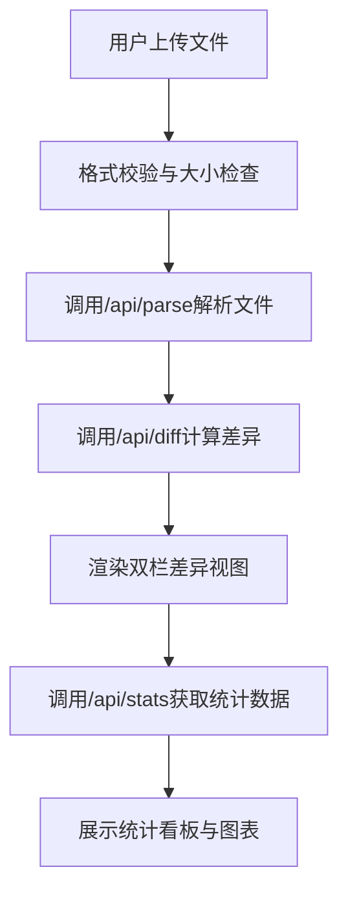

## 1. 产品概述

云端文件版本对比与差异可视化应用，帮助开发者快速对比两个版本的文本文件或代码文件差异，自动高亮显示内容差异并生成统计报告。

- 主要用途：代码版本对比、文档差异分析、配置文件比对
- 目标用户：开发者、技术人员、文档编辑者
- 解决问题：手动对比文件效率低、容易遗漏差异点

- 产品价值：提供专业级的文件差异可视化，提升代码审查和文档校对效率

## 2. 核心功能

### 2.1 用户角色
| 角色 | 注册方式 | 核心权限 |
|------|----------|----------|
| 普通用户 | 无需注册 | 上传文件、查看差异、导出统计 |

### 2.2 功能模块
1. **文件上传模块**：拖拽/点击上传、进度条显示、格式校验
2. **差异展示模块**：双栏对比、高亮显示、滚动同步、差异过滤
3. **统计看板模块**：差异统计、数据可视化、图表展示

### 2.3 页面详情
| 页面名称 | 模块名称 | 功能描述 |
|-----------|-------------|---------------------|
| 主页面 | 文件上传 | 支持拖拽和点击上传两个文件，显示上传进度，限制5MB以内 |
| 主页面 | 差异对比 | 左右双栏展示旧版/新版内容，逐行高亮差异，支持滚动同步 |
| 主页面 | 统计看板 | 展示新增/删除/修改行数统计，柱状图展示行数对比 |

## 3. 核心流程

用户上传两个文件 → 后端解析文件内容 → 后端计算逐行差异 → 前端渲染差异视图 → 生成差异统计报告

## 4. 用户界面设计

### 4.1 设计风格
- 主色调：紫色 #6C63FF（按钮、进度条）
- 差异色：新增绿色 #DCFCE7、删除红色 #FEE2E2、修改黄色 #FEF9C3
- 背景色：主背景 #F3F4F6、面板背景 #FFFFFF、代码区域 #F9FAFB
- 字体：系统默认无衬线字体，代码使用等宽字体 'Courier New', monospace
- 布局：顶部导航栏 + 主内容区（双栏布局）+ 统计看板
- 按钮：圆角8px，紫色填充，悬停阴影效果
- 卡片：圆角12px，轻微阴影 #00000008

### 4.2 页面设计概述
| 页面名称 | 模块名称 | UI元素 |
|-----------|-------------|-------------|
| 主页面 | 导航栏 | 应用图标（双文档重叠）、应用名称、上传按钮 |
| 主页面 | 文件上传区 | 拖拽区域、文件选择按钮、进度条、文件信息 |
| 主页面 | 差异视图 | 左右双栏、行号、差异图标、高亮背景、滚动同步 |
| 主页面 | 控制面板 | 忽略空白符开关、上下文行数下拉选择 |
| 主页面 | 统计看板 | 统计卡片（4个）、柱状图、动画效果 |

### 4.3 响应式
- 桌面端（≥768px）：左右双栏布局，可拖拽调整宽度
- 移动端（<768px）：上下单栏布局，隐藏拖拽手柄
- 触摸优化：按钮最小尺寸40px，滚动区域平滑

### 4.4 动画效果
- 页面加载：卡片依次从下方滑入（延迟100ms递增）
- 开关切换：0.2s弹性过渡动画
- 面板切换：0.3s平滑过渡
- 进度条：流畅的加载动画
- 悬停效果：手柄颜色变化、按钮阴影
