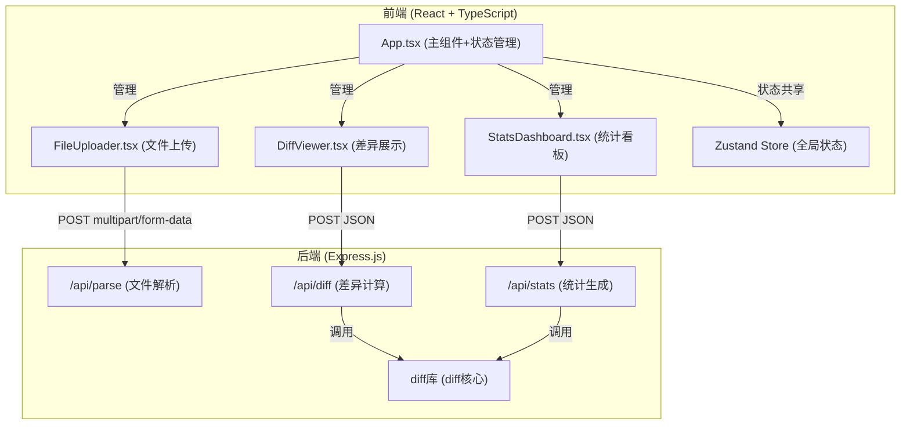
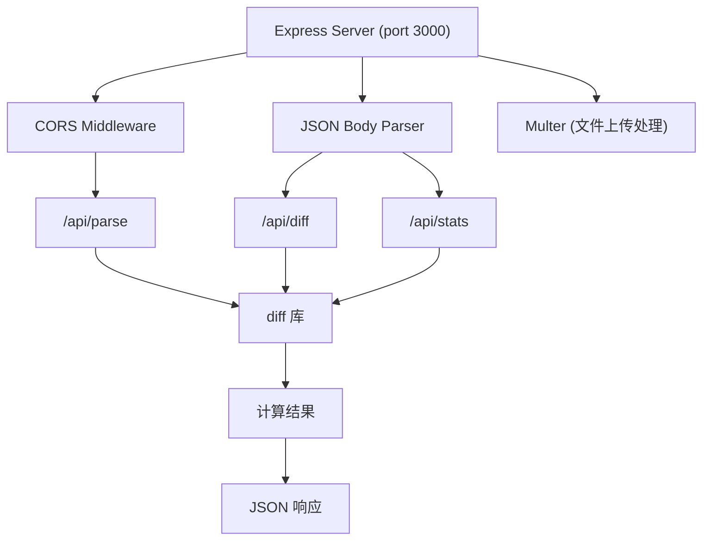

## 1. 架构设计



## 2. 技术描述

- **前端**：React 18 + TypeScript + Vite
- **后端**：Express.js 4 + TypeScript
- **状态管理**：Zustand
- **差异计算**：diff 库
- **图表**：Recharts
- **构建工具**：Vite 5
- **代理配置**：Vite 代理 /api 到本地 3000 端口
- **唯一标识**：uuid

## 3. 路由定义

| 路由 | 用途 |
|-------|---------|
| / | 主页面，包含文件上传、差异视图和统计看板 |

## 4. API 定义

### 类型定义
```typescript
// 解析请求
interface ParseRequest {
  file: File;
}

// 解析响应
interface ParseResponse {
  fileId: string;
  fileName: string;
  content: string;
  lineCount: number;
}

// 差异计算请求
interface DiffRequest {
  oldContent: string;
  newContent: string;
  ignoreWhitespace: boolean;
  contextLines: number | 'all';
}

// 差异行
interface DiffLine {
  type: 'added' | 'removed' | 'modified' | 'unchanged' | 'context';
  oldLineNumber: number | null;
  newLineNumber: number | null;
  content: string;
  oldContent?: string;
  newContent?: string;
}

// 差异响应
interface DiffResponse {
  diffLines: DiffLine[];
  oldLineCount: number;
  newLineCount: number;
}

// 统计请求
interface StatsRequest {
  oldContent: string;
  newContent: string;
  ignoreWhitespace: boolean;
}

// 统计响应
interface StatsResponse {
  totalLines: { old: number; new: number };
  addedLines: number;
  removedLines: number;
  modifiedLines: number;
  unchangedLines: number;
}
```

### API 详情
| API | 方法 | 请求格式 | 响应格式 | 说明 |
|-----|------|----------|----------|------|
| /api/parse | POST | multipart/form-data | ParseResponse | 解析上传的文件内容 |
| /api/diff | POST | application/json | DiffResponse | 计算两个文件的逐行差异 |
| /api/stats | POST | application/json | StatsResponse | 生成差异统计数据 |

## 5. 服务器架构图



## 6. 项目文件结构

```
auto105/
├── package.json
├── vite.config.js
├── tsconfig.json
├── index.html
├── src/
│   ├── app.tsx
│   ├── FileUploader.tsx
│   ├── DiffViewer.tsx
│   ├── StatsDashboard.tsx
│   └── store.ts (Zustand状态管理)
├── server/
│   └── index.ts
└── .trae/
    └── documents/
```

## 7. 核心实现要点

### 前端
1. **FileUploader.tsx**：拖拽上传、点击上传、进度条动画、格式校验（.txt/.js/.ts/.py/.html/.css）、大小限制（5MB）
2. **DiffViewer.tsx**：双栏布局、滚动同步、差异高亮、行号显示、忽略空白符开关、上下文行数选择
3. **StatsDashboard.tsx**：统计卡片、柱状图、动画效果
4. **app.tsx**：组件组合、状态管理、API调用协调
5. **store.ts**：Zustand 管理文件内容、差异结果、统计数据、配置选项

### 后端
1. **/api/parse**：Multer 处理文件上传，读取文件内容，返回解析结果
2. **/api/diff**：使用 diff 库的 diffLines 方法计算差异，处理上下文行数，支持忽略空白符
3. **/api/stats**：基于差异结果计算统计数据，返回行数变化统计

### 性能要求
- 文件大小 ≤ 5MB 时，上传解析和差异计算总时间 ≤ 3秒
- 差异计算和统计生成在服务端完成
- 前端仅负责渲染和交互
