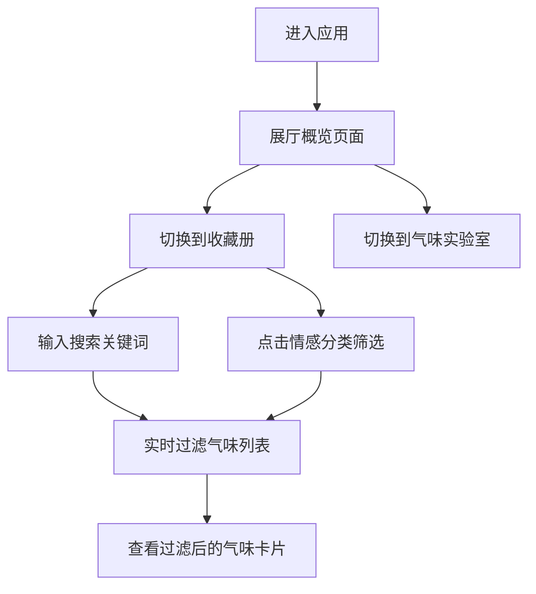

## 1. 产品概述

气味记忆博物馆是一个虚拟气味收藏与展览平台，让用户通过文字描述和视觉标签记录气味记忆，并按情感分类自动陈列在主题展厅中。

- 目标用户：喜欢记录生活感官体验、有收藏习惯的用户
- 产品价值：将无形的气味转化为可保存、可浏览的数字记忆，通过情感分类建立气味与情绪的联结

## 2. 核心功能

### 2.1 功能模块
1. **展厅概览页面**：按情感分类展示四个主题展厅（愉悦、怀念、紧张、宁静），用户可直观浏览各类气味
2. **收藏册页面**：以卡片列表形式展示所有气味收藏，支持搜索和情感筛选
3. **气味实验室页面**：（基础框架，预留扩展空间）

### 2.2 页面详情

| 页面名称 | 模块名称 | 功能描述 |
|---------|---------|---------|
| 展厅概览 | 顶部导航栏 | 三个标签页切换，带0.3s fade-in动画 |
| 展厅概览 | 四个展厅区域 | CSS Grid布局，4列自适应，渐变背景，分隔线 |
| 收藏册 | 搜索框 | 占位符"搜索气味记忆..."，聚焦时边框变色 |
| 收藏册 | 情感筛选按钮 | 四个圆形按钮，选中放大1.1倍带白色边框 |
| 收藏册 | 气味卡片列表 | 虚拟滚动，60fps流畅滚动，卡片悬停上移效果 |

## 3. 核心流程

用户进入应用 → 默认展示展厅概览 → 切换到收藏册 → 搜索/筛选气味 → 查看气味详情

## 4. 用户界面设计

### 4.1 设计风格
- 主色调：深灰蓝色 #2C3E50（背景）、#1A252F（导航栏）
- 情感色彩：愉悦 #E74C3C、怀念 #F39C12、紧张 #9B59B6、宁静 #1ABC9C
- 文字颜色：#ECF0F1
- 卡片背景：#34495E，圆角12px
- 交互：0.2-0.3s过渡动画，悬停上移效果

### 4.2 页面设计概览

| 页面名称 | 模块名称 | UI元素 |
|---------|---------|-------|
| 全局 | 顶部导航栏 | 高度60px，背景#1A252F，三个标签 |
| 收藏册 | 气味卡片 | 情感色块(8x8px圆角2px)、文字描述(#ECF0F1, 14px)、颜色渐变条纹(20px) |
| 收藏册 | 搜索输入框 | 背景#2C3E50，边框#7F8C8D，聚焦#E74C3C |
| 收藏册 | 筛选按钮 | 圆形36px直径，选中放大1.1倍+2px白色边框 |
| 展厅概览 | 展厅区域 | 渐变#1A252F到#2C3E50，1px #7F8C8D分隔线，4列Grid |

### 4.3 响应式
- 桌面端优先设计
- Grid布局自适应列数
- 虚拟滚动优化移动端性能
