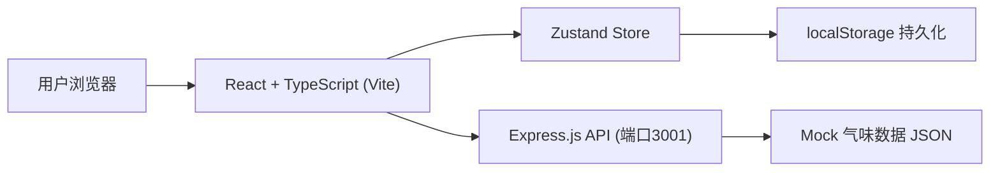
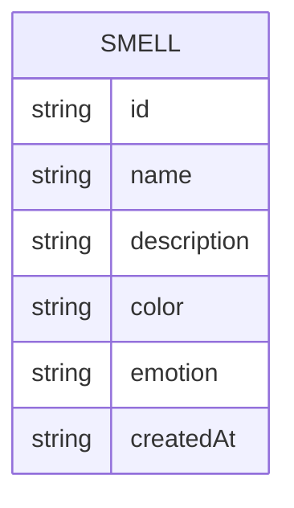

## 1. 架构设计



## 2. 技术描述
- 前端：React@18 + TypeScript + Vite
- 状态管理：Zustand
- 后端：Express.js（提供模拟API）
- 数据持久化：localStorage
- 构建工具：Vite（代理 /api 到 3001 端口）

## 3. 模块结构

| 文件路径 | 作用 |
|---------|------|
| src/App.tsx | 主应用组件，管理标签页切换和全局布局 |
| src/store.ts | Zustand状态管理（气味列表、搜索、筛选、标签页） |
| src/CollectionPage.tsx | 收藏册页面，虚拟滚动+搜索+筛选 |
| src/HallPage.tsx | 展厅概览页面，按情感分类展示 |
| server/index.js | Express服务器，提供 /api/smells 接口 |

## 4. API 定义

### GET /api/smells
返回初始5条气味数据

响应格式：
```typescript
interface Smell {
  id: string;
  name: string;
  description: string;
  color: string;
  emotion: 'joy' | 'nostalgia' | 'tension' | 'calm';
  createdAt: string;
}
```

## 5. 数据模型



## 6. 性能优化
- 虚拟滚动：仅渲染可见区域的气味卡片，保持60fps
- 搜索优化：前端本地搜索，响应时间≤50ms
- CSS硬件加速：使用transform和opacity属性实现动画
- localStorage缓存：支持离线使用
