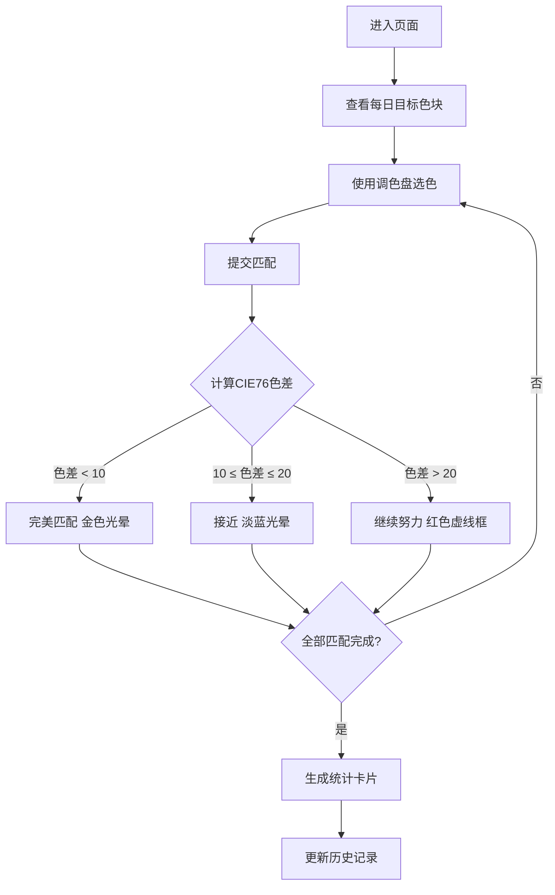

## 1. 产品概述

色彩记忆拼图是一款冥想式色彩训练应用，用户通过拖动色块匹配每日随机生成的目标色块组合，将抽象的颜色感觉转化为具体的视觉拼图。目标用户为设计师、艺术爱好者及对色彩感知有兴趣的人群，提供日常色彩敏感度训练。

## 2. 核心功能

### 2.1 功能模块
1. **主画布页面**：目标色块展示、调色盘交互、匹配对比、统计面板

### 2.2 页面详情

| 页面名称 | 模块名称 | 功能描述 |
|----------|----------|----------|
| 主画布页面 | 标题栏 | 渐变色标题栏，动态渐变分割线 |
| 主画布页面 | 目标色块区 | 展示4个每日随机生成的目标色块（80x80px，圆角8px） |
| 主画布页面 | 调色盘区域 | 包含色相环（180px直径Canvas）和亮度饱和度面板（180x180px） |
| 主画布页面 | 匹配结果反馈 | 色差<10金色光晕、10-20淡蓝光晕、>20红色虚线框 |
| 主画布页面 | 统计圆环 | SVG绘制120px圆环，显示当日完成度和平均色差 |
| 主画布页面 | 历史卡片 | 水平滚动容器，最近7天完成统计卡片 |

## 3. 核心流程

用户进入页面 → 查看每日4个目标色块 → 使用色相环和亮度饱和度面板选色 → 逐个提交匹配 → 系统计算CIE76色差 → 显示匹配动画反馈 → 完成全部匹配后生成统计卡片 → 历史记录滚动展示

## 4. 用户界面设计

### 4.1 设计风格
- 主色：#FF6B6B（珊瑚红）→ #4ECDC4（青绿）渐变
- 背景色：#FAF0E6（浅米黄）
- 调色盘背景：#F5F0E8
- 统计圆环色：#4ECDC4
- 重置按钮色：#FF6B6B
- 字体：标题300字重，清晰优雅
- 布局：左侧拼图区 + 右侧调色盘，768px以下调色盘下移
- 圆角风格：8px-16px柔和圆角

### 4.2 页面设计概览

| 页面名称 | 模块名称 | UI元素 |
|----------|----------|--------|
| 主画布页面 | 标题栏 | 渐变背景#FF6B6B→#4ECDC4，80px高，标题32px/300字重白色，底部2px动态渐变分割线4s循环 |
| 主画布页面 | 目标色块 | 80x80px，圆角8px，内阴影，4个色块横排 |
| 主画布页面 | 调色盘 | 280px宽，背景#F5F0E8，圆角16px，色相环180px直径Canvas，亮度饱和度面板180x180px |
| 主画布页面 | 匹配反馈 | 金色光晕0.5s闪烁/淡蓝光晕/红色虚线框 |
| 主画布页面 | 统计圆环 | SVG 120px直径，#4ECDC4，环宽8px |
| 主画布页面 | 历史卡片 | 120x80px，#FFFFFF，圆角8px，阴影#00000010，水平滚动 |
| 主画布页面 | 重置按钮 | 背景#FF6B6B，圆角6px，白色文字，悬停#E55A5A，0.2s过渡 |

### 4.3 响应式
- 桌面优先设计，宽度<768px时调色盘区域下移到拼图区下方
- 全屏画布布局，背景#FAF0E6

### 4.4 性能要求
- 色块渲染和颜色计算60fps
- 色相环拖拽响应时间≤16ms
