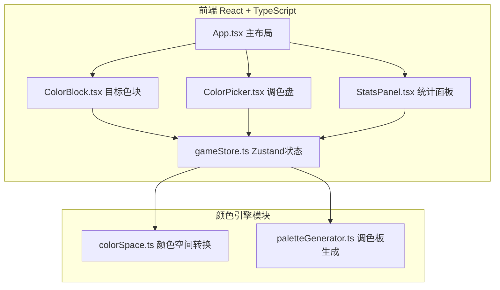

## 1. 架构设计



## 2. 技术说明
- 前端：React@18 + TypeScript + Vite + Zustand + d3-color
- 初始化工具：vite-init（react-ts模板）
- 后端：无
- 数据库：无（使用localStorage持久化历史记录）

## 3. 路由定义

| 路由 | 用途 |
|------|------|
| / | 主画布页面，包含所有交互功能 |

## 4. 文件结构

```
├── package.json
├── vite.config.js
├── tsconfig.json
├── index.html
└── src/
    ├── main.tsx
    ├── App.tsx
    ├── index.css
    ├── modules/
    │   ├── colorEngine/
    │   │   ├── colorSpace.ts      # HSL→RGB→Lab转换 + CIE76色差
    │   │   └── paletteGenerator.ts # 16种基调色随机选4个
    │   └── ui/
    │       ├── ColorPicker.tsx     # 色相环+亮度饱和度面板
    │       ├── ColorBlock.tsx      # 目标色块+匹配动画
    │       └── StatsPanel.tsx      # 统计圆环+历史卡片
    └── store/
        └── gameStore.ts           # Zustand状态管理
```

## 5. 数据模型

### 5.1 核心类型定义

```typescript
interface HSLColor {
  h: number;
  s: number;
  l: number;
}

interface LabColor {
  L: number;
  a: number;
  b: number;
}

interface TargetBlock {
  id: number;
  color: HSLColor;
}

interface MatchResult {
  blockId: number;
  targetColor: HSLColor;
  userColor: HSLColor;
  deltaE: number;
  feedback: 'perfect' | 'close' | 'tryAgain';
  timestamp: number;
}

interface DayRecord {
  date: string;
  averageDeltaE: number;
  duration: number;
}
```

### 5.2 Zustand Store 状态

```typescript
interface GameState {
  targetBlocks: TargetBlock[];
  userColors: HSLColor[];
  matchResults: MatchResult[];
  history: DayRecord[];
  startTime: number;
  currentBlockIndex: number;
  submitMatch: (userColor: HSLColor) => void;
  reset: () => void;
}
```
