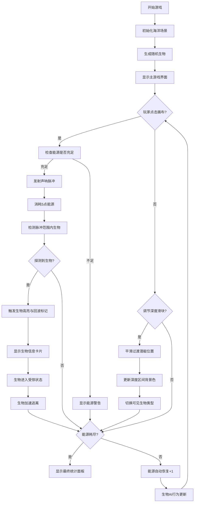

## 1. 产品概述
深海声呐追踪者是一款模拟深海潜艇声呐探测与生物追踪的交互式应用。玩家通过控制潜艇发射声呐脉冲来探测随机游动的深海生物，同时管理潜艇的能源消耗与深度调节。
- 核心目标：在有限能源下尽可能多地探测深海生物，追踪其行踪，探索不同深度的海洋生态
- 目标用户：海洋爱好者、休闲游戏玩家、教育场景学习者

## 2. 核心功能

### 2.1 功能模块
1. **主游戏画布**：深海背景渲染、潜艇、生物、声呐脉冲动画、海底地形
2. **声呐系统**：扇形脉冲发射、回波分析、生物检测反馈
3. **生物AI系统**：随机游走、受惊逃离、聚集行为的状态机
4. **能源管理**：消耗、自动恢复、低能源警告
5. **深度系统**：深度调节、不同深度生物类型分布、背景色变化
6. **信息展示**：生物信息弹出框、游戏计时器、统计面板

### 2.2 页面详情
| 页面名称 | 模块名称 | 功能描述 |
|-----------|-------------|---------------------|
| 主游戏页面 | 游戏画布 | 全屏Canvas渲染深海场景、潜艇、生物、声呐脉冲动画 |
| 主游戏页面 | UI控制面板 | 能源条、深度计、声呐冷却指示器、发射按钮、深度滑块 |
| 主游戏页面 | 生物信息弹出框 | 显示探测到的生物详情（图标、名称、大小、距离） |
| 主游戏页面 | 游戏计时器 | 实时记录游戏时长，格式为分钟:秒 |
| 主游戏页面 | 最终统计面板 | 能源耗尽时展示完整游戏统计数据 |

## 3. 核心流程
玩家进入游戏后，潜艇位于海图中下部，深海生物在各自深度区间随机游动。玩家通过点击画布任意位置发射扇形声呐脉冲，消耗能源。脉冲范围内的生物会被探测到，触发白色高亮和回波标记，并在UI右上角弹出生物信息卡片。玩家可通过深度滑块调节潜艇深度，进入不同海洋深度区间，遇到不同类型的生物。能源每秒自动恢复，低于10点时无法发射声呐并触发警告。当能源完全耗尽时，游戏结束并展示最终统计面板。

## 4. 用户界面设计

### 4.1 设计风格
- **主色调**：深海科技风格，深蓝黑色渐变背景（#001a33 → #000d1a），浅蓝色文字（#88BFFF）
- **强调色**：声呐青色（#00FFCC）、能源绿色（#00FF88）、警告红色（#FF4444）
- **按钮样式**：圆角矩形，背景#1a5276，悬浮态#2e86c1，过渡0.2s ease
- **字体**：等宽字体（monospace）用于计时器，系统字体用于UI文字
- **布局**：桌面端右侧固定UI面板，移动端底部折叠UI条；Canvas占满可用空间
- **卡片样式**：半透明深色背景（#0a1628E0），圆角12px，边框#1a375e，阴影柔和
- **动画**：所有过渡统一0.2s ease，声呐脉冲0.8s扩散，生物信息卡片0.3s滑入

### 4.2 页面设计概述
| 页面名称 | 模块名称 | UI元素 |
|-----------|-------------|-------------|
| 主游戏页面 | 深海画布 | 渐变背景、海底地形曲线、光晕粒子效果、Canvas全屏渲染 |
| 主游戏页面 | 潜艇图标 | 白色三角形、尾部光晕动画、跟随深度滑块平滑移动 |
| 主游戏页面 | 生物图标 | 发光圆形带尾巴、脉动光晕（0.2-0.4透明度，2s周期）、不同颜色区分类型 |
| 主游戏页面 | 声呐脉冲 | 60度扇形、蓝色半透明渐变、由近到远扩散消失（0.8s） |
| 主游戏页面 | 回波标记 | #00FFCC圆形、透明度0.6、逐渐缩小消失 |
| 主游戏页面 | UI面板（右侧） | 能源条（圆角8px高）、深度计、冷却指示器、声呐发射按钮、深度调节滑块 |
| 主游戏页面 | 生物信息卡片（右上） | 背景#1a1a2e、白色边框、圆角8px、图标+名称+大小+距离、右侧滑入动画 |
| 主游戏页面 | 计时器（左上） | 白色16px、monospace字体、MM:SS格式 |
| 主游戏页面 | 最终统计面板 | 居中、半透明黑色遮罩、卡片#0f3460、圆角16px、缩放动画 |

### 4.3 响应式
- **桌面端（≥768px）**：右侧固定UI面板（宽约240px），Canvas占满左侧屏幕
- **移动端（<768px）**：底部固定UI条（高80px，横向排列），Canvas占满剩余屏幕
- **触摸优化**：按钮增大点击热区，滑块支持触摸拖动

### 4.4 性能优化
- 主循环帧率目标60FPS，使用requestAnimationFrame
- 生物数量上限30只，避免过多渲染
- FPS低于30时，声呐扇形分段数从30降至15
- Canvas绘制采用离屏缓存技术，减少重复计算
- 内存占用控制在150MB以下
