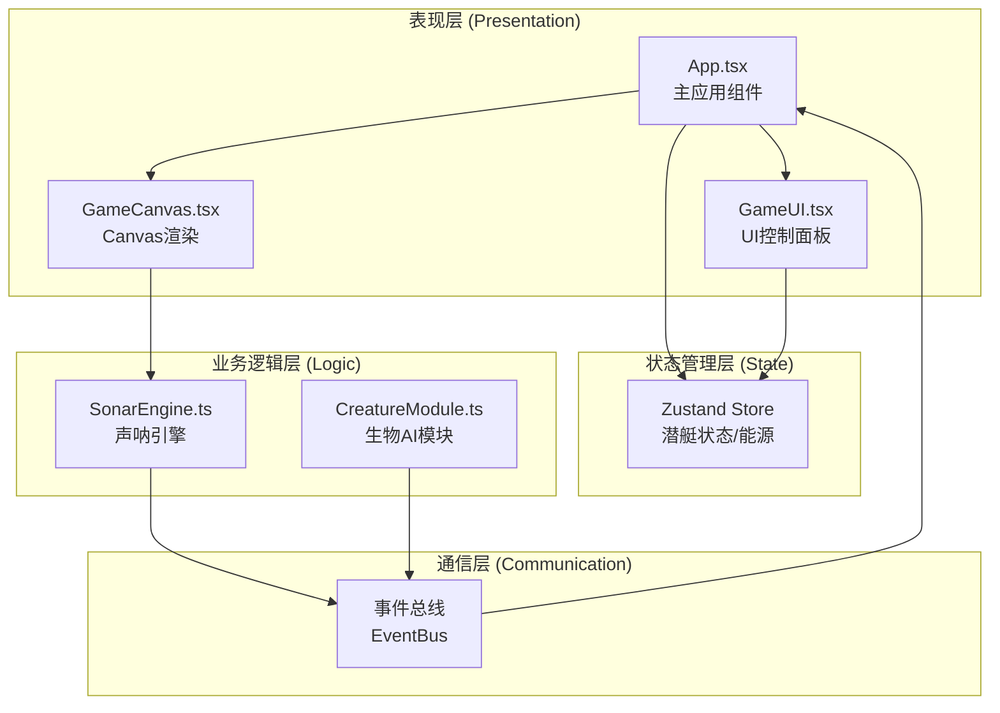

## 1. 架构设计



## 2. 技术说明
- **前端框架**：React@18 + TypeScript@5 + Vite@5
- **构建工具**：Vite@5 + @vitejs/plugin-react
- **状态管理**：Zustand@4（潜艇状态、能源、深度管理）
- **动画库**：@tweenjs/tween.js（平滑插值动画）
- **渲染方式**：HTML5 Canvas 2D（游戏画布）+ React DOM（UI层）
- **数据持久化**：localStorage（游戏统计数据）

## 3. 模块职责与接口定义

### 3.1 SonarEngine - 声呐引擎
**职责**：管理声呐脉冲发射、回波计算、生物检测

**数据结构**：
```typescript
interface SonarPulse {
  id: string;
  originX: number;
  originY: number;
  angle: number;      // 发射角度（弧度）
  spreadAngle: number; // 扇形张角（60度 = π/3）
  startTime: number;
  duration: number;   // 0.8s
  maxRange: number;   // 最大探测距离
}

interface EchoResult {
  creatureId: string;
  x: number;
  y: number;
  size: number;
  type: CreatureType;
  distance: number;
  timestamp: number;
}

type SonarEvent = 
  | { type: 'PULSE_FIRED'; pulse: SonarPulse }
  | { type: 'ECHO_DETECTED'; results: EchoResult[] }
  | { type: 'PULSE_ENDED'; pulseId: string };
```

**核心方法**：
- `firePulse(origin: Point, target: Point): boolean` - 发射声呐脉冲，返回是否成功
- `getActivePulses(): SonarPulse[]` - 获取当前活跃脉冲列表
- `detectCreatures(pulse: SonarPulse, creatures: Creature[]): EchoResult[]` - 检测脉冲范围内生物
- `update(time: number): void` - 更新脉冲状态，触发事件

### 3.2 CreatureModule - 生物AI模块
**职责**：管理所有生物实例、AI行为状态机、位置更新

**数据结构**：
```typescript
enum CreatureType {
  JELLYFISH = 'jellyfish',   // 浅层：水母 #00BFFF
  LANTERNFISH = 'lanternfish', // 中层：灯笼鱼 #FFD700
  ANGLERFISH = 'anglerfish'   // 深层：鮟鱇 #FF4500
}

enum CreatureBehavior {
  EXPLORING = 'exploring',    // 随机游走 1-3px/s
  FLEEING = 'fleeing',        // 受惊逃离 5-8px/s 3-5s
  GATHERING = 'gathering'     // 聚集行为
}

interface Creature {
  id: string;
  name: string;
  type: CreatureType;
  x: number;
  y: number;
  size: number;
  color: string;
  behavior: CreatureBehavior;
  velocity: { x: number; y: number };
  fleeEndTime: number;
  targetPoint: Point | null;
  glowPhase: number;     // 脉动光晕相位
  highlighted: boolean;  // 是否被探测高亮
  highlightEndTime: number;
  pulseTime: number;
}

type CreatureEvent =
  | { type: 'CREATURE_DETECTED'; creature: Creature; distance: number }
  | { type: 'BEHAVIOR_CHANGED'; creatureId: string; behavior: CreatureBehavior };
```

**核心方法**：
- `initializeCreatures(count: number, canvasSize: Size): void` - 初始化生物群
- `getCreaturesByDepth(depth: number): Creature[]` - 根据深度获取可见生物
- `getAllCreatures(): Creature[]` - 获取所有生物
- `update(time: number, dt: number, canvasSize: Size): void` - 更新生物行为
- `setHighlighted(creatureId: string, duration: number): void` - 设置生物高亮
- `triggerFlee(creatureId: string, fromX: number, fromY: number): void` - 触发受惊逃离

### 3.3 Zustand Store - 状态管理
**职责**：管理潜艇状态、能源、深度、游戏统计

```typescript
interface GameState {
  // 潜艇
  submarineX: number;
  submarineY: number;
  targetDepth: number;    // 0-500m
  currentDepth: number;
  
  // 能源
  energy: number;         // 0-100
  maxEnergy: number;
  sonarCooldown: boolean;
  lastSonarTime: number;
  
  // 游戏状态
  gameStartTime: number;
  gameDuration: number;   // 秒
  isGameOver: boolean;
  
  // 统计
  totalCreaturesDetected: number;
  totalSonarFired: number;
  maxDepthReached: number;
  detectedCreatureList: { name: string; type: string; time: number }[];
  
  // 操作
  fireSonar(): boolean;
  setTargetDepth(depth: number): void;
  updateGameTime(time: number): void;
  regenerateEnergy(dt: number): void;
  recordDetection(creatureName: string, creatureType: string): void;
  endGame(): void;
  resetGame(): void;
}
```

### 3.4 事件总线
采用简单发布订阅模式实现模块间解耦通信：

```typescript
type EventCallback = (event: any) => void;

interface EventBus {
  on(event: string, callback: EventCallback): () => void;
  emit(event: string, payload: any): void;
  off(event: string, callback: EventCallback): void;
}
```

## 4. 数据模型

### 4.1 深度区间定义
| 深度范围 | 生物类型 | 颜色代码 | 大小范围 | 背景色调 |
|---------|---------|---------|---------|---------|
| 0-150m | 发光水母 | #00BFFF | 8-12px | 偏蓝（#001a33） |
| 150-350m | 灯笼鱼 | #FFD700 | 12-18px | 偏紫（#0d0033） |
| 350-500m | 深海鮟鱇 | #FF4500 | 18-25px | 偏黑（#000000） |

### 4.2 游戏统计存储
```typescript
// localStorage key: 'deep_sonar_stats'
interface GameStatsRecord {
  timestamp: number;
  duration: number;          // 游戏时长（秒）
  creaturesDetected: number; // 探测生物总数
  sonarFired: number;        // 发射声呐次数
  maxDepth: number;          // 最深下潜深度
}
```

## 5. 文件结构
```
d:\Pro\tasks\auto109\
├── package.json
├── vite.config.js
├── tsconfig.json
├── index.html
└── src\
    ├── main.tsx           # React入口
    ├── App.tsx            # 主应用组件
    ├── GameCanvas.tsx     # Canvas渲染组件
    ├── GameUI.tsx         # UI控制面板
    ├── SonarEngine.ts     # 声呐引擎模块
    ├── CreatureModule.ts  # 生物AI模块
    ├── store.ts           # Zustand状态管理
    ├── eventBus.ts        # 事件总线
    └── types.ts           # 共享类型定义
```
