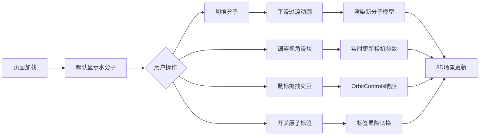

## 1. 产品概述
交互式分子结构3D查看器，让用户能够以球棍模型方式直观查看常见化学分子（水、咖啡因、葡萄糖）的三维空间结构，支持交互式视角调整和信息展示。

- 主要用途：化学教育、分子结构可视化、科研辅助展示
- 目标用户：化学学习者、教育工作者、科研人员
- 产品价值：将抽象的分子结构转化为直观的3D可视化，降低化学学习门槛

## 2. 核心功能

### 2.1 功能模块
1. **主界面**：左侧3D场景展示区 + 右侧控制面板
2. **分子管理模块**：分子切换、模型渲染、过渡动画
3. **视角控制模块**：距离缩放、水平旋转、垂直倾斜
4. **标签显示模块**：元素符号标签、标签显隐切换
5. **交互模块**：鼠标拖拽旋转、平移、缩放

### 2.2 页面详情
| 页面名称 | 模块名称 | 功能描述 |
|-----------|-------------|---------------------|
| 主界面 | 3D场景区 | 渲染分子球棍模型，背景#1a1a2e，支持鼠标交互，缓慢自动旋转 |
| 主界面 | 控制面板 | 分子选择下拉框、视角控制滑块组、标签显示开关 |
| 主界面 | 分子信息展示 | 显示当前分子名称和原子数量 |

## 3. 核心流程

用户进入页面 → 默认加载水分子模型（自动旋转）→ 用户通过下拉框切换分子（平滑过渡动画）→ 拖动滑块调整视角/缩放/倾斜 → 开启/关闭原子标签 → 鼠标拖拽手动旋转查看 → 实时反馈

## 4. 用户界面设计

### 4.1 设计风格
- **主题风格**：暗色科幻风格
- **主色调**：亮蓝色 #00d4ff（交互元素、高亮文字）
- **辅助色**：#4a4a6a（背景、边框）、#2d2d44（面板背景）、#3a3a54（卡片背景）、#1a1a2e（3D场景背景）
- **按钮样式**：Ant Design primary按钮，水波纹点击反馈
- **字体**：现代无衬线字体，信息区18px亮蓝色标题
- **布局**：左右分栏布局（左侧65% 3D场景，右侧35%控制面板），卡片式组件
- **原子配色（CPK标准）**：碳#555555、氧#ff0d0d、氮#3050f8、氢#ffffff

### 4.2 页面设计概述
| 页面名称 | 模块名称 | UI元素 |
|-----------|-------------|-------------|
| 主界面 | 3D场景区 | 全屏黑色背景，居中球棍模型，半透明球体原子，圆柱形化学键，悬浮元素标签 |
| 主界面 | 控制面板 | 宽度320px，顶部2px亮蓝色阴影，卡片间距12px，圆角8px，渐变滑块轨道 |
| 主界面 | 滑块组件 | 轨道渐变#4a4a6a→#6a6a8a，圆形亮蓝色手柄 |

### 4.3 响应式
桌面端优先，左右分栏固定布局；控制面板固定宽度320px，3D场景自适应剩余空间。

### 4.4 3D场景指引
- **环境**：深色背景#1a1a2e，营造科技感
- **光照**：多光源设置，确保模型各面清晰可见
- **相机设置**：PerspectiveCamera，默认距离10，支持5-20范围调整
- **动画**：绕Y轴自动旋转（0.005 rad/s），模型切换时0.6秒淡入淡出过渡
- **交互**：OrbitControls支持旋转、平移、缩放；缩放时标签自动按比例缩小
- **性能**：切换响应时间<200ms，滑块拖动帧率>30fps
