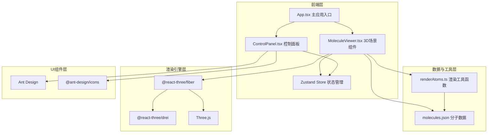

## 1. 架构设计



## 2. 技术描述

- **前端框架**：React 18 + TypeScript
- **构建工具**：Vite（配置路径别名 @）
- **3D渲染**：Three.js + @react-three/fiber + @react-three/drei
- **UI组件库**：Ant Design 5 + @ant-design/icons
- **状态管理**：Zustand
- **初始化方式**：Vite react-ts 模板

## 3. 路由定义
| 路由 | 用途 |
|-------|---------|
| / | 主应用页面（单页应用，无路由跳转） |

## 4. 数据模型

### 4.1 分子数据结构（molecules.json）

```typescript
interface Atom {
  element: string;      // 元素符号 C/O/N/H
  position: [number, number, number];  // 三维坐标 [x, y, z]
  radius: number;       // 原子半径
  color: string;        // CPK颜色
}

interface Bond {
  from: number;         // 起始原子索引
  to: number;           // 结束原子索引
}

interface Molecule {
  name: string;         // 分子名称
  nameZh: string;       // 中文名称
  atoms: Atom[];        // 原子列表
  bonds: Bond[];        // 化学键列表
}
```

### 4.2 状态管理（Zustand Store）

```typescript
interface ViewerState {
  currentMolecule: string;      // 当前分子key
  cameraDistance: number;       // 视角距离 5-20
  rotationY: number;            // 水平旋转角度 0-360
  tiltX: number;                // 垂直倾斜角度 -90~90
  showLabels: boolean;          // 是否显示原子标签
  
  setMolecule: (key: string) => void;
  setCameraDistance: (d: number) => void;
  setRotationY: (r: number) => void;
  setTiltX: (t: number) => void;
  toggleLabels: () => void;
}
```

## 5. 文件结构

```
auto11/
├── package.json
├── vite.config.js
├── tsconfig.json
├── index.html
└── src/
    ├── main.tsx              # React挂载点
    ├── App.tsx               # 主应用组件
    ├── store/
    │   └── index.ts          # Zustand状态管理
    ├── components/
    │   ├── MoleculeViewer.tsx  # 3D场景组件
    │   └── ControlPanel.tsx    # 控制面板组件
    ├── data/
    │   └── molecules.json    # 分子数据
    └── utils/
        └── renderAtoms.ts    # 几何体生成工具
```

## 6. 关键技术实现要点

### 6.1 3D渲染
- 使用 @react-three/fiber 的 Canvas 组件作为3D容器
- 使用 drei 的 OrbitControls 实现鼠标交互
- 使用 drei 的 Transition 组件实现分子切换的淡入淡出动画
- 原子使用 MeshStandardMaterial 半透明材质（opacity: 0.85）
- 化学键使用 CylinderGeometry，通过计算两原子间的位置和旋转角度生成

### 6.2 标签渲染
- 使用 drei 的 Html 组件将 DOM 元素悬浮在3D空间中
- 标签样式：半透明黑色圆角背景，白色16px文字
- 根据相机距离动态调整标签缩放比例

### 6.3 性能优化
- 分子数据预加载，切换时直接使用内存数据
- 使用 useMemo 缓存几何体计算结果
- 滑块使用 onChange 实时更新，避免不必要的重渲染
