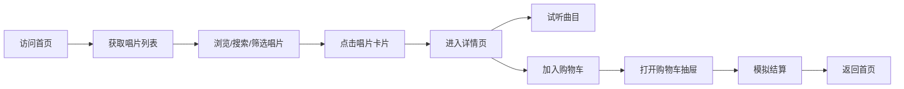
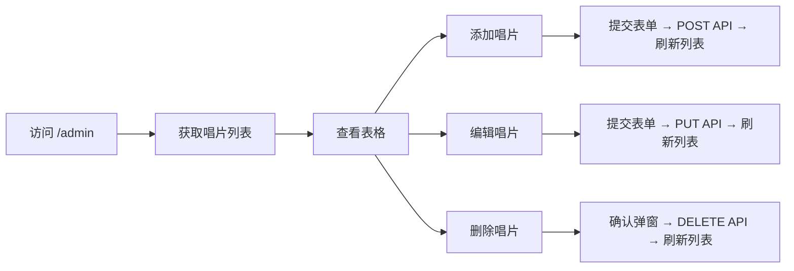

## 1. 产品概述
独立音乐厂牌数字黑胶唱片商店，访客可浏览、试听、购买限量版黑胶唱片，唱片主理人可通过后台管理库存和试听曲目。
- 目标用户：音乐爱好者、黑胶唱片收藏家（前台），唱片店主理人（后台）
- 核心价值：打造复古风格的线上黑胶唱片购物体验，提供完整的浏览-试听-购买流程与库存管理

## 2. 核心功能

### 2.1 用户角色
| 角色 | 访问方式 | 核心权限 |
|------|----------|----------|
| 访客用户 | 直接访问 | 浏览唱片、试听音频、加入购物车、模拟结算 |
| 管理员 | /admin 路径 | 唱片增删改查、库存管理、曲目更新 |

### 2.2 功能模块
1. **前台首页**：唱片列表网格、搜索筛选、唱片卡片、试听/购买按钮
2. **唱片详情页**：大尺寸封面、专辑信息、曲目列表试听、加入购物车
3. **播放条**：底部固定音频播放控制、进度条、音量调节
4. **购物车**：右侧滑出抽屉、商品数量增减、总价计算、模拟结算
5. **后台管理**：唱片表格列表、添加/编辑表单、删除确认、排序功能

### 2.3 页面详情
| 页面名称 | 模块名称 | 功能描述 |
|----------|----------|----------|
| 前台首页 | 唱片列表网格 | 响应式3/2/1列布局，展示封面、艺术家、专辑名、价格 |
| 前台首页 | 搜索筛选栏 | 实时搜索（300ms防抖）、流派下拉筛选 |
| 前台首页 | 唱片卡片 | 悬停封面浮起动效、播放按钮动画、试听/购买按钮 |
| 详情页 | 专辑信息展示 | 大尺寸封面、艺术家、年份、曲目列表、价格 |
| 详情页 | 曲目试听 | 单条曲目点击独立播放 |
| 购物车抽屉 | 商品管理 | 数量增减、小计、总价、结算 |
| 播放条 | 音频控制 | 播放/暂停、进度拖拽、音量控制 |
| 后台管理 | 唱片表格 | 封面缩略、信息列、价格/库存排序、编辑/删除操作 |
| 后台管理 | 添加/编辑表单 | 图片URL、专辑名、艺术家、年份、流派、价格、库存、曲目列表 |
| 后台管理 | 删除确认弹窗 | 二次确认后执行删除 |

## 3. 核心流程

用户浏览流程：

管理员流程：

## 4. 用户界面设计

### 4.1 设计风格
- **主色调**：深木色 #2C1810（背景）、黑色 #111111（导航栏）、金色 #FFD700（Logo/强调）、紫色 #6C63FF（按钮/链接）、红色 #FF6B6B（结算按钮）
- **复古风格**：模拟黑胶唱片店氛围，深木色背景配金色点缀
- **按钮风格**：圆角设计，悬停颜色加深，点击 scale(0.95) 缩放反馈
- **字体**：无衬线字体，标题加粗，价格使用紫色强调
- **布局**：顶部导航栏 + 内容区（最大宽度1200px居中）+ 底部播放条
- **图标**：使用 lucide-react 图标库

### 4.2 页面设计概览
| 页面名称 | 模块名称 | UI元素 |
|----------|----------|--------|
| 前台首页 | 导航栏 | 60px高黑底，金色Logo，白色链接，购物车图标+角标，齿轮图标 |
| 前台首页 | 搜索筛选区 | 圆角搜索框（左侧图标）、流派下拉框 |
| 前台首页 | 唱片网格 | 卡片300x300封面，圆角4px，阴影，悬停上浮5px+播放按钮0.3s动画 |
| 详情页 | 背景 | 浅米色 #FFF8E7 + CSS径向渐变黑胶纹理 |
| 详情页 | 详情卡片 | 白色背景圆角12px，阴影，左侧500x500封面，右侧信息 |
| 购物车抽屉 | 滑入动画 | 0.3s右滑入场，遮罩层 #00000080 |
| 播放条 | 底部固定 | 60px高黑底，金色进度条，白色圆形播放按钮，音量控制 |
| 后台管理 | 数据表格 | 缩略图40x40，排序箭头，蓝色编辑按钮，红色删除按钮 |
| 后台管理 | 表单弹窗 | 淡入淡出0.2s动画，遮罩点击关闭 |

### 4.3 响应式设计
- **桌面端（>768px）**：3列网格，详情页横向布局
- **平板端（≤768px）**：2列网格，详情页纵向布局，导航栏字号缩小
- **手机端（≤480px）**：1列网格，导航栏50px高，购物车全屏宽度

### 4.4 动画与交互
- 卡片悬停：封面向上浮起5px（transition 0.2s）
- 播放按钮：0.3s渐入动画
- 购买按钮：点击后变绿色，1.5s后恢复
- 弹窗：fade in/out 0.2s
- 购物车抽屉：translateX 100%→0，0.3s
- 按钮点击：scale(0.95) 0.1s 缩放反馈
