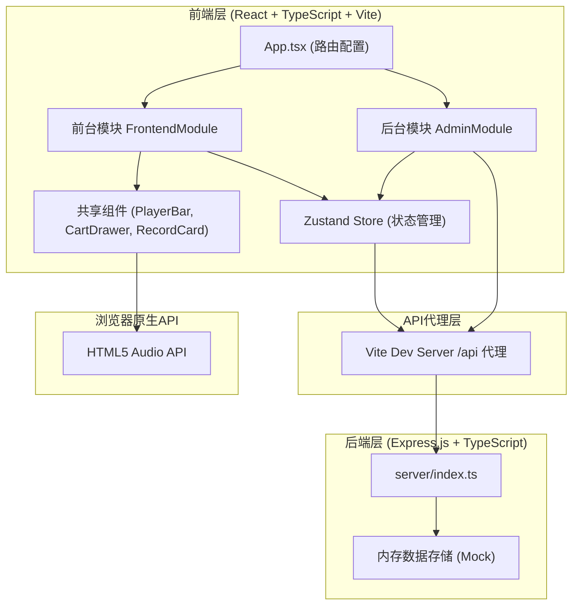

## 1. 架构设计



## 2. 技术描述
- **前端框架**：React 18 + TypeScript
- **构建工具**：Vite
- **路由**：react-router-dom v6
- **状态管理**：Zustand
- **后端框架**：Express.js 4 + TypeScript
- **跨域处理**：cors 中间件
- **唯一ID生成**：uuid
- **图标**：lucide-react
- **UI样式**：纯CSS（不使用Tailwind，采用模块化CSS + CSS变量）
- **音频播放**：HTML5 Audio API

## 3. 路由定义
| 路由路径 | 页面/组件 | 用途 |
|----------|-----------|------|
| / | FrontendModule | 前台首页 - 唱片列表展示 |
| /album/:id | FrontendModule (详情子页) | 唱片详情页 |
| /admin | AdminModule | 后台管理页 |

## 4. API 定义

### 4.1 唱片数据类型
```typescript
interface Track {
  number: number;
  title: string;
}

interface Record {
  id: string;
  coverUrl: string;
  title: string;
  artist: string;
  year: number;
  genre: string;
  price: number;
  stock: number;
  tracks: Track[];
}
```

### 4.2 API 接口
| 方法 | 路径 | 描述 | 请求体 | 响应 |
|------|------|------|--------|------|
| GET | /api/records | 获取所有唱片列表 | - | Record[] |
| GET | /api/records/:id | 获取单张唱片详情 | - | Record |
| POST | /api/records | 添加新唱片 | Omit<Record, 'id'> | Record |
| PUT | /api/records/:id | 更新唱片信息 | Partial<Record> | Record |
| DELETE | /api/records/:id | 删除唱片 | - | { success: true } |

所有接口模拟300ms异步延迟。

## 5. 文件结构与调用关系

```
project-root/
├── package.json
├── vite.config.js        # 构建配置，代理 /api → localhost:3001
├── tsconfig.json         # TypeScript 严格模式
├── index.html            # 入口 HTML，标题"黑胶唱片店"
├── server/
│   └── index.ts          # Express 后端，CRUD API + 模拟数据
└── src/
    ├── main.tsx          # React 入口
    ├── App.tsx           # 路由配置 (BrowserRouter, Routes)
    ├── store.ts          # Zustand Store (records, cart, currentTrack, actions)
    ├── styles/
    │   └── global.css    # 全局样式 + CSS 变量
    └── modules/
        ├── frontend/
        │   ├── FrontendModule.tsx   # 前台首页+详情页，路由内部分发
        │   └── components/
        │       ├── RecordCard.tsx   # 唱片卡片 (props: Record)
        │       ├── PlayerBar.tsx    # 底部播放条 (从 store 读取 currentTrack)
        │       └── CartDrawer.tsx   # 购物车抽屉 (读写 store cart)
        └── admin/
            └── AdminModule.tsx      # 后台管理 (表格+表单+弹窗)
```

### 数据流向
- **前台列表**：`FrontendModule` → `store.fetchRecords()` → `GET /api/records` → `store.records` → 渲染 `RecordCard[]`
- **卡片点击**：`RecordCard` → `useNavigate()` → `/album/:id`
- **详情页**：`FrontendModule` (路由匹配) → `store.fetchRecords()` + `findById` → 渲染详情
- **试听**：`RecordCard/详情页曲目` → `store.setCurrentTrack()` → `PlayerBar` 读取并操作 `Audio` 元素
- **购物车**：`购买按钮` → `store.addToCart()` → `CartDrawer` 读取 `store.cart` → `store.updateQuantity/removeFromCart()`
- **后台管理**：`AdminModule` → `store.fetchRecords()` → 表格 → `POST/PUT/DELETE /api/records` → `store.fetchRecords()`

## 6. Zustand Store 设计

```typescript
interface CartItem {
  record: Record;
  quantity: number;
}

interface CurrentTrack {
  recordId: string;
  recordTitle: string;
  coverUrl: string;
  trackNumber: number;
  trackTitle: string;
}

interface StoreState {
  records: Record[];
  cart: CartItem[];
  currentTrack: CurrentTrack | null;
  loading: boolean;
  error: string | null;
  // Actions
  fetchRecords: () => Promise<void>;
  addToCart: (record: Record) => void;
  removeFromCart: (recordId: string) => void;
  updateQuantity: (recordId: string, quantity: number) => void;
  clearCart: () => void;
  setCurrentTrack: (track: CurrentTrack | null) => void;
  setError: (error: string | null) => void;
}
```

## 7. 性能优化策略
- **搜索防抖**：使用 `useDebounce` 自定义 Hook，300ms 延迟筛选
- **音频预加载**：切换曲目时设置 `audio.preload = 'auto'`
- **响应式图片**：CSS 控制封面尺寸，避免重排
- **组件复用**：`RecordCard`、表单弹窗等组件复用，减少重复渲染
- **CSS 动画**：使用 transform/opacity 实现 GPU 加速的60fps动画
