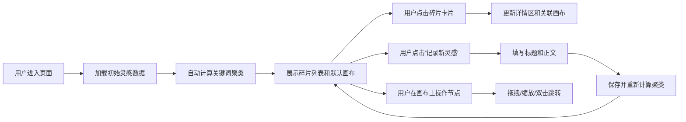

## 1. 产品概述

灵感碎片收集站是一款帮助用户随手记录零碎想法和灵感的Web应用，通过自动关键词聚类将零散想法组织成主题画布，以思维导图方式展示碎片之间的关联关系，让创意可视化。

- **核心价值**：降低灵感记录门槛，通过智能聚类和可视化帮助用户发现想法之间的潜在关联
- **目标用户**：创意工作者、学生、任何需要记录和整理零散想法的人群
- **市场定位**：轻量级、高颜值的个人知识管理工具

## 2. 核心特性

### 2.1 用户角色
| 角色 | 注册方式 | 核心权限 |
|------|----------|----------|
| 普通用户 | 无需注册，本地存储 | 记录灵感、查看聚类、编辑/删除碎片 |

### 2.2 功能模块
1. **灵感记录模块**：快速创建新灵感碎片，支持标题和正文
2. **灵感列表模块**：左侧时间线展示所有碎片，支持快速预览和选择
3. **详情展示模块**：中间区域展示碎片完整内容和关联碎片标签
4. **主题画布模块**：右侧力导向图可视化展示主题聚类，支持交互操作
5. **智能聚类模块**：基于关键词自动聚类，计算碎片间关联关系

### 2.3 页面详情
| 页面名称 | 模块名称 | 功能描述 |
|---------|----------|----------|
| 主页面 | 左侧边栏 | 展示灵感碎片列表，按创建时间倒序，支持点击切换选中碎片 |
| 主页面 | 中间详情区 | 展示选中碎片的完整内容、创建时间、关键词和关联碎片标签 |
| 主页面 | 右侧画布区 | 力导向图展示当前主题的所有碎片节点和关联连线，支持拖拽、缩放、双击跳转 |
| 主页面 | 顶部记录按钮 | 快速创建新灵感碎片弹窗 |

## 3. 核心流程

## 4. 用户界面设计

### 4.1 设计风格
- **主色调**：莫兰迪绿色系 #5B7B6A（深绿）、#A0B4AE（浅绿）
- **背景色**：柔和灰绿色 #F0F4F3
- **卡片背景**：#F9FAFB，分割线 #E2E8F0
- **文字颜色**：标题 #1F2937，正文 #374151，辅助文字 #6B7280
- **预设色板**（5种关键词颜色）：#5B7B6A、#B88C6A、#6A8CB8、#B86A8C、#8CB86A
- **按钮样式**：圆角8px，hover时背景加深 #4A6A59，过渡0.2s ease
- **卡片样式**：圆角10px，左侧5px色条，hover时上移3px，阴影增强
- **阴影规范**：统一使用 rgba(0,0,0,0.06)
- **字体**：system-ui 无衬线字体
- **过渡动画**：所有交互带 0.2-0.4s 平滑过渡

### 4.2 页面设计概述
| 页面名称 | 模块名称 | UI元素 |
|---------|----------|--------|
| 主页面 | 左侧边栏 | 宽度280px，白色背景，右侧1px分割线，顶部绿色按钮，卡片列表 |
| 主页面 | 中间详情区 | 标题18px字重600，正文15px行高1.6，关联标签圆角20px |
| 主页面 | 右侧画布区 | 宽度360px，可折叠/展开，三角折叠按钮带旋转动画，SVG力导向图 |

### 4.3 响应式设计
- **桌面端**（>768px）：三栏布局，侧边栏280px固定，画布区360px可折叠，中间自适应
- **移动端**（≤768px）：侧边栏变为顶部导航条，画布区全屏覆盖，通过按钮切换显示
- **触摸优化**：增加点击区域，支持触摸拖拽和双指缩放

### 4.4 性能要求
- 主题画布在50个以下节点时保持60fps
- 关键词聚类在100条碎片以内计算时间不超过200ms
- 力导向图支持0.5-2.0倍缩放
