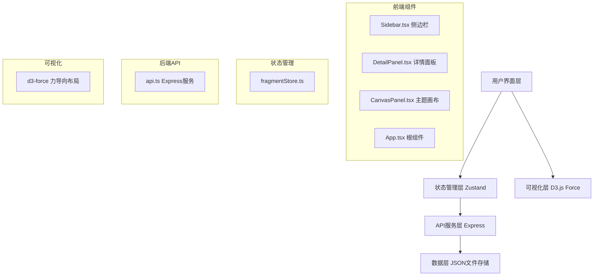
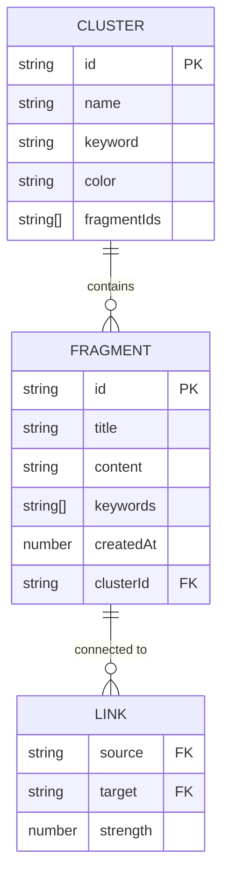

## 1. 架构设计



## 2. 技术描述

- **前端框架**：React@18 + TypeScript@5
- **构建工具**：Vite@5 + @vitejs/plugin-react@4
- **状态管理**：Zustand@4
- **可视化引擎**：d3-force@3
- **后端服务**：Express@4（模拟后端，API代理）
- **唯一ID生成**：uuid@9
- **包管理工具**：npm
- **初始化模板**：react-ts（Vite React + TypeScript）

## 3. 路由定义

| 路由 | 用途 |
|------|------|
| / | 主页面，展示三栏布局 |

## 4. API 定义

### 4.1 类型定义
```typescript
interface Fragment {
  id: string;
  title: string;
  content: string;
  keywords: string[];
  createdAt: number;
  clusterId?: string;
}

interface Cluster {
  id: string;
  name: string;
  keyword: string;
  color: string;
  fragmentIds: string[];
}

interface Link {
  source: string;
  target: string;
  strength: number;
}

interface CanvasNode {
  id: string;
  x: number;
  y: number;
  vx: number;
  vy: number;
  fx?: number;
  fy?: number;
  fragment: Fragment;
  radius: number;
  color: string;
}

interface CanvasLink {
  source: string | CanvasNode;
  target: string | CanvasNode;
  strength: number;
}
```

### 4.2 API 接口

| 方法 | 路径 | 描述 | 请求 | 响应 |
|------|------|------|------|------|
| GET | /api/fragments | 获取所有灵感碎片 | - | Fragment[] |
| POST | /api/fragments | 创建新灵感碎片 | { title, content, keywords } | Fragment |
| PUT | /api/fragments/:id | 更新灵感碎片 | { title, content, keywords } | Fragment |
| DELETE | /api/fragments/:id | 删除灵感碎片 | - | { success: boolean } |
| GET | /api/clusters | 计算并获取聚类结果 | - | { clusters: Cluster[], links: Link[] } |

## 5. 项目结构

```
auto111/
├── package.json          # 项目依赖和脚本
├── vite.config.js        # Vite 构建配置（API代理）
├── tsconfig.json         # TypeScript 配置（严格模式）
├── index.html            # 入口HTML
├── data/
│   └── fragments.json    # 初始模拟数据
└── src/
    ├── types.ts          # 类型定义
    ├── api/
    │   └── api.ts        # Express 模拟后端
    ├── store/
    │   └── fragmentStore.ts  # Zustand 状态管理
    ├── components/
    │   ├── Sidebar.tsx       # 侧边栏组件
    │   ├── DetailPanel.tsx   # 详情面板组件
    │   └── CanvasPanel.tsx   # 主题画布组件
    ├── App.tsx           # 根组件
    ├── main.tsx          # 应用入口
    └── index.css         # 全局样式
```

## 6. 数据模型

### 6.1 ER 图



### 6.2 初始数据

```json
{
  "fragments": [
    {
      "id": "uuid-1",
      "title": "关于时间管理的思考",
      "content": "时间管理本质上是精力管理...",
      "keywords": ["效率", "时间", "管理"],
      "createdAt": 1718600000000
    }
  ]
}
```

## 7. 核心算法

### 7.1 关键词聚类算法
1. 提取所有碎片的关键词，统计词频
2. 基于关键词共现计算碎片间相似度
3. 使用贪心算法将相似碎片聚类
4. 每个聚类分配一个主题关键词和颜色

### 7.2 力导向布局参数
- 节点斥力：-300
- 连线距离：100
- 连线强度：0.6
- 重力强度：0.1
- 冷却系数：0.08

### 7.3 节点半径计算
```
baseRadius = 40
maxRadius = 60
scaleFactor = 1 + (clusterSize - 1) * 0.05
radius = min(baseRadius * scaleFactor, maxRadius)
```
