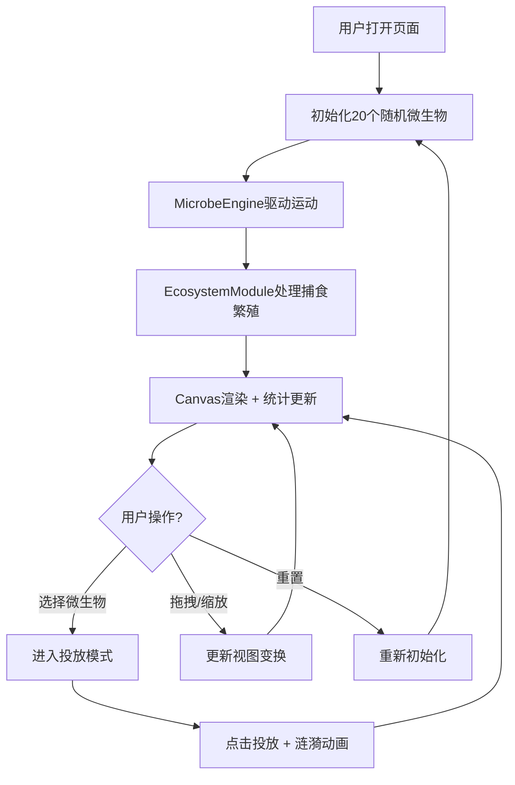

## 1. 产品概述

微观生态模拟器是一款基于Web的交互式模拟应用，让用户在虚拟显微镜视野中观察和操控微生物群落的运动、捕食与繁殖行为。玩家可以投放不同种类的细菌和病毒，见证微观世界中激烈的生存竞争。

- 主要用途：教育娱乐、生态学模拟演示、微生物行为可视化
- 目标用户：学生、生物爱好者、对生命科学感兴趣的普通用户
- 产品价值：将抽象的微生物生态系统以直观、美观、互动的方式呈现，寓教于乐

## 2. 核心功能

### 2.1 用户角色
无需注册，所有用户均可直接使用全部功能。

### 2.2 功能模块

1. **模拟主界面**：显微镜视野、微生物实时渲染、用户交互层
2. **微生物投放系统**：工具栏选择、点击投放、涟漪动画效果
3. **物理运动引擎**：布朗运动、趋化性、边界反弹、螺旋轨迹
4. **生态系统模块**：捕食判定、繁殖机制、种群密度控制
5. **数据统计面板**：实时种群数量、折线图趋势展示
6. **视图控制系统**：拖拽平移、滚轮缩放、重置功能

### 2.3 页面详情

| 页面名称 | 模块名称 | 功能描述 |
|---------|---------|---------|
| 主界面 | 显微镜视野 | 深蓝色渐变背景，100x100单位模拟区域，黑色半透明边框 |
| 主界面 | 工具栏 | 左侧固定80px宽，三种微生物图标选择，点击高亮放大1.2倍 |
| 主界面 | 十字准星 | 鼠标移入模拟区域显示白色细线十字准星 |
| 主界面 | 投放效果 | 点击生成微生物并显示0.5s扩散涟漪动画 |
| 主界面 | 统计面板 | 右下角显示三种微生物数量折线图（30秒循环，每2秒更新） |
| 主界面 | 重置按钮 | 左上角红色圆形图标，重置微生物和统计数据 |

## 3. 核心流程

用户打开页面 → 初始化20个随机微生物 → 微生物自主运动 → 用户点击工具栏选择类型 → 鼠标进入模拟区域显示准星 → 点击投放微生物 → 捕食/繁殖持续进行 → 统计面板实时更新 → 可拖拽/缩放视图 → 可重置模拟

## 4. 用户界面设计

### 4.1 设计风格
- **主色调**：深蓝色渐变背景（#0A1628 → #1A2A4A），营造显微镜下的沉浸感
- **微生物色**：球菌绿色(#27AE60)、杆菌红色(#E74C3C)、螺旋菌紫色(#9B59B6)
- **辅助色**：半透明深色面板(#0F1D33E0)、边框色(#2C3E50)、文字色(#A0B0C0)
- **按钮样式**：重置按钮红色圆形，hover变暗过渡0.2s；工具栏图标点击放大1.2倍高亮
- **字体**：默认无衬线字体，统一浅灰蓝色文字
- **布局**：桌面端左侧工具栏+中央模拟区+右下统计面板；移动端工具栏底部横条
- **图标风格**：纯CSS/SVG绘制几何形状，匹配微生物形态
- **动画**：微生物发光径向渐变、捕食白色闪烁0.3s、投放涟漪扩散0.5s、视图变换0.2s ease-out

### 4.2 页面设计概述

| 页面名称 | 模块名称 | UI元素 |
|---------|---------|--------|
| 主界面 | 背景 | 深蓝色径向渐变，模拟显微镜景深效果 |
| 主界面 | 微生物渲染 | 径向渐变（内亮白50%透明+外类型色），发光效果 |
| 主界面 | 工具栏 | 半透明深色圆角12px，图标+名称标签，选中放大高亮 |
| 主界面 | 统计面板 | 半透明深色圆角8px，Canvas折线图三种颜色 |
| 主界面 | 重置按钮 | 白色圆形图标，红色背景，hover过渡 |

### 4.3 响应式设计
- 桌面优先（>600px）：左侧工具栏80px固定宽度，统计面板右下角
- 移动端（≤600px）：工具栏变为底部横条高度50px，统计面板移至左上角缩小，微生物尺寸适当减小

### 4.4 性能要求
- 微生物数量上限200个
- Canvas渲染帧率≥45FPS
- 整体FPS≥30帧
