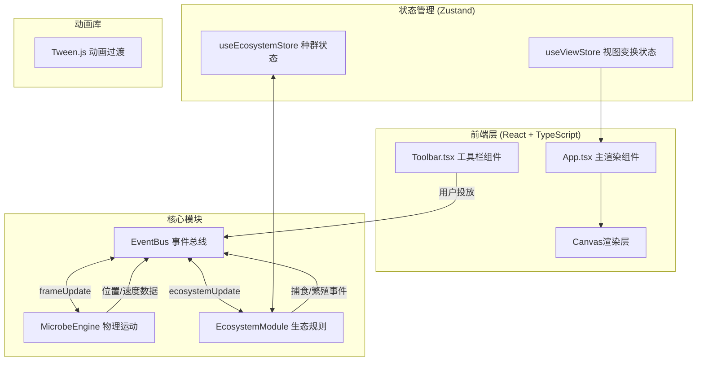

## 1. 架构设计



## 2. 技术描述

- **前端框架**：React 18 + TypeScript
- **构建工具**：Vite + @vitejs/plugin-react
- **状态管理**：Zustand
- **动画库**：@tweenjs/tween.js
- **渲染方案**：原生 Canvas 2D API
- **包管理**：npm

### 关键技术点
1. **模块化架构**：物理引擎与生态规则解耦，通过事件总线通信
2. **高性能渲染**：使用 Canvas 直接绘制，避免 React 虚拟 DOM 开销
3. **Zustand状态切片**：分别管理微生物数据、视图变换、UI状态
4. **Tween.js过渡**：视图缩放/平移、涟漪动画、选中效果的平滑过渡

## 3. 文件结构

```
d:\Pro\tasks\auto113\
├── package.json
├── vite.config.js
├── tsconfig.json
├── index.html
├── src/
│   ├── main.tsx              # 入口文件
│   ├── App.tsx               # 主组件：Canvas渲染、交互处理
│   ├── MicrobeEngine.ts      # 物理运动引擎
│   ├── EcosystemModule.ts    # 生态规则模块
│   ├── EventBus.ts           # 事件总线
│   ├── store/
│   │   ├── ecosystemStore.ts # 微生物状态
│   │   └── viewStore.ts      # 视图状态
│   ├── types/
│   │   └── index.ts          # 共享类型定义
│   ├── components/
│   │   └── Toolbar.tsx       # 工具栏组件
│   └── utils/
│       └── render.ts         # Canvas绘制工具函数
```

## 4. 数据模型

### 4.1 核心类型定义

```typescript
// 微生物类型
enum MicrobeType {
  COCCUS = 'coccus',    // 球菌
  BACILLUS = 'bacillus', // 杆菌
  SPIRILLUM = 'spirillum' // 螺旋菌
}

// 微生物实体
interface Microbe {
  id: string;
  type: MicrobeType;
  x: number;            // 模拟坐标X
  y: number;            // 模拟坐标Y
  vx: number;           // 速度X分量
  vy: number;           // 速度Y分量
  radius: number;       // 半径(px)
  age: number;          // 存活帧数
  flashing: boolean;    // 捕食闪烁
  flashTimer: number;   // 闪烁剩余帧数
  // 杆菌专属
  direction?: number;   // 移动方向(弧度)
  turnTimer?: number;   // 转向剩余帧
  // 螺旋菌专属
  spiralPhase?: number; // 螺旋相位
  spiralRadius?: number; // 螺旋摆动半径
  spiralCenterX?: number;
  spiralCenterY?: number;
}

// 投放涟漪动画
interface Ripple {
  id: string;
  x: number;
  y: number;
  type: MicrobeType;
  progress: number;     // 0-1
  startTime: number;
}

// 统计数据点
interface StatsPoint {
  time: number;         // 秒
  coccus: number;
  bacillus: number;
  spirillum: number;
}

// 视图变换
interface ViewTransform {
  offsetX: number;      // 平移X
  offsetY: number;      // 平移Y
  scale: number;        // 缩放倍率
}

// 事件类型
enum EventType {
  SPAWN_MICROBE = 'SPAWN_MICROBE',
  MICROBE_PHAGOCYTOSED = 'MICROBE_PHAGOCYTOSED',
  MICROBE_REPRODUCED = 'MICROBE_REPRODUCED',
  FRAME_POSITIONS = 'FRAME_POSITIONS',
  ECOSYSTEM_TICK = 'ECOSYSTEM_TICK',
  RESET_SIMULATION = 'RESET_SIMULATION'
}
```

## 5. 模块职责

### 5.1 MicrobeEngine.ts
- 初始化微生物物理参数
- 每帧更新位置速度
  - 球菌：布朗运动随机漂移
  - 杆菌：直线移动 + 定时转向
  - 螺旋菌：螺旋轨迹运动
- 边界碰撞检测与反弹（随机偏转10-30度）
- 碰撞检测（提供每帧微生物位置给生态模块）
- 接收投放指令创建新微生物

### 5.2 EcosystemModule.ts
- 维护种群数量统计
- 捕食判定：两不同微生物相交时，大体型70%概率吞噬小体型
- 繁殖抑制：同种密度>15/100平方单位时不繁殖
- 繁殖机制：每10秒20%概率分裂，子代大小-20%
- 输出统计数据给UI层

### 5.3 App.tsx
- Canvas主渲染循环（requestAnimationFrame）
- 绘制微生物（径向渐变发光效果）
- 绘制统计折线图
- 十字准星渲染
- 用户交互：点击投放、右键拖拽、滚轮缩放
- 重置按钮

### 5.4 Toolbar.tsx
- 三种微生物图标展示
- 点击切换选中状态（放大1.2倍高亮）
- 名称标签显示

## 6. 关键算法

### 6.1 碰撞检测（O(n²)优化）
对每帧微生物按网格空间划分，仅检测相邻格子中的微生物。

### 6.2 捕食判定
```
距离 < 半径之和 → 触发判定
  不同类型 → 大者70%概率吞噬小者（小者消失，大者+5%体型，闪烁0.3s）
  同种类型 → 检查密度是否触发繁殖抑制
```

### 6.3 繁殖机制
每10秒窗口检查每个存活微生物，20%概率分裂，子代为相同类型且在母体10单位范围内随机生成。

## 7. 性能优化策略
1. 微生物数量硬上限200
2. Canvas分层：静态背景缓存离屏Canvas，动态微生物每帧重绘
3. 统计数据每2秒记录一次，而非每帧
4. 空间网格碰撞检测（微生物多时启用）
5. requestAnimationFrame驱动渲染，与物理更新分离
