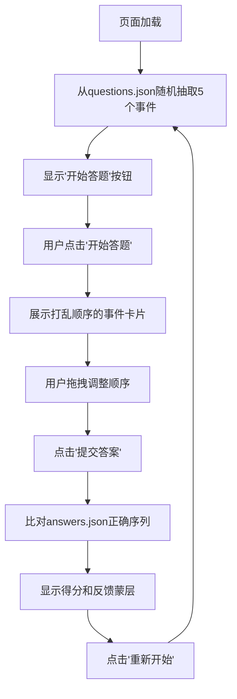

## 1. 产品概述

交互式历史时间轴拖拽排序应用，帮助网课老师快速制作可交互的历史教学工具，让学生通过拖拽事件卡片梳理朝代更替与重大事件的前后顺序。

- 核心价值：将枯燥的历史事件记忆转化为互动式学习体验，提升学生学习兴趣和记忆效果
- 目标用户：历史老师、学生、历史爱好者
- 核心场景：课堂互动练习、课后作业、自主复习

## 2. 核心功能

### 2.1 用户角色

| 角色 | 注册方式 | 核心权限 |
|------|----------|----------|
| 普通用户 | 无需注册 | 使用题目生成、拖拽排序、提交评分、查看历史得分功能 |

### 2.2 功能模块

1. **题目生成模块**：从JSON题库随机抽取5个历史事件，打乱顺序生成排序题
2. **拖拽答题模块**：展示可拖拽的事件卡片，支持上下拖拽调整顺序
3. **评分反馈模块**：比对用户答案与正确答案，显示得分和详细错误反馈
4. **状态管理模块**：使用Zustand存储当前题目、用户排序、得分历史

### 2.3 页面详情

| 页面名称 | 模块名称 | 功能描述 |
|----------|----------|----------|
| 主页面 | 题目生成区 | 页面加载后自动抽取题目，显示"开始答题"按钮 |
| 主页面 | 拖拽答题区 | 垂直展示打乱的事件卡片，支持react-beautiful-dnd拖拽排序 |
| 主页面 | 评分反馈区 | 提交后显示得分，正确卡片绿色边框+对勾，错误卡片红色边框+叉号及正确答案 |
| 主页面 | 操作按钮区 | "提交答案"、"重新开始"按钮 |

## 3. 核心流程

### 用户操作流程

1. 页面加载 → 自动从questions.json随机抽取5个历史事件
2. 点击"开始答题" → 展示打乱顺序的事件卡片
3. 用户拖拽卡片调整事件时间顺序
4. 点击"提交答案" → 系统比对用户排序与正确年份序列
5. 显示评分结果（0-100分）和详细反馈
6. 点击"重新开始" → 清空状态，重新随机抽取题目

## 4. 用户界面设计

### 4.1 设计风格

- **整体风格**：羊皮纸复古风格，营造历史感
- **主色调**：浅米色背景 #F5F0E8，深褐色标题栏 #3E2723
- **卡片样式**：背景 #FFF8E7，圆角12px，左侧5px时代色条
- **时代色条**：
  - 先秦 #8B4513
  - 秦汉 #B22222
  - 三国两晋 #DAA520
  - 唐宋 #1E90FF
  - 明清 #2E8B57
  - 近代 #9370DB
- **反馈颜色**：正确绿色 #4CAF50，错误红色 #F44336，满分金色 #FFD700
- **字体**：标题28px #FFD700，事件名加粗18px #3E2723，描述14px #6D4C41

### 4.2 页面设计概述

| 页面名称 | 模块名称 | UI元素 |
|----------|----------|--------|
| 主页面 | 顶部标题栏 | 高度60px，深褐色背景，金色"历史时间轴"文字 |
| 主页面 | 答题区域 | 居中800px宽度，垂直排列5张事件卡片 |
| 主页面 | 事件卡片 | 左侧时代色条，事件名加粗，描述两行截断，圆角12px |
| 主页面 | 拖拽反馈 | 拖拽时放大1.05倍+柔和阴影，0.2s平滑过渡 |
| 主页面 | 提交反馈 | 半透明蒙层0.3s fade-in，正确绿色边框+对勾，错误红色边框+叉号，下方显示正确答案 |
| 主页面 | 得分显示 | 0-100分，全对显示"满分！"金色提示，数字1.2倍弹性动画 |

### 4.3 响应式设计

- **桌面端**：答题区宽度800px，居中显示
- **移动端（<768px）**：答题区宽度95%，事件名字号16px，描述字号12px
- **触摸优化**：确保拖拽区域足够大，适合触屏操作

### 4.4 动画与交互细节

- 拖拽时卡片transform: scale(1.05) + box-shadow，transition: 0.2s ease-out
- 提交答案时蒙层opacity从0到1，transition: 0.3s ease-in
- 得分数字弹性动画：transform: scale(1.2) 后恢复，transition: cubic-bezier(0.68, -0.55, 0.265, 1.55)
- 卡片hover效果：轻微阴影加深
