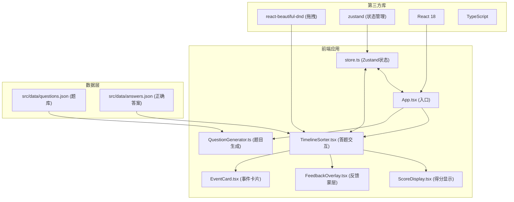
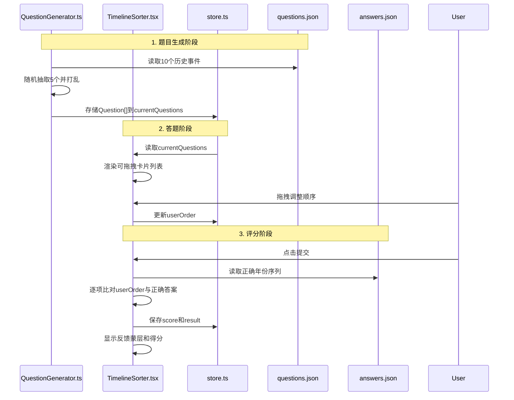

## 1. 架构设计



## 2. 技术描述

- **前端框架**：React 18 + TypeScript
- **构建工具**：Vite 5
- **状态管理**：Zustand 4
- **拖拽库**：react-beautiful-dnd 13
- **开发语言**：TypeScript (严格模式，ES2020)
- **样式方案**：CSS Modules / 内联样式（根据需求）
- **后端模拟**：JSON文件静态数据

### 依赖清单

| 包名 | 版本 | 用途 |
|------|------|------|
| react | ^18.2.0 | 前端框架 |
| react-dom | ^18.2.0 | React DOM渲染 |
| react-beautiful-dnd | ^13.1.1 | 拖拽排序功能 |
| zustand | ^4.5.0 | 状态管理 |
| typescript | ^5.4.0 | 类型安全 |
| vite | ^5.2.0 | 构建工具 |
| @vitejs/plugin-react | ^4.2.0 | Vite React插件 |

## 3. 数据流向图



## 4. 文件结构与职责

```
src/
├── types/
│   └── index.ts          # 类型定义：Question, Answer, StoreState
├── data/
│   ├── questions.json    # 10个历史事件题库
│   └── answers.json      # 正确答案对照表（年份序列）
├── QuestionGenerator.ts  # 题目生成模块入口
├── store.ts              # Zustand状态管理
├── TimelineSorter.tsx    # 答题交互核心组件
├── components/
│   ├── EventCard.tsx     # 事件卡片组件（React.memo优化）
│   ├── FeedbackOverlay.tsx  # 提交反馈蒙层
│   └── ScoreDisplay.tsx  # 得分显示组件
├── App.tsx               # 应用入口
├── main.tsx              # React挂载入口
└── index.css             # 全局样式
```

### 文件调用关系

1. **App.tsx** → 引入 QuestionGenerator、TimelineSorter、store
2. **QuestionGenerator.ts** → 读取 questions.json → 输出 Question[] → 存入 store
3. **TimelineSorter.tsx** → 从 store 读取题目 → 使用 react-beautiful-dnd → 渲染 EventCard → 提交时读取 answers.json → 更新 store
4. **store.ts** → 被 QuestionGenerator 和 TimelineSorter 双向调用
5. **EventCard.tsx** → 被 TimelineSorter 调用，使用 React.memo 避免重渲染
6. **FeedbackOverlay.tsx** → 被 TimelineSorter 调用，显示正确/错误状态

## 5. 类型定义

```typescript
// types/index.ts
export interface Question {
  id: string;
  year: number;
  event: string;
  description: string;
  era: '先秦' | '秦汉' | '三国两晋' | '唐宋' | '明清' | '近代';
}

export interface Answer {
  id: string;
  correctYear: number;
  correctPosition: number;
}

export interface CheckResult {
  id: string;
  isCorrect: boolean;
  userPosition: number;
  correctPosition: number;
  correctYear: number;
  correctEvent: string;
}

export interface StoreState {
  currentQuestions: Question[];
  userOrder: Question[];
  score: number | null;
  results: CheckResult[];
  isStarted: boolean;
  isSubmitted: boolean;
  scoreHistory: number[];
  
  setQuestions: (questions: Question[]) => void;
  setUserOrder: (order: Question[]) => void;
  setScore: (score: number) => void;
  setResults: (results: CheckResult[]) => void;
  setStarted: (started: boolean) => void;
  setSubmitted: (submitted: boolean) => void;
  reset: () => void;
}
```

## 6. 核心API/函数定义

### QuestionGenerator.ts

```typescript
// 加载JSON题库
function loadQuestions(): Promise<Question[]>

// 随机抽取n个事件并打乱
function generateQuestions(count?: number): Promise<Question[]>

// 洗牌算法
function shuffle<T>(array: T[]): T[]
```

### store.ts

```typescript
const useTimelineStore = create<StoreState>((set) => ({
  // state...
  setQuestions: (questions) => set({ currentQuestions: questions, userOrder: questions }),
  setUserOrder: (order) => set({ userOrder: order }),
  setScore: (score) => set({ score }),
  setResults: (results) => set({ results }),
  setStarted: (started) => set({ isStarted: started }),
  setSubmitted: (submitted) => set({ isSubmitted: submitted }),
  reset: () => set({ /* 重置所有状态 */ }),
}))
```

### TimelineSorter.tsx

```typescript
// 处理拖拽结束
function handleDragEnd(result: DropResult): void

// 提交答案并计算得分
function handleSubmit(): void

// 重新开始
function handleRestart(): void
```

## 7. 性能优化策略

1. **React.memo 优化 EventCard**：避免拖拽时不必要的重渲染
2. **拖拽性能**：react-beautiful-dnd 已内置虚拟化，确保50ms内响应
3. **状态更新优化**：使用 Zustand 的 selector 避免不必要的重渲染
4. **CSS 动画**：使用 transform 和 opacity 实现硬件加速动画
5. **防抖节流**：拖拽过程中避免频繁状态更新

## 8. 时代颜色映射

```typescript
export const ERA_COLORS: Record<string, string> = {
  '先秦': '#8B4513',
  '秦汉': '#B22222',
  '三国两晋': '#DAA520',
  '唐宋': '#1E90FF',
  '明清': '#2E8B57',
  '近代': '#9370DB',
};
```

## 9. 路径别名配置

vite.config.js 和 tsconfig.json 配置 `@` 别名指向 `src/` 目录，方便导入。
