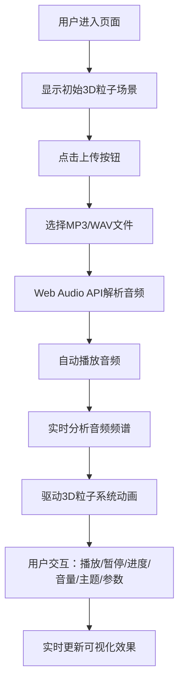

## 1. 产品概述

动态音乐可视化应用，用户上传音频文件后系统实时分析音频频谱，驱动3D粒子系统生成与音乐节奏同步的视觉动画。

- 核心功能：音频上传播放、实时频谱分析、3D粒子音乐可视化、主题切换、参数调节
- 目标用户：音乐爱好者、视觉设计师、需要音乐可视化效果的创作者
- 产品价值：将抽象的音乐转化为具象的视觉艺术，提供沉浸式的音乐体验

## 2. 核心功能

### 2.1 用户角色
无需角色区分，所有用户拥有完整功能权限。

### 2.2 功能模块
1. **音频控制模块**：文件上传、播放/暂停、进度控制、音量调节
2. **音频分析模块**：Web Audio API实时频谱分析
3. **3D粒子渲染模块**：Three.js粒子系统，20000+粒子同步音乐节奏运动
4. **主题切换模块**：霓虹、极光、熔岩三种预设视觉主题
5. **参数调节模块**：粒子数量、运动速度、颜色饱和度、发光强度实时调节
6. **性能监控模块**：帧率显示、动态渲染精度调节

### 2.3 页面详情
| 页面名称 | 模块名称 | 功能描述 |
|---------|---------|---------|
| 主页面 | 音频上传控制 | 支持MP3/WAV格式上传，自动播放并启动可视化 |
| 主页面 | 3D粒子场景 | Three.js渲染画布，粒子与音乐节奏同步运动 |
| 主页面 | 底部控制栏 | 播放/暂停、进度条、音量控制、主题切换 |
| 主页面 | 参数面板 | 粒子数量、速度倍率、颜色饱和度、发光强度调节 |
| 主页面 | 性能监控 | 右下角帧率实时显示 |

## 3. 核心流程

用户进入页面后，看到全屏黑色渐变背景和Three.js画布。点击上传按钮选择音频文件，系统自动播放并启动可视化动画。用户可通过底部控制栏控制播放、调节音量、切换主题，通过左上角参数面板调节可视化效果。

## 4. 用户界面设计

### 4.1 设计风格
- **主色调**：深紫蓝渐变背景（#0D0D1A到#1A1A33），品牌色#6C63FF
- **主题色**：霓虹（紫蓝粉）、极光（青绿）、熔岩（红橙黄）
- **按钮风格**：圆形按钮，上传按钮背景#6C63FF，hover变亮#7B73FF，0.2s过渡
- **字体**：现代无衬线字体，标签12px，值显示14px，帧率10px
- **布局**：全屏画布 + 底部80px控制栏 + 左上角悬浮参数面板
- **毛玻璃效果**：参数面板backdrop-filter: blur(8px)

### 4.2 页面设计概述
| 页面名称 | 模块名称 | UI元素 |
|---------|---------|---------|
| 主页面 | 3D画布 | 全屏Three.js渲染，透视相机60度FOV，抗锯齿开启 |
| 主页面 | 底部控制栏 | 半透明背景#000000CC，高度80px，圆角控件 |
| 主页面 | 进度条 | 宽度60%，高度4px，已播放部分#6C63FF，拖拽点直径12px带阴影 |
| 主页面 | 音量滑块 | 宽度80px，高度4px，滑块圆点直径10px白色 |
| 主页面 | 主题切换 | 三个彩色圆点（紫、青、橙），选中时外圈发光 |
| 主页面 | 参数面板 | 半透明毛玻璃，圆角12px，padding 16px，四个滑块 |
| 主页面 | 帧率显示 | 右下角白色10px半透明文字 |

### 4.3 响应式
桌面端优先，自适应不同屏幕尺寸，触摸设备支持滑块拖拽操作。

### 4.4 3D场景指引
- **环境**：黑色渐变背景，三种主题背景色切换（#0A0A1A/#001F3F/#1A0500）
- **灯光**：环境光#404060，点光源白色
- **相机**：透视相机，视野60度，距离原点合适位置
- **粒子系统**：BufferGeometry，20000粒子，初始分布在半径30的球体内
- **粒子属性**：位置（Z轴速度由低频控制）、Y轴偏移（中频控制）、大小（高频控制）、颜色（HSL插值）
- **动画效果**：主题切换1秒补间动画，粒子光晕/拖尾/发光效果
- **后处理**：根据粒子数量动态调整渲染精度，超过30000粒子降低精度
