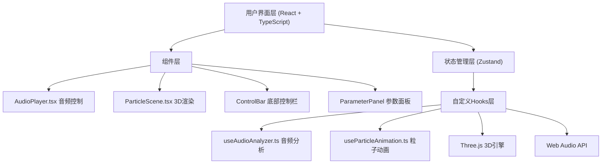

## 1. 架构设计



## 2. 技术描述
- **前端框架**：React@18 + TypeScript@5 + Vite@5
- **3D渲染**：Three.js@0.160
- **动画库**：GSAP@3.12（平滑过渡动画）
- **状态管理**：Zustand@4.4
- **构建工具**：Vite + @vitejs/plugin-react
- **音频处理**：原生Web Audio API
- **图标**：lucide-react

## 3. 核心数据结构与状态

### 3.1 Zustand Store
```typescript
interface AppState {
  // 音频状态
  audioFile: File | null;
  isPlaying: boolean;
  currentTime: number;
  duration: number;
  volume: number;
  
  // 可视化参数
  particleCount: number;
  speedMultiplier: number;
  colorSaturation: number;
  glowIntensity: number;
  currentTheme: 'neon' | 'aurora' | 'lava';
  
  // 音频数据
  frequencyData: Uint8Array;
  timeDomainData: Uint8Array;
  
  // 方法
  setAudioFile: (file: File) => void;
  setIsPlaying: (playing: boolean) => void;
  setCurrentTime: (time: number) => void;
  setDuration: (duration: number) => void;
  setVolume: (volume: number) => void;
  setParticleCount: (count: number) => void;
  setSpeedMultiplier: (multiplier: number) => void;
  setColorSaturation: (saturation: number) => void;
  setGlowIntensity: (intensity: number) => void;
  setCurrentTheme: (theme: 'neon' | 'aurora' | 'lava') => void;
  setAudioData: (freq: Uint8Array, time: Uint8Array) => void;
}
```

### 3.2 主题配置
```typescript
interface ThemeConfig {
  name: string;
  backgroundColor: string;
  colorRange: { low: [number, number]; mid: [number, number]; high: [number, number] };
  glowEffect: boolean;
  trailEffect: boolean;
  dotColor: string;
}
```

## 4. 性能优化策略

1. **Object Pool模式**：粒子对象池管理，避免频繁GC
2. **BufferGeometry**：使用BufferGeometry而非Geometry，减少Draw Call
3. **动态精度**：粒子数>30000时自动降低渲染精度（pixelRatio=0.75）
4. **requestAnimationFrame**：统一动画循环驱动
5. **TypedArray**：使用Uint8Array/Float32Array存储粒子数据
6. **离屏计算**：音频分析在单独的回调中处理，不阻塞渲染

## 5. 文件结构

```
d:\Pro\tasks\auto116\
├── package.json
├── vite.config.js
├── tsconfig.json
├── index.html
├── src/
│   ├── main.tsx
│   ├── App.tsx
│   ├── components/
│   │   ├── AudioPlayer.tsx
│   │   ├── ParticleScene.tsx
│   │   ├── ControlBar.tsx
│   │   └── ParameterPanel.tsx
│   ├── hooks/
│   │   ├── useAudioAnalyzer.ts
│   │   └── useParticleAnimation.ts
│   ├── store/
│   │   └── useAppStore.ts
│   ├── types/
│   │   └── index.ts
│   ├── utils/
│   │   ├── audioUtils.ts
│   │   └── colorUtils.ts
│   └── styles/
│       └── index.css
```

## 6. 关键技术实现点

### 6.1 音频分析
- AnalyserNode FFT size = 256
- frequencyData: Uint8Array(128)
- 频段划分：低频(0-100Hz)、中频(200-2000Hz)、高频(2000-20000Hz)
- 每帧requestAnimationFrame中更新数据

### 6.2 粒子系统
- BufferGeometry存储positions、colors、sizes
- 初始随机分布在半径30的球体内（球坐标系转换）
- 每个粒子附加随机相位偏移
- 每帧更新：位置（Z轴低频驱动）、Y偏移（中频驱动）、大小（高频驱动）、颜色（频段映射HSL）

### 6.3 颜色映射
- 低频(20-250Hz): HSL 0-30度（红到橙）
- 中频(250-2000Hz): HSL 120-240度（绿到蓝）
- 高频(2000-20000Hz): HSL 270-330度（紫到粉）
- HSL插值实现平滑过渡

### 6.4 主题切换
- GSAP tween动画，1秒过渡
- 背景色、粒子颜色范围、大小范围同时补间
- 光晕、拖尾等特效开关切换

### 6.5 性能阈值
- 粒子数20000: 60FPS
- 粒子数30000: ≥45FPS，pixelRatio=0.75
- 粒子数50000: ≥30FPS，pixelRatio=0.5
- 音频延迟≤50ms
- 首屏加载≤3秒
