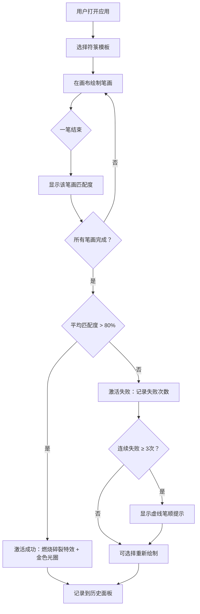

## 1. 产品概述

符箓绘灵——一款模拟古代符箓绘制与激活的互动应用，让玩家在浏览器中用鼠标绘制符文，系统根据笔画顺序和形状相似度判断是否激活成功，并触发华丽的视觉特效。目标用户为对中国传统文化和互动体验感兴趣的休闲玩家。

## 2. 核心功能

### 2.1 功能模块

1. **主画布页面**：符箓绘制画布、实时笔迹渲染、笔画匹配反馈、激活特效展示
2. **符箓选择面板**：5种符箓模板选择、模板预览
3. **历史记录面板**：最近10次绘制记录、匹配结果展示
4. **操作控制**：清空画布、重绘按钮

### 2.2 页面详情

| 页面名称 | 模块名称 | 功能描述 |
|---------|---------|---------|
| 主画布页面 | 符箓绘制区 | 中央Canvas画布，用户鼠标绘制符文，实时显示金色拖尾轨迹（线宽8px，颜色#FFD700，30帧半透明拖尾） |
| 主画布页面 | 笔画匹配 | 每笔结束后与模板对应笔画进行形状相似度匹配（关键点欧氏距离+方向角差异），画布左下角显示匹配度百分比（16px，红#FF4500到绿#00FF00渐变） |
| 主画布页面 | 激活判定 | 所有笔画匹配完成，平均匹配度>80%激活成功，画布中央显示"符箓激活！"（36px黄色，0.5s弹跳动画） |
| 主画布页面 | 激活特效 | 激活成功时符箓燃烧碎裂（200-400金色粒子碎片，持续3秒），画布周围闪烁金色光圈（1.5s，#FFD700到透明渐变） |
| 主画布页面 | 失败处理 | 连续3次激活失败，自动显示模板虚线提示笔顺（透明度0.3，#FF6347） |
| 右侧面板 | 符箓选择 | 5种符箓模板选择，每种有不同形状和复杂度，选中时背景高亮#6B4A3A（过渡0.3s ease） |
| 左侧面板 | 历史记录 | 最近10次绘制记录列表，显示符箓名称、日期、匹配结果（成功绿点#00FF00，失败红点#FF0000，直径8px） |
| 主画布页面 | 操作控制 | 圆形铜色渐变按钮（#CD853F→#8B6914），hover亮度+20%，active缩小95% |

## 3. 核心流程

用户打开应用 → 从右侧面板选择符箓模板 → 在中央画布用鼠标绘制笔画 → 每笔结束后系统显示匹配度 → 所有笔画完成后判断激活结果 → 成功则触发燃烧碎裂特效+金色光圈 / 失败则记录失败次数 → 连续3次失败则显示虚线笔顺提示 → 记录结果到左侧历史面板

## 4. 界面设计

### 4.1 设计风格

- **主题**：深色古风，仿宣纸米黄色纹理背景（#F5E6C8，CSS radial-gradient模拟纸纹）
- **主画布**：深灰色背景（#2C2C2C），仿古铜色装饰边框（#8B7355，4px，圆角12px）
- **面板**：半透明暗红色（#4A2C2A，透明度0.9，圆角8px）
- **字体**：隶书风格（font-family: 'Ma Shan Zheng', serif），字号14px，颜色#D4B48C
- **按钮**：圆形铜色径向渐变（#CD853F→#8B6914），hover亮度+20%，active缩小95%
- **笔迹**：金色#FFD700，线宽8px，30帧半透明拖尾
- **特效**：金色粒子系统（200-400碎片）、金色光圈闪烁

### 4.2 页面设计概览

| 页面名称 | 模块名称 | UI元素 |
|---------|---------|--------|
| 主画布页面 | 绘制区域 | 中央70%宽度Canvas，深灰色背景#2C2C2C，古铜边框#8B7355（4px圆角12px），金色拖尾笔迹 |
| 主画布页面 | 匹配度显示 | 左下角数字16px，颜色红#FF4500→绿#00FF00渐变 |
| 主画布页面 | 激活成功文字 | 中央"符箓激活！"36px黄色#FFD700，0.5s scale弹跳动画 |
| 主画布页面 | 激活特效 | 金色粒子爆发+画布周围金色光圈1.5s渐隐 |
| 主画布页面 | 失败提示 | 虚线笔顺提示，透明度0.3，颜色#FF6347 |
| 左侧面板 | 历史记录 | 宽度200px，暗红色半透明，符箓名/日期/结果点（绿/红8px） |
| 右侧面板 | 符箓选择 | 宽度180px，暗红色半透明，5个模板图标，选中高亮#6B4A3A |
| 主画布页面 | 操作按钮 | 圆形铜色渐变按钮，hover/active效果 |

### 4.3 响应式适配

- 桌面端：三栏布局（左200px历史面板 + 中间70%画布 + 右180px选择面板）
- 移动端（<768px）：左右面板折叠为顶部/底部滑动抽屉，画布占满剩余空间

### 4.4 性能约束

- 画布帧率维持60FPS
- 粒子系统数量≤400，生命周期≤5秒
- 主流浏览器（Chrome/Firefox/Edge）无卡顿
