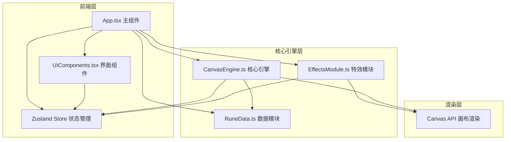

## 1. 架构设计



### 数据流向

1. **用户交互**：鼠标事件 → CanvasEngine → 生成笔迹坐标数组 → Store更新
2. **笔画匹配**：CanvasEngine计算笔画特征量 → 与RuneData模板对比 → 输出匹配分数和激活状态 → Store更新
3. **特效触发**：Store中激活状态变化 → EffectsModule监听 → Canvas逐帧绘制粒子/光晕
4. **UI反馈**：Store状态变化 → UIComponents重新渲染 → 显示匹配度/结果/历史

### 文件调用关系

- `App.tsx` → 整合 `CanvasEngine`、`RuneData`、`EffectsModule`，管理UI状态
- `CanvasEngine.ts` → 引用 `RuneData.ts` 获取模板数据
- `EffectsModule.ts` → 独立粒子系统和光晕渲染，监听激活事件
- `UIComponents.tsx` → 从Store读取状态，渲染选择面板/历史/按钮
- `RuneData.ts` → 纯数据模块，无外部依赖

## 2. 技术说明

- **前端框架**：React@18 + TypeScript（严格模式）+ Vite
- **样式方案**：Tailwind CSS + 自定义CSS（古风主题、渐变、动画）
- **状态管理**：Zustand
- **画布渲染**：Canvas 2D API（笔迹、粒子、光晕）
- **字体**：Google Fonts - Ma Shan Zheng（隶书风格）
- **构建工具**：Vite + @vitejs/plugin-react
- **无后端**：纯前端应用，数据存储在内存中

## 3. 路由定义

| 路由 | 用途 |
|------|------|
| / | 主页面，包含画布、选择面板、历史面板 |

单页面应用，无路由切换。

## 4. API定义

无后端API，所有数据和逻辑在前端处理。

### 4.1 核心数据类型

```typescript
interface Point {
  x: number;
  y: number;
  timestamp: number;
}

interface Stroke {
  points: Point[];
  direction: number[];
}

interface RuneTemplate {
  id: string;
  name: string;
  strokes: Stroke[];
  keyPoints: Point[][];
  complexity: number;
  description: string;
}

interface MatchResult {
  strokeIndex: number;
  score: number;
  activated: boolean;
}

interface HistoryRecord {
  id: string;
  runeName: string;
  date: string;
  success: boolean;
  matchScore: number;
}

interface AppState {
  selectedRuneId: string | null;
  currentStrokes: Stroke[];
  matchResults: MatchResult[];
  isActivated: boolean;
  consecutiveFailures: number;
  showHint: boolean;
  history: HistoryRecord[];
  isDrawing: boolean;
  activationAnimation: boolean;
}
```

## 5. 模块详细设计

### 5.1 CanvasEngine.ts

职责：
- 接收鼠标事件（mousedown/mousemove/mouseup）
- 生成笔迹坐标数组（带时间戳的Point序列）
- 维护30帧拖尾缓冲区
- 计算笔画特征量（关键点、方向角序列）
- 与RuneData模板进行相似度匹配（关键点欧氏距离 + 方向角差异加权）
- 输出每笔匹配分数和整体激活状态

### 5.2 RuneData.ts

职责：
- 预存5种符箓模板数据
- 每个模板包含：笔画顺序数组、每个笔画的关键点坐标
- 提供 `getRuneById(id)` 方法
- 提供 `getAllRunes()` 方法

5种符箓：
1. **镇魂符** - 简单（3笔画，直线为主）
2. **净心符** - 较简（4笔画，含弧线）
3. **驱邪符** - 中等（5笔画，含折线）
4. **招财符** - 较难（6笔画，含曲线和折线）
5. **天罡符** - 困难（8笔画，复杂组合）

### 5.3 EffectsModule.ts

职责：
- 监听激活状态变化
- 激活成功时触发粒子系统（200-400金色碎片，3秒持续）
- 粒子属性：位置、速度、加速度（重力）、生命周期、颜色、大小
- 绘制画布周围金色光圈（1.5s渐隐动画）
- 每帧更新和渲染所有活跃粒子
- 管理粒子生命周期（最大5秒）

### 5.4 App.tsx

职责：
- 整合CanvasEngine、RuneData、EffectsModule
- 管理Zustand Store
- 处理Canvas引用和渲染循环（requestAnimationFrame）
- 响应式布局逻辑

### 5.5 UIComponents.tsx

职责：
- RuneSelectPanel：符箓选择面板，5个模板卡片
- HistoryPanel：历史记录面板，最近10条记录
- ActionButtons：清空画布、重绘按钮
- MatchScoreDisplay：匹配度显示组件
- ActivationText：激活成功文字动画
