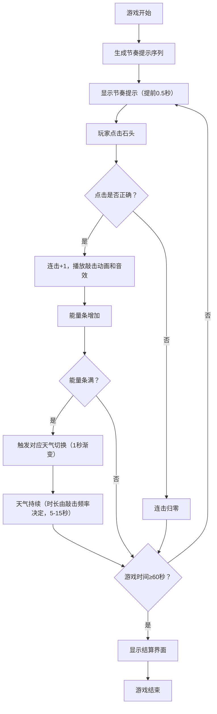

## 1. 产品概述

部落天气仪式是一款基于节奏的互动游戏，玩家扮演原始部落巫师，通过敲击不同材质的石头召唤天气变化。游戏解决了传统节奏游戏缺乏动态环境反馈和自然元素联动的问题，让玩家的敲击节奏直接影响屏幕上的自然场景。

- 核心玩法：节奏敲击与天气系统联动，玩家根据节奏提示敲击对应石头积累能量触发天气变化
- 目标用户：休闲游戏玩家、音乐节奏爱好者、对部落文化和自然元素感兴趣的用户
- 产品价值：创新的节奏+自然模拟玩法，沉浸式的部落视觉风格，动态天气反馈带来独特的游戏体验

## 2. 核心功能

### 2.1 功能模块

1. **主游戏界面**：天气场景画布、石头交互区域、能量条、连击显示、计时器
2. **石头交互系统**：三块不同材质石头、点击反馈动画、音效播放、节奏提示光圈
3. **天气渲染引擎**：晴天（太阳光芒）、雨天（雨滴粒子+水花）、雷暴（闪电+暴雨）
4. **节奏评分系统**：连击计数、节奏提示生成、特效触发、得分统计
5. **游戏状态管理**：游戏计时、天气持续时间、能量条进度、最终结算

### 2.2 页面详情

| 页面名称 | 模块名称 | 功能描述 |
|-----------|-------------|---------------------|
| 游戏主界面 | 天气场景画布 | 60%宽度区域，渲染晴/雨/雷暴三种动态天气效果，支持1秒渐变过渡 |
| 游戏主界面 | 石头交互区 | 高度120px区域，横向排列三块石头，间距40px，处理点击和节奏提示 |
| 游戏主界面 | 能量进度条 | 总长300px，三段式渐变（晴#FFD700→雨#4A90D9→雷暴#8B0000） |
| 游戏主界面 | 状态显示区 | 右上角连击数（24px白色）、倒计时显示 |
| 游戏主界面 | 图腾边框 | 手绘风格棕色图腾边框，四角圆形太阳符号 |
| 结算界面 | 统计面板 | 60秒游戏结束后显示总得分、最高连击、天气触发次数统计 |

## 3. 核心流程

## 4. 用户界面设计

### 4.1 设计风格
- **整体风格**：原始部落风格，粗犷质朴，自然元素丰富
- **主色调**：暗黄色渐变背景（#3E2C1A到#5C4033），深棕色（#2B1B17）石头区域
- **强调色**：花岗岩#8B7355、玄武岩#3E2723、石英#E8D5B7
- **天气色**：晴天#87CEEB、雨天#4A4A4A、雷暴#1A0033
- **边框**：棕色图腾线条#6D4C41，线宽2px，点状/锯齿状装饰
- **字体**：采用具有部落风格的装饰性字体，搭配清晰易读的正文字体
- **按钮**：石头质感，悬停时颜色加深0.1s ease-out过渡

### 4.2 页面设计概述

| 页面名称 | 模块名称 | UI元素 |
|-----------|-------------|-------------|
| 游戏主界面 | 天气画布 | Canvas渲染，动态粒子系统，太阳旋转光芒，雨滴/闪电效果 |
| 游戏主界面 | 石头区域 | 三块不同颜色石头，点击时白色放射状裂纹（0.15秒），每5连击金色光晕 |
| 游戏主界面 | 节奏提示 | 半透明光圈脉冲放大（30px→50px，0.5秒），颜色匹配对应石头 |
| 游戏主界面 | 能量条 | 三段式渐变色块，平滑填充动画 |
| 游戏主界面 | 状态文字 | 白色24px连击数，右上角定位 |
| 结算界面 | 统计面板 | 半透明部落风格边框，显示得分、连击、天气数据 |

### 4.3 响应式设计
- **桌面端**：天气画布60%宽度，石头区域高度120px横向排列
- **移动端（<768px）**：天气画布50%宽度，石头区域高度150px，确保触控区域充足
- **性能**：粒子数量控制在500以内，渲染帧率稳定在45fps以上
- **触控优化**：石头区域足够大，支持触摸点击

### 4.4 动画规范
- 石头敲击：白色放射状裂纹，0.15秒消失
- 节奏提示：光圈脉冲放大，30px→50px，持续0.5秒
- 连击特效：金色光晕扩散，半径10px→100px，透明度0.8→0，持续0.8秒
- 场景切换：1秒渐变过渡
- 按钮悬停：颜色加深，0.1s ease-out
- 天气粒子：雨滴下落200-400px/s随机，雷暴时速度翻倍
- 太阳光芒：12条射线，0.5圈/秒旋转
