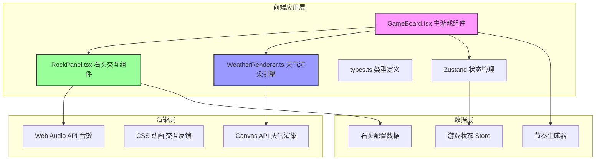

## 1. 架构设计



## 2. 技术描述

### 2.1 核心技术栈
- **前端框架**: React 18 + TypeScript 5
- **构建工具**: Vite 5
- **状态管理**: Zustand 4
- **渲染技术**: Canvas API（天气粒子）+ CSS3（UI动画）
- **音频**: Web Audio API（程序化音效生成）

### 2.2 依赖包
- react: ^18.2.0
- react-dom: ^18.2.0
- zustand: ^4.5.0
- typescript: ^5.3.0
- vite: ^5.0.0
- @vitejs/plugin-react: ^4.2.0

## 3. 文件结构

```
auto118/
├── index.html                 # 入口HTML
├── package.json              # 项目依赖
├── vite.config.js            # Vite配置
├── tsconfig.json             # TypeScript配置
└── src/
    ├── main.tsx              # 应用入口
    ├── App.tsx               # 根组件
    ├── types.ts              # 类型定义
    ├── GameBoard.tsx         # 主游戏组件
    ├── RockPanel.tsx         # 石头交互组件
    ├── WeatherRenderer.ts    # 天气渲染引擎
    ├── store/
    │   └── useGameStore.ts   # Zustand状态管理
    └── styles/
        └── index.css         # 全局样式
```

## 4. 核心数据模型

### 4.1 类型定义 (types.ts)

```typescript
export type WeatherType = 'sunny' | 'rain' | 'thunderstorm';
export type RockType = 'granite' | 'basalt' | 'quartz';

export interface RockConfig {
  id: RockType;
  name: string;
  color: string;
  weather: WeatherType;
  frequency: 'low' | 'mid' | 'high';
}

export interface GameState {
  currentWeather: WeatherType;
  combo: number;
  maxCombo: number;
  energy: number;
  timeRemaining: number;
  score: number;
  isPlaying: boolean;
  isGameOver: boolean;
  weatherDuration: number;
  rockHits: Record<RockType, number>;
  weatherTriggers: Record<WeatherType, number>;
}

export interface Particle {
  x: number;
  y: number;
  vx: number;
  vy: number;
  life: number;
  maxLife: number;
  size: number;
  opacity: number;
}

export interface RhythmPrompt {
  rockId: RockType;
  startTime: number;
  duration: number;
  isActive: boolean;
}

export interface ClickEffect {
  id: string;
  rockId: RockType;
  type: 'crack' | 'golden';
  startTime: number;
  duration: number;
}
```

### 4.2 Zustand Store (useGameStore.ts)

```typescript
import { create } from 'zustand';
import { GameState, WeatherType, RockType } from '../types';

interface GameActions {
  startGame: () => void;
  endGame: () => void;
  resetGame: () => void;
  handleRockClick: (rockId: RockType, isCorrect: boolean) => void;
  setWeather: (weather: WeatherType) => void;
  addEnergy: (amount: number) => void;
  tick: () => void;
  setWeatherDuration: (duration: number) => void;
}

export const useGameStore = create<GameState & GameActions>((set, get) => ({
  // 初始状态
  currentWeather: 'sunny',
  combo: 0,
  maxCombo: 0,
  energy: 0,
  timeRemaining: 60,
  score: 0,
  isPlaying: false,
  isGameOver: false,
  weatherDuration: 5,
  rockHits: { granite: 0, basalt: 0, quartz: 0 },
  weatherTriggers: { sunny: 0, rain: 0, thunderstorm: 0 },
  
  // Actions 实现
  startGame: () => set({ isPlaying: true, isGameOver: false }),
  endGame: () => set({ isPlaying: false, isGameOver: true }),
  resetGame: () => set({ /* 重置所有状态 */ }),
  handleRockClick: (rockId, isCorrect) => { /* 处理点击逻辑 */ },
  setWeather: (weather) => set({ currentWeather: weather }),
  addEnergy: (amount) => set({ energy: Math.min(100, get().energy + amount) }),
  tick: () => { /* 游戏时钟更新 */ },
  setWeatherDuration: (duration) => set({ weatherDuration: Math.min(15, duration) }),
}));
```

## 5. 核心模块设计

### 5.1 WeatherRenderer.ts 天气渲染引擎

纯函数模块，接收天气类型和粒子参数，返回Canvas绘制指令。

```typescript
export interface DrawCommand {
  type: 'background' | 'particle' | 'shape' | 'text';
  data: Record<string, any>;
}

export interface RenderContext {
  width: number;
  height: number;
  time: number;
  particles: Particle[];
}

// 晴天渲染
export const renderSunny = (ctx: RenderContext): DrawCommand[] => {
  const commands: DrawCommand[] = [];
  
  // 背景渐变
  commands.push({
    type: 'background',
    data: { gradient: ['#87CEEB', '#B0E0E6'] }
  });
  
  // 太阳光芒（12条旋转射线）
  const sunX = ctx.width * 0.2;
  const sunY = ctx.height * 0.2;
  const rotation = (ctx.time * 0.5) % (Math.PI * 2);
  
  for (let i = 0; i < 12; i++) {
    const angle = rotation + (i * Math.PI * 2) / 12;
    commands.push({
      type: 'shape',
      data: {
        shape: 'line',
        x1: sunX,
        y1: sunY,
        x2: sunX + Math.cos(angle) * 80,
        y2: sunY + Math.sin(angle) * 80,
        color: '#FFD700',
        lineWidth: 3,
        opacity: 0.8
      }
    });
  }
  
  // 太阳本体
  commands.push({
    type: 'shape',
    data: {
      shape: 'circle',
      x: sunX,
      y: sunY,
      radius: 40,
      fill: '#FFD700'
    }
  });
  
  return commands;
};

// 雨天渲染
export const renderRain = (ctx: RenderContext): DrawCommand[] => { /* ... */ };

// 雷暴渲染
export const renderThunderstorm = (ctx: RenderContext): DrawCommand[] => { /* ... */ };

// 主渲染入口
export const renderWeather = (
  weather: WeatherType,
  ctx: RenderContext
): DrawCommand[] => {
  switch (weather) {
    case 'sunny': return renderSunny(ctx);
    case 'rain': return renderRain(ctx);
    case 'thunderstorm': return renderThunderstorm(ctx);
  }
};

// 执行绘制指令
export const executeDrawCommands = (
  canvasCtx: CanvasRenderingContext2D,
  commands: DrawCommand[]
) => {
  commands.forEach(cmd => {
    switch (cmd.type) {
      case 'background':
        // 绘制背景渐变
        break;
      case 'shape':
        // 绘制形状
        break;
      // ...其他类型
    }
  });
};
```

### 5.2 RockPanel.tsx 石头交互组件

负责渲染三块石头，处理点击事件，播放动画和音效。

### 5.3 GameBoard.tsx 主游戏组件

协调各子组件，管理游戏循环，处理节奏生成，控制天气切换。

## 6. 性能优化方案

### 6.1 Canvas渲染优化
- 使用离屏Canvas预渲染静态元素
- 粒子对象池复用，避免频繁GC
- 限制最大粒子数≤500
- 使用requestAnimationFrame批量绘制

### 6.2 React渲染优化
- 使用React.memo包装子组件
- Zustand状态分片选择，避免不必要重渲染
- 动画使用CSS transform和opacity，触发GPU加速

### 6.3 内存管理
- 粒子系统对象池复用
- 及时清理过期的点击效果和节奏提示
- 组件卸载时取消所有定时器和动画帧

## 7. 游戏循环流程

```
requestAnimationFrame
    ↓
更新游戏时钟（时间递减、天气持续时间检查）
    ↓
更新粒子系统（位置、生命周期）
    ↓
检查节奏提示队列（显示/隐藏）
    ↓
执行Canvas绘制（天气渲染引擎）
    ↓
更新UI状态（连击、能量条、计时器）
    ↓
下一帧
```
