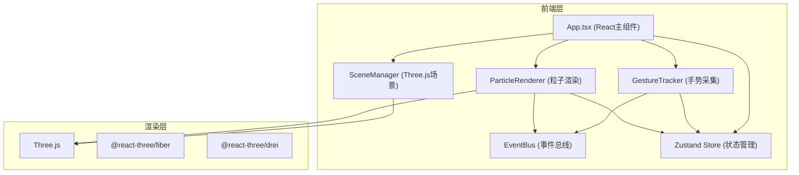

## 1. 架构设计



## 2. 技术说明
- 前端：React@18 + TypeScript + Vite
- 3D渲染：Three.js + @react-three/fiber + @react-three/drei
- 状态管理：Zustand
- 初始化工具：vite-init（react-ts模板）
- 后端：无
- 数据库：无

## 3. 模块通信设计

### 3.1 事件总线 (EventBus)
GestureTracker和ParticleRenderer通过EventBus通信，解耦两个模块：

| 事件名 | 发布者 | 订阅者 | 数据 |
|--------|--------|--------|------|
| `gesture:start` | GestureTracker | ParticleRenderer, App | 起始3D坐标 |
| `gesture:move` | GestureTracker | App | 当前3D坐标 |
| `gesture:end` | GestureTracker | ParticleRenderer, App | 完整轨迹点数组+特征数据 |
| `trajectory:features` | GestureTracker | App, ParticleRenderer | 特征数据(曲率/长度/方向) |

### 3.2 Zustand Store
| 状态字段 | 类型 | 说明 |
|----------|------|------|
| `trajectories` | TrajectoryData[] | 所有轨迹数据 |
| `activeTrajectoryId` | string \| null | 当前正在绘制的轨迹ID |
| `isDrawing` | boolean | 是否正在绘制 |
| `curvatureThreshold` | number | 曲率阈值(0.1-5.0) |
| `panelCollapsed` | boolean | 特征面板是否折叠 |

## 4. 核心模块设计

### 4.1 GestureTracker
- 监听mousedown/mousemove/mouseup事件
- 使用Raycaster将2D屏幕坐标转换为3D世界坐标（投射到地面平面y=0）
- 存储轨迹点序列，计算实时特征：
  - 曲率：三点法计算离散曲率
  - 长度：相邻点距离累加
  - 方向：相邻点向量角度

### 4.2 ParticleRenderer
- 接收轨迹点数据和特征数据
- 为每条轨迹生成200-500个粒子
- 粒子属性：位置、速度(0.5-2单位/秒)、大小(2-5px)、颜色
- 每帧更新粒子位置：沿轨迹路径移动，到达终点后返回起点
- 颜色插值：根据当前位置曲率和阈值，在#4FC3F7和#E53935之间插值
- 超过5条轨迹时，最旧轨迹粒子1秒淡出后移除

### 4.3 SceneManager
- 初始化Three.js场景
- 设置透视相机，位置(0, 30, 50)
- 添加环境光和方向光
- 创建半透明地面网格（GridHelper，颜色#45A29E，透明度0.2）
- 管理绘制平面和轨迹线渲染
- 提供清除所有对象的方法

## 5. 文件结构

```
├── package.json
├── vite.config.js
├── tsconfig.json
├── index.html
└── src/
    ├── main.tsx
    ├── App.tsx
    ├── GestureTracker.ts
    ├── ParticleRenderer.ts
    ├── SceneManager.ts
    ├── EventBus.ts
    ├── store.ts
    └── types.ts
```
