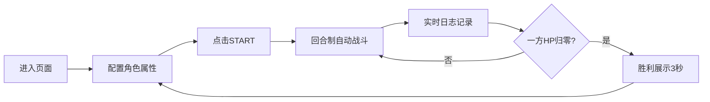

## 1. 产品概述
2D决斗场模拟器是一款基于Canvas 2D的回合制战斗可视化工具，允许用户自定义剑士和法师两个角色的属性与技能，在竞技场中观察自动战斗过程与策略胜负结果。
- 主要用途：策略模拟、战斗可视化、角色属性调优
- 目标用户：游戏爱好者、策略研究者、前端动效演示

## 2. 核心特性

### 2.1 功能模块
1. **竞技场舞台**：800x600 Canvas渲染舞台，含网格地面、角色站位、战斗动画与粒子效果
2. **角色控制面板**：双栏配置剑士与法师的生命值、攻击力、技能选择
3. **自动战斗系统**：回合制战斗引擎，剑士近战攻击、法师远程攻击，含技能特效
4. **战斗日志面板**：实时记录每回合行动，虚拟列表渲染，颜色高亮区分行为类型
5. **胜利展示**：战斗结束后胜利者放大旋转动画，闪烁胜利文案

### 2.2 页面详情
| 页面名称 | 模块名称 | 功能描述 |
|-----------|-------------|---------------------|
| 主页面 | 竞技场舞台 | 800x600 Canvas，深灰背景，浅灰双线网格（40px间距），左右角色站位带脉动光环 |
| 主页面 | 控制面板 | 左栏剑士配置（HP 100-300，ATK 10-50，技能：重斩/旋风斩/格挡），右栏法师配置（HP 80-200，ATK 20-60，技能：火球/冰锥/护盾），START按钮 |
| 主页面 | 战斗日志 | 280px宽度，实时记录回合行动，攻击红/防御绿/技能紫高亮，最多30条，虚拟列表渲染20条可见 |

## 3. 核心流程
用户配置角色属性与技能 → 点击START开始战斗 → 回合制自动战斗（剑士1.5s攻击间隔，法师2s攻击间隔含0.5s蓄力+0.8s弹丸飞行）→ 实时日志记录 → 一方HP归零 → 胜利展示（3秒）→ 自动回到配置状态

## 4. 用户界面设计
### 4.1 设计风格
- **主色调**：深灰#2C2C2C、#1E1E1E、#252525，剑士蓝#00BFFF，法师红#FF4080
- **风格定位**：暗色赛博朋克，霓虹色悬停效果，磨砂玻璃面板，扫描线动效
- **按钮样式**：START按钮渐变色#4CAF50→#388E3C，圆角8px，悬停亮度+20%，按压内阴影
- **滑块样式**：轨道深灰#444，手柄对应角色蓝/红色，实时数值显示14px白色字体
- **动画**：角色光环0.5s脉动循环，攻击前冲/剑光弧线/弹丸飞行/粒子爆炸，扫描线0.8Hz横移
- **字体**：14px配置数值，12px日志文字，白色#FFFFFF/#E0E0E0

### 4.2 页面设计概览
| 页面名称 | 模块名称 | UI元素 |
|-----------|-------------|-------------|
| 主页面 | 竞技场舞台 | Canvas 800x600、网格地面、角色光环脉动、攻击动画、粒子特效、扫描线 |
| 主页面 | 控制面板 | 双栏布局、滑块组件、技能下拉、技能图标装饰、START按钮、霓虹悬停 |
| 主页面 | 战斗日志 | 磨砂玻璃效果、虚拟列表、颜色高亮条目、行内图标、渐隐旧条目 |

### 4.3 响应性
桌面端优先，固定布局1280px+宽度，舞台居中展示。

### 4.4 性能要求
- 帧率≥50FPS
- 粒子数≤100同时绘制
- 日志虚拟列表仅渲染20条可见
- 所有交互过渡0.2s平滑动画
