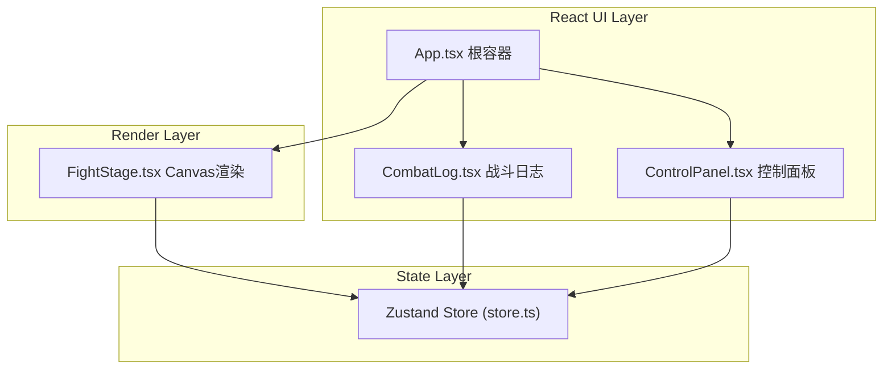
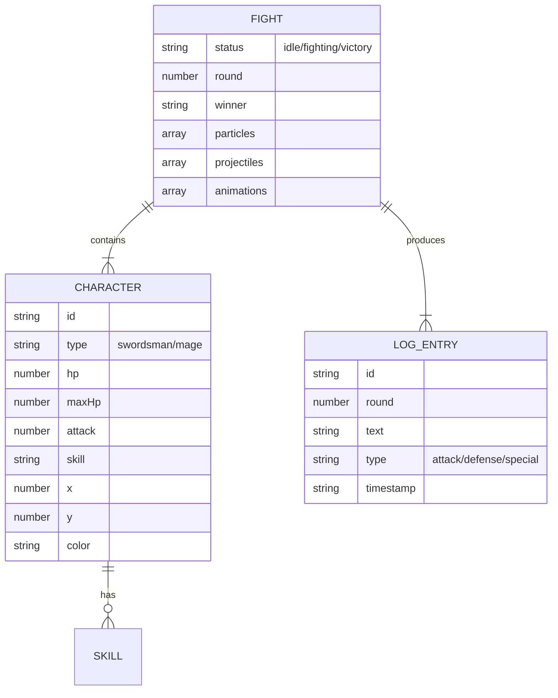

## 1. 架构设计
纯前端单页应用，React组件层负责UI与交互，Zustand管理全局战斗状态，Canvas 2D独立渲染循环驱动动画绘制。



## 2. 技术说明
- **前端框架**：React 18 + TypeScript
- **构建工具**：Vite + @vitejs/plugin-react
- **状态管理**：Zustand
- **渲染引擎**：Canvas 2D API
- **工具库**：uuid
- **样式方案**：内联样式 + CSS Modules

## 3. 路由定义
| 路由 | 用途 |
|-------|---------|
| / | 主页面，包含完整模拟器界面 |

## 4. 数据模型

### 4.1 数据模型定义


### 4.2 Zustand Store结构
- `swordsman`: { hp, maxHp, attack, skill, x, y }
- `mage`: { hp, maxHp, attack, skill, x, y }
- `fightStatus`: 'idle' | 'fighting' | 'victory'
- `round`: number
- `winner`: 'swordsman' | 'mage' | null
- `logs`: LogEntry[] (最多30条)
- Actions: `updateCharacter()`, `startFight()`, `recordLog()`, `resetFight()`

## 5. 文件结构
```
auto12/
├── package.json
├── vite.config.js
├── tsconfig.json
├── index.html
└── src/
    ├── App.tsx          # 根组件布局
    ├── FightStage.tsx   # Canvas战斗舞台渲染
    ├── ControlPanel.tsx # 角色配置面板
    ├── CombatLog.tsx    # 战斗日志（虚拟列表）
    └── store.ts         # Zustand全局状态
```
