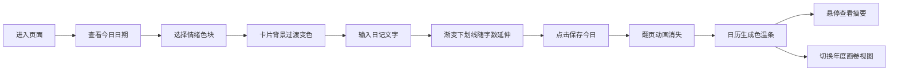

## 1. 产品概述

情绪色温日记是一款以色彩记录情绪的极简日记应用，用户每天选择代表心情的颜色并书写文字，系统自动生成抽象色温条，随时间推移在日历上形成连续的情绪色彩图谱。

- 核心价值：用视觉化的色彩语言记录和回顾情绪变化，让抽象的心情变得可感知、可追溯
- 目标用户：喜欢极简美学、注重内心觉察、追求仪式感的年轻群体

## 2. 核心功能

### 2.1 功能模块

1. **日记卡片**：今日日期展示、12色色块选择、多行文本输入、保存按钮及翻页动画
2. **日历面板**：月视图展示、色温条标记、Tooltip摘要、年度色温画卷切换
3. **状态管理**：记录列表、当前选中色块、输入文字、视图模式

### 2.3 页面详情

| 页面名称 | 模块名称 | 功能描述 |
|---------|---------|---------|
| 主页面 | 日记卡片 | 竖向A4尺寸卡片，白色背景圆角16px，展示日期、12个圆形色块、文本输入区、保存按钮 |
| 主页面 | 日历面板 | 月视图日历，40x40px日期格，已记录日期显示色温条，支持年度画卷切换 |
| 主页面 | 年度色温画卷 | 12行x31列网格，18x18px格子，用记录主色填充形成完整色温画卷 |

## 3. 核心流程

用户进入页面 → 查看今日日期 → 点击选择情绪色块（卡片背景过渡变色、色块脉动光晕） → 输入日记文字（渐变荧光下划线随字数延伸） → 点击"保存今日"（翻页动画） → 日历对应日期出现色温条 → 悬停查看摘要 / 切换年度画卷视图

## 4. 用户界面设计

### 4.1 设计风格

- **主色调**：暖灰底色 #F5F5F0，卡片白色 #FFFFFF，文字深灰 #333333 / #555555
- **情绪色环**：12色从冷蓝 #4A90D9 → 暖橙 #FF8C00 → 冷紫 #9B59B6，按色相环排列
- **按钮风格**：深灰底白字，圆角20px，hover上浮2px
- **字体**：现代无衬线字体，标题27px字重200，正文16px
- **布局风格**：桌面端卡片+日历并排，平板上下排列，移动端底部抽屉
- **动效风格**：所有过渡0.2-0.6s ease-out，流畅丝滑，60fps

### 4.2 页面设计概览

| 页面名称 | 模块名称 | UI元素 |
|---------|---------|-------|
| 主页面 | 日记卡片 | 竖向A4比例、白色卡片、12圆形色环、文本输入区、渐变下划线、翻页动画 |
| 主页面 | 日历面板 | 月历网格、色温条标记、Tooltip、月份切换、年度画卷按钮 |
| 主页面 | 年度画卷 | 12×31网格、色彩填充、fade-in切换动画 |

### 4.3 响应式设计

- 桌面端（>1024px）：日记卡片与日历面板左右并排布局
- 平板端（768-1024px）：日记卡片在上，日历面板在下，垂直排列
- 移动端（<768px）：日记卡片全屏展示，日历折叠为底部可展开抽屉

### 4.4 交互动效

- 色块点击：白色光晕脉动扩散10px收回，持续0.6s
- 卡片背景：0.4s ease-out过渡到选中色10%透明度
- 文本下划线：宽度随字数从0到100%平滑延伸，颜色从选中色渐变到透明
- 保存按钮：hover上浮2px，背景变浅，0.2s过渡
- 翻页动画：从右向左翻转，0.5s，背面显示"已记录"淡出
- 年度画卷切换：0.3s fade-in动画
- Tooltip：悬停显示，背景深灰文字白色
