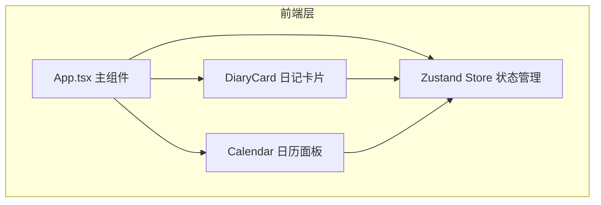

## 1. 架构设计



## 2. 技术栈说明

- **前端框架**：React 18 + TypeScript
- **构建工具**：Vite 5.x + @vitejs/plugin-react
- **状态管理**：Zustand 4.x
- **样式方案**：CSS Modules / 内联样式 + CSS 变量
- **目标版本**：ES2020
- **包管理器**：npm

## 3. 项目结构

```
.
├── index.html                 # 入口HTML，含viewport适配
├── package.json               # 依赖配置
├── vite.config.js             # Vite构建配置
├── tsconfig.json              # TypeScript配置（严格模式）
└── src/
    ├── App.tsx                # 主组件，布局管理与状态协调
    ├── store.ts               # Zustand状态管理
    └── components/
        ├── DiaryCard.tsx      # 日记卡片组件
        └── Calendar.tsx       # 日历面板组件
```

## 4. 数据模型

### 4.1 日记记录 (DiaryEntry)

| 字段 | 类型 | 说明 |
|------|------|------|
| date | string | 日期字符串 YYYY-MM-DD |
| colorIndex | number | 选中色块索引 0-11 |
| content | string | 日记文字内容 |

### 4.2 应用状态 (AppState)

| 字段 | 类型 | 说明 |
|------|------|------|
| entries | DiaryEntry[] | 所有日记记录列表 |
| selectedColorIndex | number | 当前选中的色块索引 |
| inputText | string | 当前输入的文字 |
| viewMode | 'month' \| 'year' | 日历视图模式 |
| currentMonth | number | 当前显示月份 0-11 |
| currentYear | number | 当前显示年份 |

## 5. 状态管理设计

使用 Zustand 集中管理：
- `entries`: 日记记录数组，localStorage 持久化
- `selectedColorIndex`: 当前选中色块，默认中间色
- `inputText`: 文本输入区内容
- `viewMode`: 月视图 / 年度画卷切换
- 操作方法：`addEntry`, `setColorIndex`, `setInputText`, `toggleViewMode`

## 6. 核心交互实现

### 6.1 色块系统
- 12种颜色按色相环从冷蓝到暖橙再到冷紫排列
- 使用 HSL 色彩空间计算渐变色
- 点击色块触发脉冲光晕动画（CSS keyframes）

### 6.2 翻页动画
- CSS 3D transform: rotateY + perspective
- preserve-3d 实现正反面翻转
- 背面显示"已记录"文字

### 6.3 响应式布局
- 桌面端：Flex 横向排列，卡片 flex 1，日历固定 300px
- 平板端：Flex 纵向排列
- 移动端：日历使用底部抽屉（transform translateY）

### 6.4 性能优化
- 所有动画使用 CSS transform + opacity，保证 60fps
- 列表渲染使用 React.memo 避免不必要重渲染
- 状态更新使用 immer 或不可变更新模式
