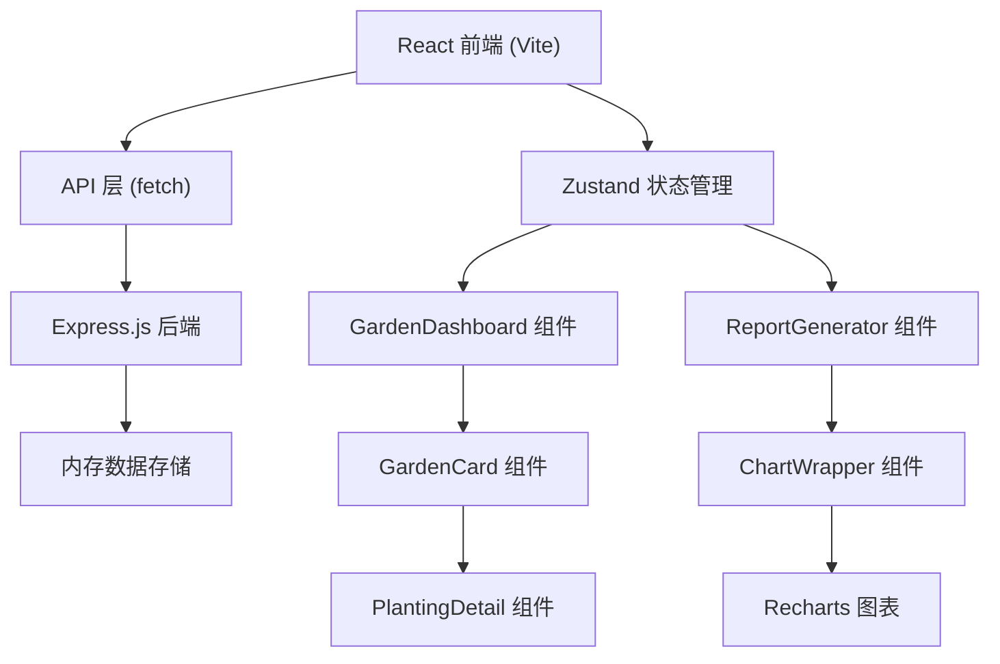
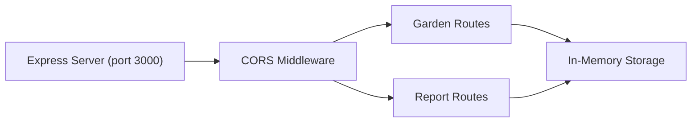
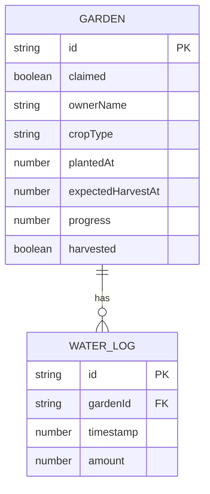

## 1. 架构设计



## 2. 技术描述
- 前端：React@18 + TypeScript + Vite
- 状态管理：Zustand
- 后端：Express@4 + CORS + UUID
- 图表：Recharts
- 构建工具：Vite，代理/api到Express端口3000

## 3. 路由定义
| 路由 | 用途 |
|------|------|
| / | 主应用入口，包含标签页切换（菜畦/报告） |

## 4. API 定义

### 4.1 类型定义
```typescript
interface WaterLog {
  id: string;
  timestamp: number;
  amount: number; // ml
}

interface Garden {
  id: string;
  claimed: boolean;
  ownerName?: string;
  cropType?: 'tomato' | 'lettuce' | 'carrot' | 'strawberry';
  plantedAt?: number;
  waterLogs: WaterLog[];
  expectedHarvestAt?: number;
  progress: number;
  harvested: boolean;
}

interface WeeklyWaterData {
  week: string;
  count: number;
}

interface CarbonData {
  date: string;
  kg: number;
}
```

### 4.2 接口定义
| Method | Path | 描述 |
|--------|------|------|
| GET | /api/gardens | 获取所有菜畦列表 |
| POST | /api/gardens | 创建菜畦 |
| PUT | /api/gardens/:id | 更新菜畦信息（认领、进度等） |
| POST | /api/gardens/:id/water | 添加浇水记录 |
| DELETE | /api/gardens/:id | 删除/重置菜畦 |
| GET | /api/report/weekly-water | 获取每周浇水量数据 |
| GET | /api/report/carbon-reduction | 获取碳减排趋势数据 |

## 5. 服务器架构



## 6. 数据模型

### 6.1 数据模型定义


### 6.2 初始数据
6个待认领的空白菜畦，id从garden-1到garden-6，claimed=false，waterLogs=[], progress=0。

## 7. 项目文件结构
```
auto122/
├── package.json
├── vite.config.ts
├── tsconfig.json
├── index.html
├── server/
│   └── index.ts          # Express后端
└── src/
    ├── api/
    │   └── api.ts        # API请求函数
    ├── store/
    │   └── useGardenStore.ts  # Zustand状态管理
    ├── modules/
    │   ├── garden/
    │   │   ├── GardenDashboard.tsx
    │   │   ├── GardenCard.tsx
    │   │   └── PlantingDetail.tsx
    │   └── report/
    │       ├── ReportGenerator.tsx
    │       └── ChartWrapper.tsx
    ├── App.tsx
    └── main.tsx
```
