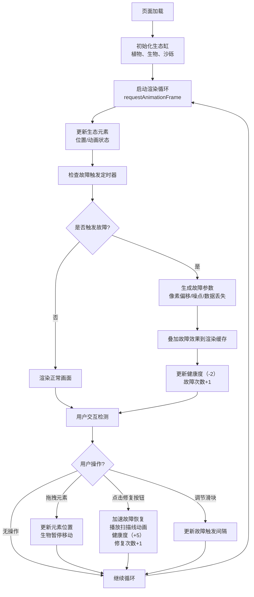

## 1. 产品概述
故障生态缸是一款模拟"故障艺术"风格的数字生态缸应用，让用户观察并干预一个不断被程序故障和噪声侵蚀的微型生态系统的平衡。

- **主要目的**：解决传统虚拟宠物或生态模拟游戏缺乏动态视觉退化、数据纠错与自我修复的沉浸式体验问题
- **目标用户**：对数字艺术、故障美学和生态模拟感兴趣的用户
- **产品价值**：提供独特的故障艺术视觉体验，结合生态模拟与交互干预，创造沉浸式的数字生态观察体验

## 2. 核心功能

### 2.1 功能模块
1. **生态缸主界面**：Canvas渲染的600x400px缸体，包含发光像素植物、游走生物和底部沙砾层
2. **故障效果系统**：随机触发像素偏移、噪点覆盖、数据丢失三种故障效果
3. **用户干预模块**：鼠标拖拽元素、注入修复数据按钮、故障频率调节滑块
4. **数据统计面板**：实时显示健康度、故障次数、修复次数

### 2.2 页面详情
| 页面名称 | 模块名称 | 功能描述 |
|-----------|-------------|---------------------|
| 主页面 | 生态缸渲染 | Canvas绘制缸体、植物、生物、沙砾，支持鼠标拖拽交互 |
| 主页面 | 故障效果引擎 | 定时触发像素偏移、噪点覆盖、数据丢失三种故障效果 |
| 主页面 | 用户控制面板 | 注入修复按钮、频率滑块、健康度进度条、统计数字显示 |
| 主页面 | 故障风格UI | 抖动标题、页面噪点背景、故障艺术风格交互反馈 |

## 3. 核心流程
用户进入页面后，生态缸自动开始运行，植物脉动、生物游走。每隔5-15秒随机触发故障效果，健康度随之下降。用户可以：
1. 鼠标拖拽移动植物或生物位置（拖拽时生物暂停移动）
2. 点击"注入修复数据"按钮加速故障恢复，提升健康度
3. 拖动滑块调节故障发生频率
4. 实时观察健康度、故障次数、修复次数的变化

## 4. 用户界面设计

### 4.1 设计风格
- **设计理念**：故障艺术（Glitch Art）风格，数字退化与自我修复的视觉冲突
- **主色调**：深空灰黑 #0D0D0D（背景）、深绿 #0B1E0E（缸体）、青绿 #00FF88（生物/植物）、青色 #00B4D8（按钮）
- **辅助色**：品红 #FF00FF、青色 #00FFFF、黄色 #FFFF00（故障噪点）
- **按钮风格**：圆角8px，背景 #00B4D8，hover时 #0096C7，过渡0.2s，点击时0.1s白色闪烁
- **字体**：使用等宽字体（如Consolas或JetBrains Mono）增强数字科技感
- **布局**：居中布局，生态缸在中央，控制面板在右侧和底部
- **特殊效果**：页面四周彩色噪点、标题抖动文字、按钮闪烁反馈、滑块数值实时显示

### 4.2 页面设计概述
| 页面名称 | 模块名称 | UI元素 |
|-----------|-------------|-------------|
| 主页面 | 标题区 | "故障生态缸"文字，28px字重800，白色，红青色偏移阴影，每0.1s随机水平偏移±1px |
| 主页面 | 生态缸区域 | 600x400px Canvas，背景深绿 #0B1E0E 透明度0.9，居中显示 |
| 主页面 | 控制面板 | 右下角修复按钮，右侧滑块和统计面板，健康度进度条 |
| 主页面 | 背景效果 | 页面四周1px彩色噪点，透明度0.2，每帧轻微变化 |

### 4.3 响应式
- 桌面端优先，固定600x400px缸体尺寸
- 移动端自适应缩放，保持缸体宽高比
- 触摸操作支持拖拽和点击

### 4.4 性能要求
- 缸体渲染稳定在50FPS以上
- 故障效果叠加时最低不低于30FPS
- 使用requestAnimationFrame和Canvas离屏渲染优化
