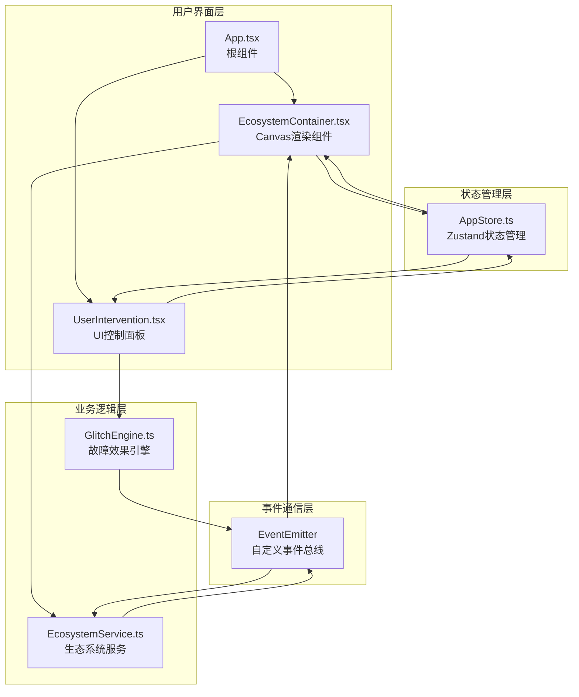

## 1. 架构设计



## 2. 技术描述
- **前端框架**：React@18 + TypeScript@5
- **构建工具**：Vite@5 + @vitejs/plugin-react@4
- **状态管理**：Zustand@4
- **渲染技术**：Canvas 2D API + 离屏Canvas优化
- **动画系统**：requestAnimationFrame
- **事件通信**：自定义EventEmitter实现事件总线

## 3. 目录结构
```
src/
├── App.tsx                    # React根组件
├── AppStore.ts                # Zustand状态管理
├── EcosystemModule/
│   ├── EcosystemContainer.tsx # Canvas渲染组件
│   └── EcosystemService.ts    # 生态系统服务
├── GlitchModule/
│   ├── GlitchEngine.ts        # 故障效果引擎
│   └── UserIntervention.tsx   # 用户干预UI组件
└── types.ts                   # 类型定义（可选）
```

## 4. 核心数据结构

### 4.1 生态元素类型
```typescript
interface Plant {
  id: string;
  x: number;
  y: number;
  size: number;
  pulsePhase: number;
}

interface Creature {
  id: string;
  x: number;
  y: number;
  vx: number;
  vy: number;
  color: string;
  paused: boolean;
}

interface SandGrain {
  x: number;
  y: number;
  width: number;
  height: number;
  color: string;
}
```

### 4.2 故障效果类型
```typescript
type GlitchType = 'pixelShift' | 'noiseOverlay' | 'dataLoss';

interface GlitchEffect {
  id: string;
  type: GlitchType;
  startTime: number;
  duration: number;
  params: Record<string, any>;
}
```

### 4.3 应用状态
```typescript
interface AppState {
  health: number;
  glitchCount: number;
  repairCount: number;
  frequency: number; // 0-100
  incrementGlitch: () => void;
  incrementRepair: () => void;
  setFrequency: (value: number) => void;
  calculateHealth: () => void;
}
```

## 5. 模块职责

### 5.1 EcosystemService
- 管理植物、生物、沙砾的位置和状态
- 每帧更新生物位置和植物脉动动画
- 处理边界碰撞检测
- 暴露update()和render()方法
- 发送"entityMoved"事件

### 5.2 GlitchEngine
- 管理故障触发定时器
- 根据频率滑块值（0-100）线性映射为2-30秒触发间隔
- 随机生成三种故障效果参数
- 广播"glitch"事件
- 提供triggerRepair()方法加速故障恢复

### 5.3 EcosystemContainer
- 创建和管理Canvas渲染上下文
- 调用EcosystemService更新和绘制
- 监听GlitchEngine的"glitch"事件叠加故障效果
- 处理鼠标拖拽交互
- 使用离屏Canvas优化性能

### 5.4 UserIntervention
- 渲染"注入修复数据"按钮
- 渲染故障频率滑块（0-100）
- 渲染健康度进度条和统计数字
- 通过AppStore读取和更新状态
- 调用GlitchEngine的修复方法

### 5.5 AppStore
- 使用Zustand管理全局状态
- 健康度计算公式：max(0, 100 - 故障次数*2 + 修复次数*5)
- 提供incrementGlitch、incrementRepair、setFrequency等actions

## 6. 事件总线设计

```typescript
class EventEmitter {
  private listeners: Map<string, Set<Function>>;
  
  on(event: string, callback: Function): void;
  off(event: string, callback: Function): void;
  emit(event: string, data?: any): void;
}
```

**事件定义：**
- `glitch`: 故障触发，携带故障参数
- `entityMoved`: 元素位置更新
- `repair`: 修复触发
