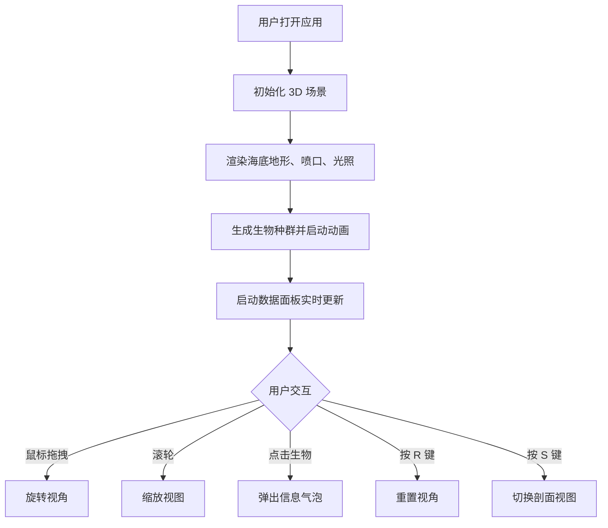

## 1. 产品概述
深海热液生态模拟系统是一款基于 WebGL 的三维交互应用，旨在解决传统生态展示缺乏动态交互与实时数据可视化的痛点，让用户自由探索深海热液喷口周围的奇特生物分布与化学梯度变化。

- 主要面向海洋生物学研究者、科普教育工作者和对深海生态感兴趣的公众用户
- 通过沉浸式 3D 场景和实时数据展示，提供前所未有的深海探索体验

## 2. 核心功能

### 2.1 功能模块
1. **场景渲染模块**：构建 600x400 单位的水下场景，包含起伏海底地形、热液喷口、烟雾粒子效果、光照与雾效
2. **生物管理模块**：在喷口周围随机分布 6 种深海生物，每种 3-5 个体，具有独立运动行为和发光光晕
3. **数据可视化模块**：实时显示温度、化学物质浓度、生物种群数量等数据，带数字滚动动画
4. **交互控制模块**：鼠标拖拽旋转视角、点击生物查看详情、键盘快捷键支持

### 2.2 页面详情
| 页面名称 | 模块名称 | 功能描述 |
|---------|---------|---------|
| 主场景页 | 场景渲染模块 | 渲染海底地形、热液喷口、烟雾粒子、光照雾效 |
| 主场景页 | 生物管理模块 | 生成并管理 6 种深海生物，独立运动行为，发光光晕 |
| 主场景页 | 数据可视化模块 | 右上角数据面板，温度/化学浓度/种群数量，GSAP 数字动画 |
| 主场景页 | 交互控制模块 | OrbitControls、点击气泡、R 键重置、S 键剖面视图 |

## 3. 核心流程
用户打开应用后，全屏展示 3D 深海场景，用户可以鼠标拖拽旋转视角、滚轮缩放，点击任意生物查看详情信息，通过键盘快捷键切换不同视图模式。右上角实时面板持续更新环境数据和生物种群信息。

## 4. 用户界面设计

### 4.1 设计风格
- **主题颜色**：深蓝黑色海洋主题，页面背景 #0A1128
- **主色调**：#0A1128（深蓝黑）、#0D1B2A（深海蓝）、#4A6B8A（光照蓝）
- **强调色**：#E74C3C（喷口红）、#E67E22（热液橙）、#F1C40F（高温黄）
- **生物色**：#C0392B（管虫）、#8E44AD（贻贝）、#D35400（盲虾）等
- **字体**：标题使用系统字体，数值使用 'Courier New', monospace
- **布局**：全屏 3D 场景，UI 元素悬浮叠加
- **视觉效果**：毛玻璃面板、发光阴影、FogExp2 雾效、fade-in 动画

### 4.2 页面设计概述
| 页面名称 | 模块名称 | UI 元素 |
|---------|---------|---------|
| 主场景页 | 标题区域 | 左上角应用标题，24px 字重 200，#E0E0E0，发光阴影 #00FFFF50 |
| 主场景页 | 数据面板 | 右上角 200x300px，rgba(0,20,40,0.7) 背景，圆角 8px，毛玻璃效果 |
| 主场景页 | 操作提示 | 左下角半透明 #FFFFFF60，14px，列出所有操作方式 |
| 主场景页 | 信息气泡 | CSS2DRenderer 实现，点击生物弹出，3 秒后淡出 |
| 主场景页 | 3D 场景 | 全屏视口，600x400 单位，FogExp2 雾效 |

### 4.3 响应性
桌面端优先设计，全屏 3D 场景自适应窗口大小，UI 元素使用固定像素定位，移动端通过触摸手势支持旋转缩放。

### 4.4 3D 场景指导
- **环境氛围**：深海黑暗环境，FogExp2 密度 0.003，营造深度感
- **光照设置**：AmbientLight(#4A6B8A, 0.4) + PointLight(#E67E22, 0.8, 喷口位置)
- **相机设置**：PerspectiveCamera，初始位置可观察整个场景，OrbitControls 控制
- **核心元素**：喷口（渐变圆锥）、烟雾粒子（每秒 200 个，3 秒寿命）、6 种生物（各 3-5 个）
- **动画效果**：生物运动（摇摆/静止/游走）、粒子流动、数据面板数字滚动、界面 fade-in
- **性能要求**：60FPS 帧率，首次加载不超过 3 秒
