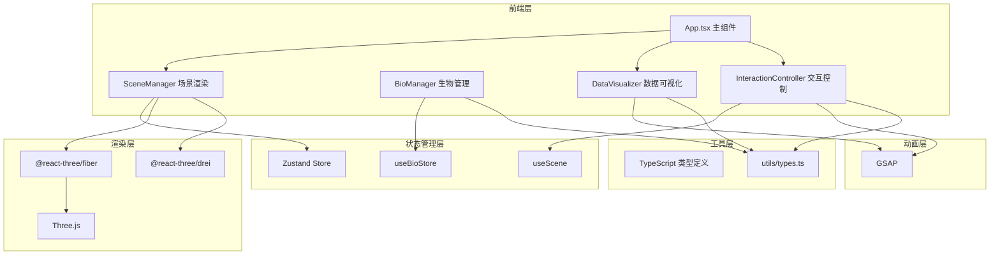
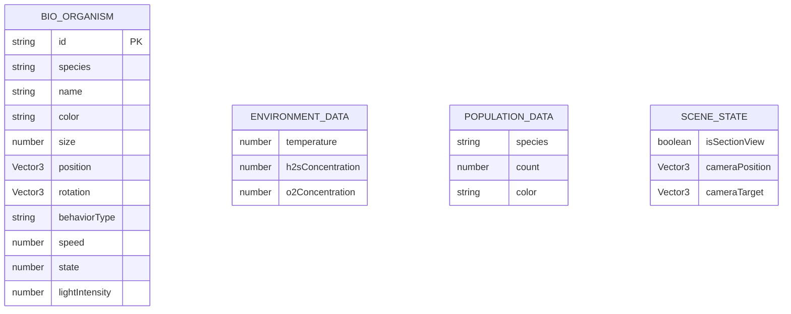

## 1. 架构设计



## 2. 技术描述
- **前端框架**：React@18 + TypeScript
- **构建工具**：Vite + @vitejs/plugin-react
- **3D 渲染**：Three.js + @react-three/fiber + @react-three/drei
- **状态管理**：Zustand
- **动画库**：GSAP
- **类型系统**：TypeScript 严格模式

## 3. 路由定义
| 路由 | 用途 |
|-----|------|
| / | 主场景页面，展示深海热液生态 3D 模拟 |

## 4. 数据模型

### 4.1 数据模型定义



### 4.2 类型定义
```typescript
// 生物行为类型
type BehaviorType = 'swaying' | 'stationary' | 'wandering';

// 生物活动状态
type ActivityState = 'foraging' | 'floating' | 'moving';

// 生物物种定义
interface SpeciesConfig {
  id: string;
  name: string;
  color: string;
  minCount: number;
  maxCount: number;
  minSize: number;
  maxSize: number;
  behavior: BehaviorType;
  geometryType: 'sphere' | 'box';
}

// 单个生物实例
interface Organism {
  id: string;
  speciesId: string;
  position: [number, number, number];
  rotation: [number, number, number];
  scale: number;
  activityState: ActivityState;
  basePosition: [number, number, number];
  phase: number;
  velocity: [number, number, number];
}

// 环境数据
interface EnvironmentData {
  temperature: number;
  h2s: number;
  o2: number;
}

// 种群统计
interface PopulationStats {
  speciesId: string;
  count: number;
}

// 场景配置
interface SceneConfig {
  sceneWidth: number;
  sceneDepth: number;
  ventPosition: [number, number, number];
  isSectionView: boolean;
}
```

## 5. 文件组织结构

```
auto129/
├── package.json
├── vite.config.js
├── tsconfig.json
├── index.html
├── src/
│   ├── main.tsx
│   ├── App.tsx
│   ├── utils/
│   │   └── types.ts
│   └── modules/
│       ├── scene/
│       │   └── SceneManager.tsx
│       ├── bio/
│       │   └── BioManager.ts
│       ├── data/
│       │   └── DataVisualizer.tsx
│       └── interaction/
│           └── InteractionController.ts
```

## 6. 模块职责说明

### SceneManager.tsx
- 创建海底地形（PlaneGeometry + 顶点扰动）
- 创建热液喷口（ConeGeometry + 渐变色）
- 管理烟雾粒子系统（Points + PointsMaterial）
- 设置光照（AmbientLight + PointLight）和雾效（FogExp2）
- 渲染生物模型
- 导出 useScene hook

### BioManager.ts
- 定义 6 种生物物种配置
- 生成生物列表（每种 3-5 个体，喷口周围随机分布）
- 创建 Zustand store（useBioStore）管理生物状态
- 实现生物运动行为更新（摇摆/静止/游走）
- 管理发光 PointLight 附件

### DataVisualizer.tsx
- 渲染右上角半透明数据面板
- 从 useBioStore 读取环境数据和种群数据
- 每秒更新温度、H2S、O2 数值
- 使用 GSAP 实现数字滚动动画（0.6秒）
- 颜色渐变映射（温度红→黄，H2S橙，O2蓝）

### InteractionController.ts
- 封装 OrbitControls 配置
- 处理点击生物事件，弹出 CSS2DRenderer 信息气泡
- 气泡显示生物名称、数量、活动状态，3秒后淡出
- 监听键盘事件：R键重置视角（GSAP 1.2秒动画），S键切换剖面视图
- 导出 useInteraction hook
