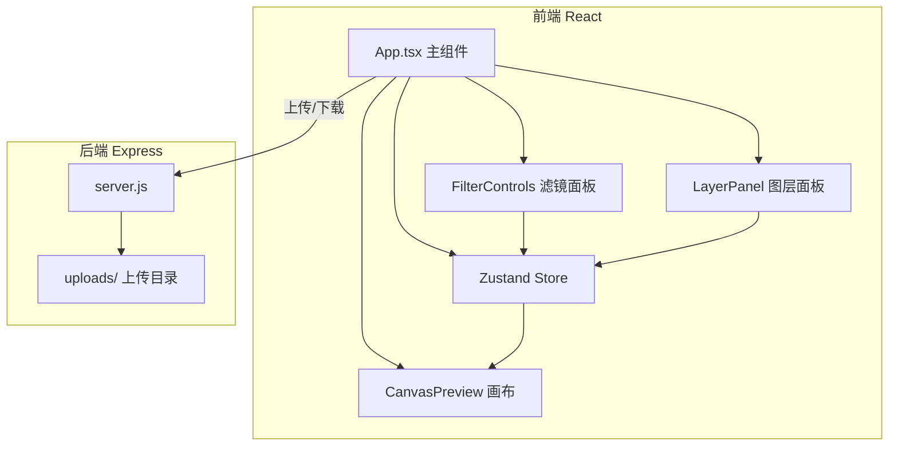
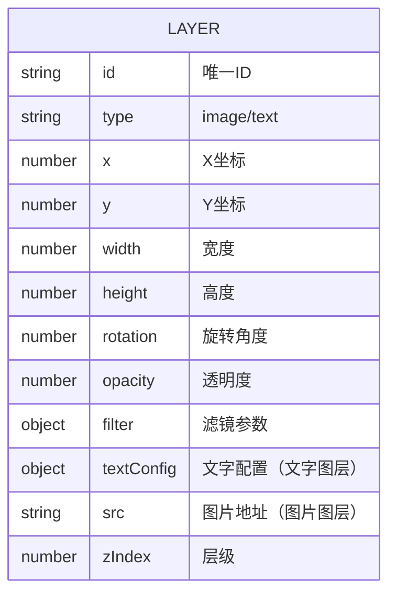
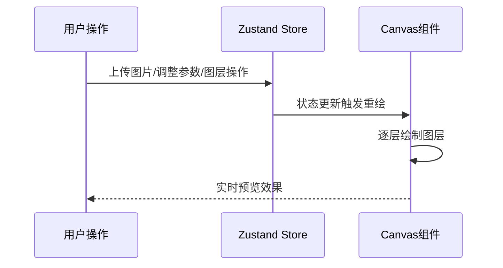

## 1. 架构设计



## 2. 技术选型

- **前端框架**：React 18 + TypeScript
- **构建工具**：Vite 5 + @vitejs/plugin-react
- **状态管理**：Zustand
- **Canvas 渲染**：原生 Canvas 2D API
- **唯一 ID**：uuid
- **后端框架**：Express 4
- **跨域处理**：cors
- **文件上传**：multer
- **开发模式**：前后端分离，前端 Vite 开发服务器 + 后端 Express

## 3. 路由定义

| 路由 | 用途 |
|------|------|
| / | 主编辑页面（单页应用） |
| /api/upload | 图片上传接口（POST） |
| /api/download | 合成图下载接口（POST） |

## 4. API 定义

### 4.1 上传接口
- **路径**：POST /api/upload
- **请求**：multipart/form-data，字段名 image
- **支持格式**：jpg, png, zip
- **响应**：
```typescript
interface UploadResponse {
  success: boolean;
  url: string;
  filename: string;
  width: number;
  height: number;
}
```

### 4.2 下载接口
- **路径**：POST /api/download
- **请求**：
```typescript
interface DownloadRequest {
  layers: Layer[];
  canvasWidth: number;
  canvasHeight: number;
}
```
- **响应**：image/png 文件流

## 5. 数据模型

### 5.1 图层数据模型



### 5.2 滤镜参数
```typescript
interface FilterConfig {
  brightness: number;     // 亮度 0-200，默认100
  contrast: number;       // 对比度 0-200，默认100
  hueRotate: number;      // 色相旋转 0-360，默认0
  saturate: number;       // 饱和度 0-200，默认100
  blur: number;           // 模糊 0-10，默认0
  sepia: number;          // 复古 0-100，默认0
  grayscale: number;      // 灰度 0-100，默认0
  preset: string | null;  // 当前预设名称
}
```

### 5.3 文字配置
```typescript
interface TextConfig {
  content: string;
  fontFamily: string;
  fontSize: number;
  fontWeight: string;
  color: string;
  textAlign: 'left' | 'center' | 'right';
  opacity: number;
}
```

### 5.4 画布状态
```typescript
interface CanvasState {
  width: number;
  height: number;
  platform: 'taobao' | 'jd' | 'pdd';
}
```

## 6. 数据流向



- **单向数据流**：用户操作 → Store 更新 → Canvas 重绘
- **双向绑定**：Canvas 拖拽操作 → Store 更新 → Canvas 重绘
- **性能优化**：requestAnimationFrame 批量重绘，滤镜使用 CSS filter + Canvas filter 双模式
