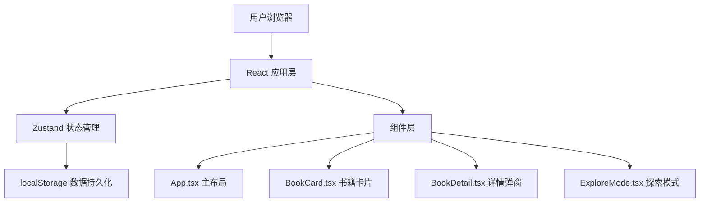

## 1. 架构设计



## 2. 技术描述

- **前端框架**：React 18 + TypeScript
- **构建工具**：Vite
- **状态管理**：Zustand
- **数据存储**：浏览器 localStorage 模拟后端
- **样式方案**：原生 CSS（配合 CSS 变量和动画）
- **性能优化**：虚拟滚动（仅渲染视口内卡片）、requestAnimationFrame 驱动定时器

## 3. 核心文件结构

```
auto130/
├── package.json
├── vite.config.js
├── tsconfig.json
├── index.html
└── src/
    ├── App.tsx              # 主应用组件
    ├── stores/
    │   └── bookStore.ts     # Zustand 状态管理
    └── components/
        ├── BookCard.tsx     # 书籍卡片组件
        ├── BookDetail.tsx   # 详情弹窗组件
        └── ExploreMode.tsx  # 探索模式组件
```

## 4. 数据模型

### 4.1 数据类型定义

```typescript
interface Book {
  id: string;
  title: string;
  author: string;
  publishYear: number;
  review: string;
  status: 'available' | 'borrowed' | 'exchanged';
  ownerNote?: string;
  messages: Message[];
  createdAt: number;
}

interface Message {
  id: string;
  content: string;
  rating: number;
  avatar: string;
  timestamp: number;
}
```

### 4.2 状态模型

```typescript
interface BookStore {
  books: Book[];
  selectedBookId: string | null;
  isExploreMode: boolean;
  blinkingBookId: string | null;
  
  addBook: (book: Omit<Book, 'id' | 'createdAt' | 'messages'>) => void;
  updateBook: (id: string, updates: Partial<Book>) => void;
  selectBook: (id: string | null) => void;
  toggleExploreMode: () => void;
  setBlinkingBook: (id: string | null) => void;
  addMessage: (bookId: string, message: Omit<Message, 'id' | 'timestamp'>) => void;
}
```

## 5. 性能优化策略

1. **虚拟滚动**：书籍列表使用 IntersectionObserver 或自定义虚拟滚动实现，仅渲染视口内卡片
2. **动画优化**：探索模式的闪烁定时器使用 requestAnimationFrame 驱动，确保帧率 ≥ 30fps
3. **CSS 优化**：使用 transform 和 opacity 实现动画，触发 GPU 合成
4. **状态最小化**：Zustand store 按功能拆分选择器，避免不必要的重渲染
5. **本地存储**：使用防抖/节流优化 localStorage 写入频率
