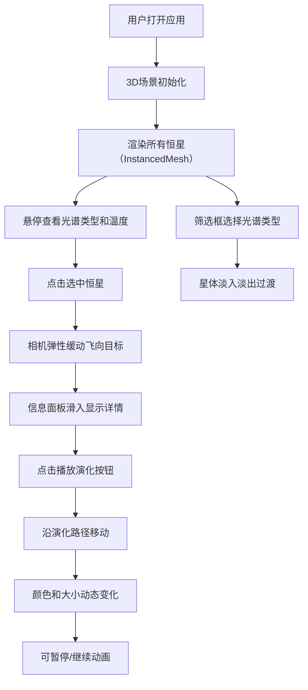

## 1. 产品概述
恒星光谱分类与演化路径三维可视化应用，旨在帮助天文学教育者通过交互式三维可视化工具，让学生直观理解不同恒星的光谱分类与演化路径，解决传统教材中静态图表难以传递动态物理过程的问题。

- 核心目标：将抽象的恒星光谱分类（O、B、A、F、G、K、M）和演化过程（主序星→红巨星→白矮星）转化为可交互的3D可视化体验
- 目标用户：天文学教育者和学生
- 市场价值：提升天文教学的直观性和互动性，帮助学生建立空间物理概念

## 2. 核心 Features

### 2.1 用户角色
| 角色 | 注册方式 | 核心权限 |
|------|----------|----------|
| 教育者/学生 | 无需注册 | 浏览3D星图、选择恒星、播放演化动画、筛选光谱类型 |

### 2.2 Feature Module
1. **3D赫罗图视图**：按绝对星等（Y轴）和温度对数（X轴）分布的3D恒星分布图
2. **恒星详情面板**：展示选中恒星的光谱类型、温度、半径、演化阶段等参数
3. **演化路径动画**：沿预计算路径展示恒星从主序星到终态的完整演化过程
4. **光谱类型筛选**：按O/B/A/F/G/K/M类型筛选显示恒星
5. **交互控制系统**：鼠标拖拽旋转、滚轮缩放、悬停提示、点击选中

### 2.3 Page Details
| 页面名称 | 模块名称 | 功能描述 |
|----------|----------|----------|
| 主页面 | 3D场景区域 | 渲染赫罗图风格3D恒星分布，支持OrbitControls交互 |
| 主页面 | 信息面板 | 滑入式左侧面板，显示恒星详细参数和演化控制按钮 |
| 主页面 | 筛选控件 | 右上角光谱类型下拉筛选框 |
| 主页面 | 演化路径 | 选中恒星后显示演化路径和动画进度条 |

## 3. 核心流程

用户打开应用 → 3D场景初始化，渲染所有恒星 → 悬停查看恒星基本信息 → 点击选中恒星 → 相机飞向目标，信息面板滑入 → 点击"播放演化"按钮 → 恒星沿路径移动，颜色和大小动态变化 → 可随时暂停/继续动画 → 通过筛选框切换显示不同光谱类型恒星

## 4. User Interface Design

### 4.1 Design Style
- **主色调**：深空蓝黑渐变背景（#0B0C10 到 #1F2833），营造宇宙空间氛围
- **光谱配色**：
  - O型：蓝色 #7B9CFF
  - B型：蓝白 #A8C4FF
  - A型：白色 #F0F0F0
  - F型：黄白 #FFF8DC
  - G型：黄色 #FFD700
  - K型：橙色 #FF8C00
  - M型：红色 #FF4500
- **信息面板**：背景 #2C3E50，半透明 0.92，边框 #4A5B6E，圆角 12px
- **按钮/控件**：背景 #34495E，hover 时 #3D566E，圆角 6px，过渡 0.2s ease

### 4.2 字体与排版
- 面板标题：20px，字重 600，颜色 #E0E0E0
- 参数值：16px，字重 400，颜色 #BDC3C7
- 工具提示：白色背景，圆角 4px，阴影 #00000030

### 4.3 布局结构
- 桌面端：左侧固定信息面板 340px，右侧场景区域占 75% 宽度
- 移动端（<768px）：信息面板折叠为底部抽屉，最大高度 50vh，场景占满剩余视口
- 筛选下拉框：场景右上角悬浮

### 4.4 动画与交互
- 相机飞行：1.5秒 easeOutElastic 弹性缓动
- 星体高亮：半径放大1.5倍，外发光脉动周期1秒
- 演化动画：8秒全程，可暂停/继续，进度条显示百分比
- 筛选切换：0.5秒渐变半透明淡出（透明度降至0.1）
- 悬停效果：光标变为pointer，显示工具提示

### 4.5 3D Scene Guidance
- **环境**：深空背景，无HDRI，使用渐变色营造宇宙氛围
- **光照**：环境光 + 点光源，恒星使用自发光材质
- **相机**：PerspectiveCamera，初始位置可观测全图，支持OrbitControls
- **后处理**：星体辉光效果，半透明光晕
- **性能优化**：InstancedMesh渲染星体（≤200个），动画使用requestAnimationFrame

### 4.6 Responsiveness
- Desktop-first 设计，视口 <768px 时自动适配移动端布局
- 信息面板从左侧滑入改为底部抽屉，支持拖拽调整高度
- 场景区域始终占满可用空间
- 触控设备支持双指缩放和滑动旋转

## 5. 性能约束
- 运行帧率 ≥ 50FPS
- 星体数量 ≤ 200个（使用InstancedMesh优化）
- 演化路径动画无内存泄漏
- 暂停后CPU占用率 ≤ 10%
