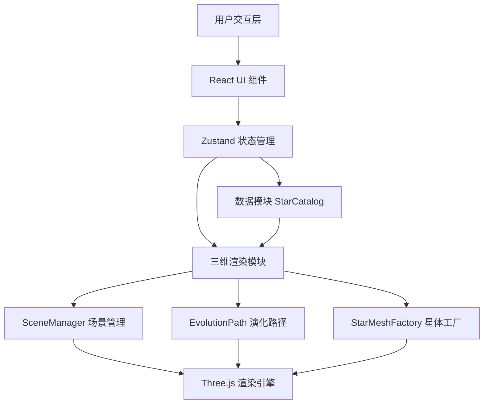

## 1. 架构设计



## 2. 技术栈说明

- **前端框架**：React 18 + TypeScript 5
- **构建工具**：Vite 5 + @vitejs/plugin-react
- **状态管理**：Zustand 4
- **3D渲染**：Three.js 0.160 + OrbitControls
- **样式方案**：原生CSS + CSS Variables（无Tailwind，保持轻量）
- **图标**：lucide-react

## 3. 项目结构与文件职责

```
d:\Pro\tasks\auto131\
├── index.html                      # 入口HTML，含div#root
├── package.json                    # 依赖配置
├── vite.config.js                  # Vite构建配置
├── tsconfig.json                   # TypeScript配置（严格模式，ES2020）
└── src/
    ├── App.tsx                     # 主应用组件，状态管理与布局
    ├── main.tsx                    # React入口
    ├── store/
    │   └── useStarStore.ts         # Zustand全局状态管理
    ├── data/
    │   ├── stars.json              # 预设恒星数据集
    │   └── StarCatalog.ts          # 恒星数据加载与解析模块
    ├── rendering/
    │   ├── SceneManager.ts         # 三维场景初始化与管理
    │   ├── EvolutionPath.ts        # 演化路径生成与渲染
    │   └── StarMeshFactory.ts      # 星体网格创建工厂
    ├── components/
    │   ├── StarInfoPanel.tsx       # 恒星详情信息面板
    │   ├── SpectrumFilter.tsx      # 光谱类型筛选下拉框
    │   ├── Tooltip.tsx             # 悬停工具提示
    │   └── EvolutionProgress.tsx   # 演化动画进度条
    ├── types/
    │   └── star.ts                 # 类型定义
    └── styles/
        └── global.css              # 全局样式
```

### 数据流与调用关系

1. **初始化流程**：
   - [App.tsx](file:///d:/Pro/tasks/auto131/src/App.tsx) 启动时调用 [StarCatalog.ts](file:///d:/Pro/tasks/auto131/src/data/StarCatalog.ts) 加载恒星数据
   - 数据存入 [useStarStore.ts](file:///d:/Pro/tasks/auto131/src/store/useStarStore.ts)
   - [SceneManager.ts](file:///d:/Pro/tasks/auto131/src/rendering/SceneManager.ts) 初始化Three.js场景

2. **渲染流程**：
   - [SceneManager.ts](file:///d:/Pro/tasks/auto131/src/rendering/SceneManager.ts) 从Store获取筛选后的恒星列表
   - 调用 [StarMeshFactory.ts](file:///d:/Pro/tasks/auto131/src/rendering/StarMeshFactory.ts) 创建星体Mesh
   - 使用InstancedMesh批量渲染星体

3. **交互流程**：
   - 用户点击星体 → [SceneManager.ts](file:///d:/Pro/tasks/auto131/src/rendering/SceneManager.ts) 触发相机飞行
   - 更新Store中selectedStarId → [StarInfoPanel.tsx](file:///d:/Pro/tasks/auto131/src/components/StarInfoPanel.tsx) 自动更新
   - 点击"播放演化" → Store设置isPlaying → [EvolutionPath.ts](file:///d:/Pro/tasks/auto131/src/rendering/EvolutionPath.ts) 开始动画

4. **筛选流程**：
   - [SpectrumFilter.tsx](file:///d:/Pro/tasks/auto131/src/components/SpectrumFilter.tsx) 更新Store中filterType
   - [SceneManager.ts](file:///d:/Pro/tasks/auto131/src/rendering/SceneManager.ts) 监听变化，执行星体淡入淡出

## 4. 数据模型

### 4.1 类型定义

```typescript
// src/types/star.ts
export type SpectralType = 'O' | 'B' | 'A' | 'F' | 'G' | 'K' | 'M' | 'ALL';

export type EvolutionStage = 'main_sequence' | 'red_giant' | 'white_dwarf';

export interface Star {
  id: string;
  name: string;
  spectralType: SpectralType;
  temperature: number;       // 3000K - 40000K
  absoluteMagnitude: number; // -10 到 +15
  radius: number;            // 太阳半径倍数
  evolutionStage: EvolutionStage;
  mass: number;              // 太阳质量倍数
  luminosity: number;        // 太阳光度倍数
}

export interface EvolutionPoint {
  position: { x: number; y: number; z: number };
  temperature: number;
  radius: number;
  spectralType: SpectralType;
  stage: EvolutionStage;
}

export interface StarStoreState {
  stars: Star[];
  selectedStarId: string | null;
  filterType: SpectralType;
  isPlaying: boolean;
  evolutionProgress: number; // 0 - 1
  evolutionPath: EvolutionPoint[];
  setSelectedStar: (id: string | null) => void;
  setFilterType: (type: SpectralType) => void;
  togglePlayback: () => void;
  setEvolutionProgress: (progress: number) => void;
  loadEvolutionPath: (starId: string) => void;
}
```

### 4.2 恒星数据JSON结构

```json
{
  "stars": [
    {
      "id": "star_001",
      "name": "Sirius A",
      "spectralType": "A",
      "temperature": 9940,
      "absoluteMagnitude": 1.42,
      "radius": 1.711,
      "evolutionStage": "main_sequence",
      "mass": 2.02,
      "luminosity": 25.4
    }
  ]
}
```

## 5. 核心算法与实现要点

### 5.1 赫罗图坐标映射

```typescript
// 温度（对数）→ X轴：log10(temperature) 映射到 [-10, 10]
const x = (Math.log10(star.temperature) - 3.8) * 8;

// 绝对星等 → Y轴：数值越小越亮（上方），映射到 [-10, 10]
const y = (15 - star.absoluteMagnitude) * 0.8 - 10;

// Z轴添加轻微随机偏移，形成3D层次感
const z = (Math.random() - 0.5) * 4;
```

### 5.2 演化路径插值

```typescript
// 使用CatmullRomCurve3生成平滑路径
// 关键阶段点：主序星 → 红巨星分支 → 白矮星
const controlPoints = [
  mainSequencePoint,
  redGiantTipPoint,
  horizontalBranchPoint,
  whiteDwarfPoint
];
const curve = new THREE.CatmullRomCurve3(controlPoints, false, 'catmullrom', 0.5);
```

### 5.3 相机缓动动画

```typescript
// easeOutElastic 弹性缓动函数
function easeOutElastic(t: number): number {
  const c4 = (2 * Math.PI) / 3;
  return t === 0 ? 0 : t === 1 ? 1 :
    Math.pow(2, -10 * t) * Math.sin((t * 10 - 0.75) * c4) + 1;
}
```

### 5.4 性能优化策略

1. **InstancedMesh**：所有星体使用单个InstancedMesh渲染，减少Draw Call
2. **材质复用**：相同光谱类型的星体共享材质实例
3. **动画帧管理**：暂停时停止演化路径的粒子更新，降低CPU占用
4. **资源清理**：组件卸载时调用dispose()释放Three.js资源，防止内存泄漏

## 6. 性能指标保障

- 帧率监控：使用Stats.js监控FPS，保持≥50
- 内存管理：星体切换时及时dispose旧的Geometry和Material
- 动画节流：演化进度更新使用requestAnimationFrame，避免过度渲染
- 事件防抖：窗口resize事件防抖处理，防止频繁重绘
