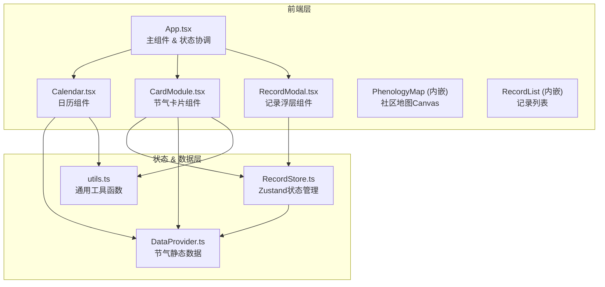

## 1. 架构设计



## 2. 技术说明

- **前端框架**：React 18 + TypeScript
- **构建工具**：Vite 5 + @vitejs/plugin-react
- **状态管理**：Zustand
- **唯一ID生成**：uuid
- **初始化方式**：Vite + react-ts 模板

## 3. 模块定义

### 3.1 文件结构

```
auto134/
├── index.html                    # 入口HTML
├── package.json                  # 项目依赖
├── vite.config.js                # Vite配置
├── tsconfig.json                 # TypeScript配置
└── src/
    ├── main.tsx                  # React入口
    ├── App.tsx                   # 主组件
    ├── DataProvider.ts           # 节气数据模块
    ├── RecordStore.ts            # Zustand状态管理
    ├── Calendar.tsx              # 日历组件
    ├── CardModule.tsx            # 节气卡片组件
    ├── RecordModal.tsx           # 记录浮层组件
    └── utils.ts                  # 工具函数
```

### 3.2 模块职责

| 模块 | 职责 |
|------|------|
| `DataProvider.ts` | 静态存储24节气数据（名称、日期、季节、物候描述、插画类型），提供 `getSolarTerms()`、`getSolarTermByName()` 等函数 |
| `RecordStore.ts` | Zustand store管理用户记录，提供 `addRecord()`、`getRecordsBySolarTerm()`、`deleteRecord()` 方法，数据持久化到localStorage |
| `Calendar.tsx` | 渲染竖版月历，从DataProvider获取节气数据，在对应日期渲染彩色圆点，点击圆点通过props回调通知父组件 |
| `CardModule.tsx` | 展示节气卡片，使用Canvas绘制粒子/线条风格物候插画（4秒周期脉动动画），展示物候描述和记录按钮，点击按钮打开记录浮层 |
| `RecordModal.tsx` | 记录提交表单浮层，包含节气选择、文字输入（140字限制）、图片上传预览（≤5MB），表单验证后调用RecordStore.addRecord() |
| `utils.ts` | 节气颜色映射、日期格式化、季节判断、Canvas绘制辅助函数 |
| `App.tsx` | 管理当前选中节气、浮层开关状态，协调各组件数据传递，组织页面整体布局，实现视差背景和页面过渡动画 |

## 4. 数据模型

### 4.1 节气数据模型 (SolarTerm)

```typescript
interface SolarTerm {
  id: string;
  name: string;           // 节气名称，如"立春"
  month: number;          // 月份 1-12
  day: number;            // 日期
  season: 'spring' | 'summer' | 'autumn' | 'winter';
  phenology: string;      // 物候描述文字
  illustrationType: string; // 插画类型，如'willow'、'wheat'、'persimmon'等
}
```

### 4.2 用户记录数据模型 (PhenologyRecord)

```typescript
interface PhenologyRecord {
  id: string;             // uuid
  solarTermName: string;  // 关联节气名称
  city: string;           // 城市名称
  description: string;    // 物候描述（≤140字）
  imageDataUrl?: string;  // 图片Base64数据URL
  createdAt: number;      // 时间戳
  coords?: {              // 地图坐标
    x: number;
    y: number;
  };
}
```

## 5. Canvas绘制方案

### 5.1 物候插画实现策略

每个节气使用不同的粒子/线条绘制算法：
- **春季节气**：柳条粒子摆动、花瓣飘落
- **夏季节气**：麦穗粒子波浪、荷叶涟漪
- **秋季节气**：柿子圆形粒子、枫叶旋转飘落
- **冬季节气**：雪花粒子下落、梅花线条

使用 `requestAnimationFrame` 实现60fps动画，通过时间戳计算4秒周期的正弦脉动缩放。

### 5.2 中国地图绘制方案

使用Canvas Path绘制简化版中国各省轮廓，城市坐标预定义在数据中，记录提交时根据城市匹配坐标或取默认位置。
