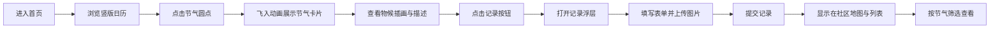

## 1. 产品概述

节气物候历是一款展示中国二十四节气与自然物候现象的互动式Web应用，让用户通过视觉化日历探索节气对应的自然变化，并记录分享本地物候观察。

- 核心价值：将传统文化与自然观察结合，提供沉浸式节气体验与社区共享平台
- 目标用户：对传统文化、自然观察、摄影记录感兴趣的大众用户

## 2. 核心功能

### 2.1 功能模块

1. **首页日历**：竖版滚动式月历，节气以彩色圆点标记，点击展开节气卡片
2. **节气卡片**：展示节气名称、Canvas绘制的抽象物候插画、物候描述文字、记录按钮
3. **记录提交浮层**：选择节气、输入文字描述、上传图片，提交本地物候记录
4. **社区物候地图**：Canvas绘制中国地图，以圆形图钉展示各城市物候记录
5. **记录列表**：按节气筛选查看所有用户提交的物候记录卡片

### 2.2 页面详情

| 页面名称 | 模块名称 | 功能描述 |
|-----------|-------------|---------------------|
| 首页 | 竖版日历 | 12个月横向排列，纵向滚动浏览，节气彩色圆点标记（24px），四季配色（春#27AE60/夏#F39C12/秋#E67E22/冬#3498DB） |
| 首页 | 节气卡片 | 纵向340px宽卡片，楷体节气名称（32px/600字重），Canvas物候插画（4秒脉动），物候描述（16px/300字重/行高1.8），记录按钮 |
| 首页 | 记录浮层 | 白色背景/圆角16px/阴影#00000020，居中弹出动画0.3s ease，表单含节气选择、文字描述（140字限制）、图片上传（≤5MB） |
| 首页 | 社区地图 | Canvas绘制中国省份轮廓，图钉按节气着色，点击弹出物候快照 |
| 首页 | 记录列表 | 按节气筛选，卡片背景#F9F9F9/圆角8px/左侧2px节气色条，点击展开全量内容 |

## 3. 核心流程

用户进入首页 → 浏览竖版日历发现节气圆点 → 点击圆点触发飞入动画展示节气卡片 → 查看物候插画与描述 → 点击「记录本地的物候」按钮 → 打开记录浮层填写表单并上传图片 → 提交记录 → 记录显示在社区地图与记录列表中 → 可按节气筛选查看记录

## 4. 用户界面设计

### 4.1 设计风格

- **主色调**：暖白米色 #FFF8F0
- **辅助色**：浅绿 #E8F5E9（视差背景层）
- **节气色**：春#27AE60、夏#F39C12、秋#E67E22、冬#3498DB
- **中性色**：文字#444444、按钮#2C3E50、按钮hover#34495E、卡片背景#F9F9F9
- **字体**：节气名称使用楷体（KaiTi/STKaiti），正文使用系统无衬线字体
- **按钮风格**：无边框扁平化，hover时translateY(-3px)并加深阴影
- **圆角规范**：卡片8px-16px，按钮8px，浮层16px
- **动效规范**：卡片飞入0.6s ease-out，浮层弹出0.3s ease，节气切换顶部渐隐0.8s，背景差速视差滚动

### 4.2 页面设计概览

| 页面名称 | 模块名称 | UI元素 |
|-----------|-------------|-------------|
| 首页 | 竖版日历 | 横向12列布局、日期网格、节气彩色圆点（24px→40px放大动画） |
| 首页 | 节气卡片 | 纵向布局、楷体标题、Canvas插画（4s脉动）、物候描述、记录按钮（hover上移） |
| 首页 | 记录浮层 | 居中弹出、表单元素、图片预览区、提交按钮 |
| 首页 | 社区地图 | Canvas中国地图、节气色图钉、物候弹出框 |
| 首页 | 记录列表 | 节气色左侧条、卡片布局、可展开详情 |

### 4.3 响应式设计

桌面端优先设计，移动端自适应：日历布局在移动端改为纵向单列滚动，节气卡片自适应屏幕宽度，浮层在移动端全宽显示。

### 4.4 性能要求

- 首页日历首次加载 ≤ 1.5秒完成渲染
- 物候卡片Canvas插画帧率保持 60fps
- 浮层打开动画流畅无卡顿
- 背景视差滚动性能优化，不影响主线程
