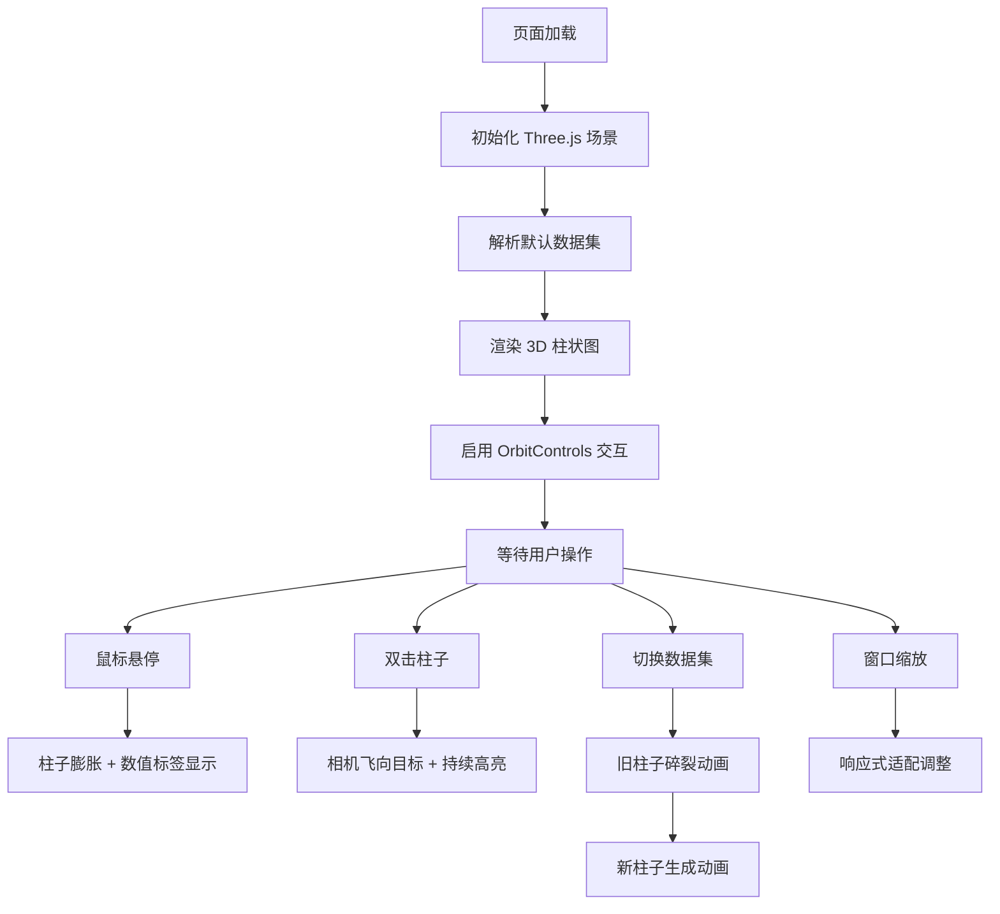

## 1. 产品概述

三维交互式柱状图数据可视化应用，面向数据新闻编辑与数据分析师，将复杂的社会经济统计数据转化为可交互的三维柱状图，让读者直观感知区域间的指标差异与趋势变化。通过 Three.js 实现沉浸式 3D 体验，配合 OrbitControls 提供自由视角操控。

## 2. 核心功能

### 2.1 功能模块

1. **数据解析模块**：从内嵌 JSON 数据中解析区域名称与对应数值，输出标准化数组
2. **3D 柱状图渲染模块**：创建带渐变色的 3D 柱状图，支持高度映射与颜色映射
3. **交互控制模块**：鼠标悬停高亮、数据标签显示、双击聚焦、视角控制
4. **数据切换模块**：支持两组预设数据切换，伴随过渡动画
5. **响应式适配模块**：移动端自动调整相机距离与柱体尺寸

### 2.2 页面详情

| 页面名称 | 模块名称 | 功能描述 |
|---------|---------|---------|
| 主页面 | 3D 场景容器 | 全屏 Three.js 渲染画布，深空蓝渐变背景 |
| 主页面 | 顶部标题区 | 应用名称（发光文字效果）+ 操作提示 |
| 主页面 | 数据切换下拉菜单 | 左上角下拉选择器，切换"年度经济数据"与"人口密度数据" |
| 主页面 | 环形底座 | 半透明环形底座 + 旋转刻度线，增强空间感 |
| 主页面 | 3D 柱状图 | 10+ 个地区柱状图，渐变色映射，悬停/点击交互 |

## 3. 核心流程

用户进入页面 → 自动加载默认数据集（年度经济数据）→ 3D 柱状图渲染完成 → 用户可通过鼠标拖拽旋转视角/滚轮缩放 → 鼠标悬停柱子显示数值标签与膨胀动画 → 双击柱子相机飞向目标并持续高亮 → 通过左上角下拉菜单切换数据集（伴随碎裂过渡动画）→ 窗口尺寸变化时自动适配

## 4. 用户界面设计

### 4.1 设计风格

- **整体风格**：深色科技感 / 数据仪表盘风格
- **主色调**：深空蓝渐变（#0B0C10 → #1F2833）作为背景
- **强调色**：
  - 低数值绿色 #2ECC71
  - 高数值红色 #E74C3C
  - 高亮金色 #F1C40F
  - 发光青 #00FFAA
- **文字色**：白色 #FFFFFF，辅助文字透明度 0.6
- **底座色**：深蓝灰 #34495E，透明度 0.3

### 4.2 页面设计概述

| 页面名称 | 模块名称 | UI 元素 |
|---------|---------|--------|
| 主页面 | 标题区 | 左上角 20px/300 字重白色标题，带 #00FFAA 发光阴影 |
| 主页面 | 操作提示 | 右上角 14px 白色半透明（0.6）提示文字 |
| 主页面 | 下拉菜单 | 左上角下拉选择，背景 #2C3E50，白色文字，圆角 4px |
| 主页面 | 3D 场景 | 占屏幕 80% 宽高，四周留白 20%，居中展示 |
| 主页面 | 环形底座 | 半径 120 单位，厚度 5 单位，带旋转刻度线 |
| 主页面 | 柱状图 | 侧面透明度 0.6，顶面透明度 0.9，渐变配色 |

### 4.3 响应式

- **桌面端**（≥768px）：相机 z 轴 400，底座半径 120，正常柱高
- **移动端**（<768px）：相机 z 轴 600，底座半径 80，柱高减半
- 触摸优化：支持单指旋转、双指缩放

### 4.4 3D 场景指引

- **环境**：深空蓝渐变背景，营造数据可视化沉浸感
- **光照**：环境光 + 方向光组合，确保柱体侧面与顶面有层次感
- **相机**：PerspectiveCamera，初始视角略微俯视
- **交互**：OrbitControls 支持拖拽旋转、滚轮缩放、阻尼效果
- **动画**：
  - 悬停膨胀（0.3s）+ 白色闪烁（0.1s）
  - 双击聚焦（0.8s ease-in-out）
  - 数据切换碎裂过渡（0.6s 四面体四散）
- **性能**：FPS 60 帧，初始化 < 2 秒，悬停响应 < 100ms
