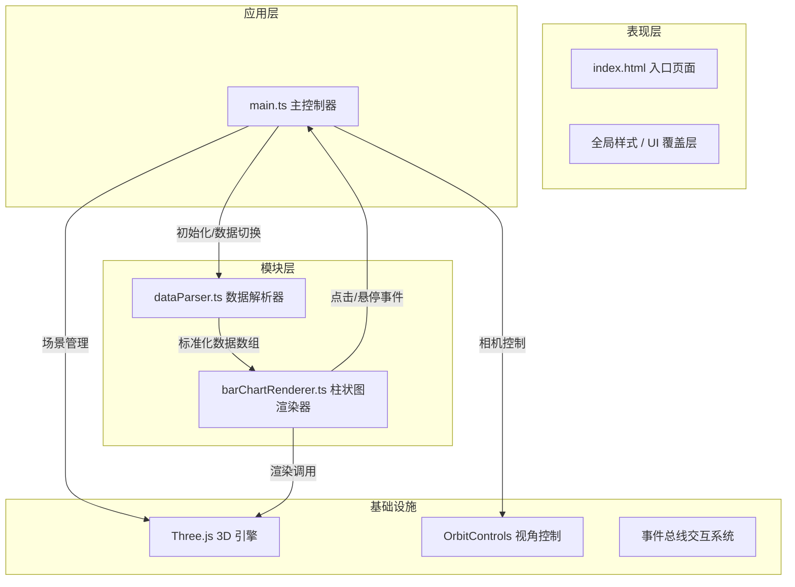

## 1. 架构设计



## 2. 技术说明

- **前端框架**：原生 TypeScript + Three.js（无 React 组件渲染，保留 @vitejs/plugin-react 以备扩展）
- **构建工具**：Vite 5.x
- **3D 引擎**：three@^0.160.0
- **交互控制**：OrbitControls（three 内置）
- **语言**：TypeScript 5.x（严格模式，ES2020）
- **包管理器**：npm

## 3. 文件结构

```
.
├── package.json
├── vite.config.js
├── tsconfig.json
├── index.html
└── src/
    ├── main.ts              # 主入口：场景/相机/渲染器初始化，协调数据流与事件
    ├── dataParser.ts        # 数据解析模块：JSON → 标准化数组
    └── barChartRenderer.ts  # 柱状图渲染模块：3D 柱体创建、颜色映射、交互
```

## 4. 核心模块定义

### 4.1 数据类型定义

```typescript
interface DataItem {
  name: string;   // 地区名称
  value: number;  // 数值
}

interface RendererOptions {
  barWidth: number;
  barDepth: number;
  minHeight: number;
  maxHeight: number;
  colorStart: string;  // #2ECC71
  colorEnd: string;    // #E74C3C
}
```

### 4.2 dataParser 模块

- 职责：从内嵌 JSON 数据解析，输出标准化 DataItem[]
- 内置两组预设数据集（年度经济数据 / 人口密度数据）
- 数据流向：解析后传递给 BarChartRenderer

### 4.3 barChartRenderer 模块

- 职责：接收 DataItem[]，在 Three.js 场景中创建 3D 柱状图
- 功能：
  - 动态高度映射（100-1000 → 20-200 单位）
  - 渐变色映射（#2ECC71 → #E74C3C）
  - 顶面/侧面不同透明度（0.9 / 0.6）
  - 鼠标悬停膨胀动画（0.3s，1.15x）
  - 白色闪烁效果（0.1s）
  - Sprite 数值标签（48px 字体）
  - 双击持续高亮（金色边框 #F1C40F，线宽 2px）
  - 数据切换碎裂动画（四面体四散，0.6s）
- 数据流向：通过事件总线将点击交互返回给 main.ts

### 4.4 main.ts 模块

- 职责：
  - 初始化场景、相机、渲染器
  - 集成 OrbitControls
  - 深空蓝渐变背景
  - 环形底座 + 旋转刻度线
  - 协调数据加载与渲染流程
  - 管理交互事件（悬停、双击、数据切换）
  - 响应式适配（窗口大小 <768px 自动调整）
  - 相机飞行动画（0.8s ease-in-out）

## 5. 性能优化策略

- **几何复用**：同类柱体共享 BufferGeometry，减少 draw call
- **材质池**：预计算渐变色材质，避免运行时重复创建
- **射线检测优化**：仅对柱体进行 raycast，排除底座和标签
- **帧率控制**：requestAnimationFrame 循环，保持 60 FPS
- **内存管理**：数据切换时及时 dispose 旧几何体与材质

## 6. 事件总线设计

使用简单的发布订阅模式：

```typescript
type EventType = 'bar:hover' | 'bar:click' | 'bar:doubleClick' | 'data:changed';

interface EventBus {
  on(event: EventType, callback: (data: any) => void): void;
  off(event: EventType, callback: (data: any) => void): void;
  emit(event: EventType, data: any): void;
}
```
