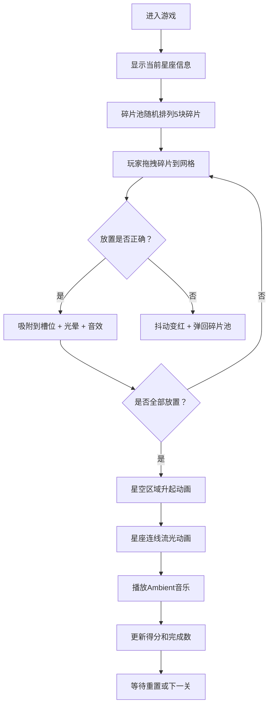

## 1. 产品概述

星尘拓印者是一款沉浸式星座拼图游戏，玩家扮演虚拟天文台观测员，通过拖拽拼接星尘碎片还原被遗忘的星座图谱，触发绚丽的星空动画。

- 核心玩法：拖拽六边形碎片到正确的网格槽位，完成星座图案还原
- 目标用户：喜欢天文、拼图类休闲游戏的玩家
- 产品价值：寓教于乐，在游戏中学习星座知识，体验唯美的星空视觉效果

## 2. 核心功能

### 2.1 功能模块

1. **游戏主界面**：观测台工作台、碎片池、网格区域、星空展示区
2. **拖拽拼图系统**：碎片拖拽、吸附定位、正确性校验
3. **视觉反馈系统**：放置动画、错误抖动、光晕效果
4. **星空动画系统**：星座连线流光、星空升起过渡
5. **音频系统**：放置音效、错误音效、Ambient背景音乐
6. **进度系统**：碎片进度追踪、得分统计、星座完成计数
7. **游戏控制**：重置功能、星座切换

### 2.2 页面详情

| 页面名称 | 模块名称 | 功能描述 |
|-----------|-------------|---------------------|
| 游戏主页面 | 顶部UI条 | 显示得分、完成星座数、重置按钮 |
| 游戏主页面 | 工作台区域 | 900x600px 观测台，带网格纹理 |
| 游戏主页面 | 星座信息 | 当前星座名称、碎片进度（0/5） |
| 游戏主页面 | 碎片池 | 左侧随机排列5块六边形碎片 |
| 游戏主页面 | 网格区域 | 中央虚线描绘星座轮廓槽位 |
| 游戏主页面 | 星空展示区 | 完成后升起，显示星座连线动画 |

## 3. 核心流程

## 4. 用户界面设计

### 4.1 设计风格

- **主色调**：深空蓝渐变（#0B0C10 → #1F2833），工作台深灰（#161B22），碎片池半透明黑（#0D1117）
- **星座主题色**：天龙座 #6C63FF，天鹅座 #FF6584
- **强调色**：金色连线 #FFD700，错误提示 #FF4444，白色槽位 #FFFFFF（0.6透明度）
- **字体**：选择富有科幻感的无衬线字体，标题使用独特的显示字体
- **布局**：工作台居中，碎片池居左，顶部UI条悬浮
- **视觉效果**：网格纹理、柔和光晕、流光动画、平滑过渡

### 4.2 页面设计概述

| 页面名称 | 模块名称 | UI 元素 |
|-----------|-------------|-------------|
| 游戏主页面 | 顶部UI条 | 高60px，背景#0D1117（0.9透明度），左侧得分和完成数，右侧圆角重置按钮 |
| 游戏主页面 | 工作台 | 900x600px，#161B22背景，圆角12px，微弱网格纹理 |
| 游戏主页面 | 碎片池 | 宽300px，#0D1117半透明背景，六边形碎片直径80px |
| 游戏主页面 | 网格槽位 | 虚线描绘星座轮廓，放置后变实线白色 |
| 游戏主页面 | 星空区域 | 900x600px纯黑背景，2秒升起动画，金色流光连线 |
| 游戏主页面 | 碎片拖拽 | 跟随鼠标放大到85px，增加阴影，0.3秒ease-out吸附 |

### 4.3 响应性

- 桌面端优先设计，固定尺寸工作台区域
- 支持窗口缩放，保持游戏区域居中显示
- 拖拽操作针对鼠标优化

### 4.4 动画细节

- 碎片放置：0.3秒 ease-out 吸附动画
- 放置正确：0.5秒光晕透明度从0.8衰减到0
- 放置错误：0.2秒抖动，0.3秒红色后恢复
- 星空升起：2秒 ease-out Y轴从0到-600px
- 星座连线：每条线0.5秒，透明度0→0.9，流光效果
- 按钮hover：0.2秒背景色过渡
