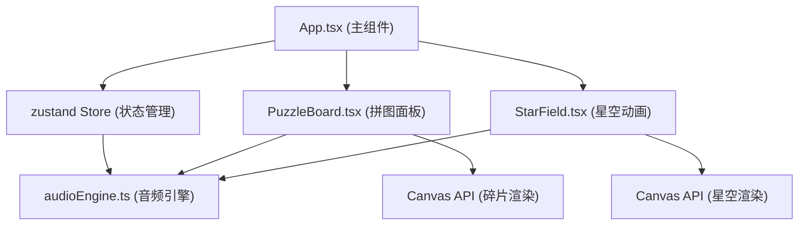

## 1. 架构设计



## 2. 技术描述

- **前端框架**：React 18 + TypeScript
- **构建工具**：Vite 5 + @vitejs/plugin-react
- **状态管理**：Zustand
- **图形渲染**：Canvas API（高性能动画渲染）
- **音频系统**：Web Audio API（程序生成音效和音乐）
- **样式方案**：CSS Modules / 内联样式（动画性能优先）
- **性能目标**：60FPS 流畅动画，无卡顿拖拽体验

## 3. 目录结构

```
├── package.json
├── vite.config.js
├── tsconfig.json
├── index.html
└── src/
    ├── App.tsx              # 主组件，游戏状态管理
    ├── PuzzleBoard.tsx      # 拼图面板，拖拽逻辑
    ├── StarField.tsx        # 星空动画组件
    ├── audioEngine.ts       # Web Audio API 封装
    └── store.ts             # Zustand 状态管理
```

## 4. 状态管理设计

### Zustand Store 定义

```typescript
interface GameState {
  // 当前星座
  currentConstellation: Constellation;
  // 已放置的碎片
  placedFragments: Fragment[];
  // 碎片池
  fragmentPool: Fragment[];
  // 得分
  score: number;
  // 完成的星座数
  completedCount: number;
  // 是否完成当前星座
  isCompleted: boolean;
  // 拖拽状态
  draggingFragment: Fragment | null;
  // 动画状态
  animationState: 'idle' | 'rising' | 'animating';
  
  // Actions
  placeFragment: (fragmentId: string, slotId: string) => void;
  resetGame: () => void;
  startStarAnimation: () => void;
  setDragging: (fragment: Fragment | null) => void;
}
```

### 数据模型

```typescript
interface Constellation {
  id: string;
  name: string;
  color: string;
  slots: Slot[];
  connections: Connection[];
}

interface Slot {
  id: string;
  x: number;
  y: number;
  fragmentId: string;
}

interface Fragment {
  id: string;
  color: string;
  isPlaced: boolean;
  targetSlotId: string;
}

interface Connection {
  from: string;
  to: string;
}
```

## 5. 核心组件职责

### App.tsx
- 组装顶层 UI（顶部导航栏、工作区域、星空区域）
- 管理游戏整体状态和生命周期
- 处理星座完成事件，触发星空动画
- 渲染顶部 UI 条（得分、完成数、重置按钮）

### PuzzleBoard.tsx
- 渲染碎片池（左侧）和网格区域（中央）
- 处理鼠标拖拽事件（mousedown/mousemove/mouseup）
- 实现碎片吸附逻辑（计算最近槽位）
- 管理放置动画（ease-out、光晕、抖动）
- 验证放置正确性，触发音效
- 维护槽位显示状态（虚线/实线）

### StarField.tsx
- 渲染黑色星空背景和随机星星
- 实现升起动画（CSS transform + transition）
- 绘制星座连线流光效果（Canvas 动画）
- 控制连线动画时序（每条0.5秒）

### audioEngine.ts
- 单例模式封装 Web Audio API
- `playPlaceSound()`: 440Hz 正弦波，0.2秒
- `playErrorSound()`: 低频锯齿波，0.3秒
- `startAmbientMusic()`: C大调和弦序列，每2秒一个和弦
- `stopAmbientMusic()`: 停止背景音乐

## 6. 性能优化策略

1. **Canvas 分层渲染**：静态背景层 + 动态碎片层，减少重绘区域
2. **requestAnimationFrame**：所有动画统一由 RAF 驱动，保证 60FPS
3. **事件委托**：拖拽事件在父容器监听，避免频繁绑定解绑
4. **状态最小化**：Zustand 只存储必要状态，避免不必要的重渲染
5. **CSS will-change**：对频繁变换的元素提前声明，提升合成性能
6. **对象池**：Canvas 绘制时复用路径对象，减少 GC 压力
