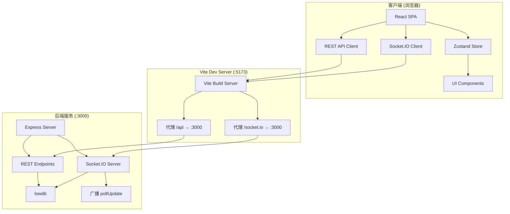
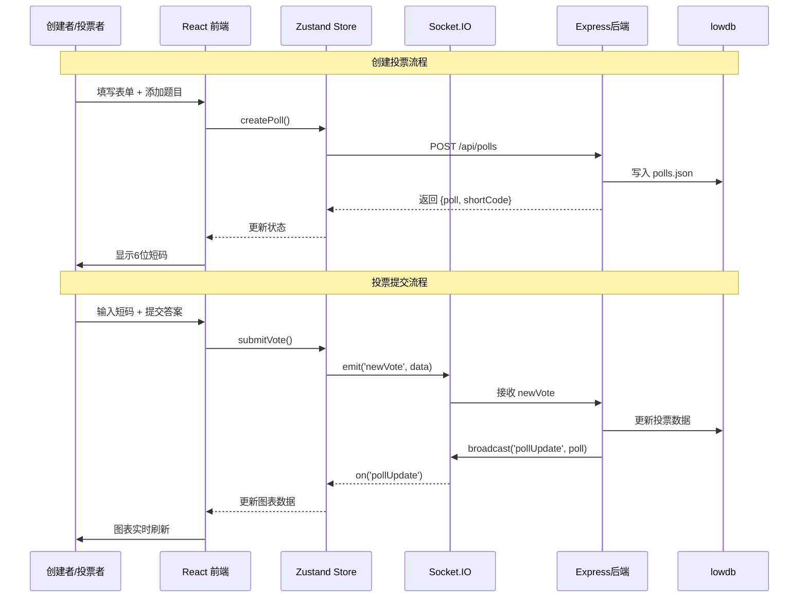

# QuickVote - 技术架构文档

## 1. 技术栈选型

### 1.1 前端技术栈

| 技术 | 版本 | 用途 |
|------|------|------|
| **React** | ^18 | UI框架，组件化开发 |
| **TypeScript** | ^5 | 类型安全，减少运行时错误 |
| **Vite** | ^5 | 构建工具，极速开发体验 |
| **Ant Design** | ^5 | Material Design风格UI组件库 |
| **@ant-design/icons** | ^5 | 图标库 |
| **Recharts** | ^2 | 数据可视化图表库（基于React） |
| **Zustand** | ^4 | 轻量级状态管理 |
| **socket.io-client** | ^4 | WebSocket客户端，实时通信 |
| **React Router** | ^6 | 路由管理（SPA多页面） |

### 1.2 后端技术栈

| 技术 | 版本 | 用途 |
|------|------|------|
| **Express.js** | ^4 | RESTful API服务器 |
| **Socket.IO** | ^4 | WebSocket服务端，实时广播 |
| **lowdb** | ^6 | 轻量级JSON文件数据库 |
| **uuid** | ^9 | 唯一ID生成器 |
| **cors** | ^2 | 跨域资源共享中间件 |

### 1.3 构建与开发工具

| 工具 | 用途 |
|------|------|
| @vitejs/plugin-react | Vite React支持插件 |
| tsconfig.json | TypeScript编译配置（严格模式） |
| vite.config.js | Vite构建配置 + 代理设置 |

---

## 2. 系统架构设计

### 2.1 整体架构图



### 2.2 核心数据流



---

## 3. 项目目录结构

```
auto14/
├── .trae/
│   └── documents/
│       ├── PRD.md              # 产品需求文档
│       └── ARCHITECTURE.md     # 技术架构文档（本文件）
├── src/
│   ├── main.tsx                # React入口，挂载App + Provider
│   ├── App.tsx                 # 根组件，路由切换
│   ├── pollStore.ts            # Zustand状态仓库
│   ├── styles/
│   │   └── global.css          # 全局样式（Material Design）
│   ├── types/
│   │   └── index.ts            # TypeScript类型定义
│   └── components/
│       ├── Sidebar.tsx         # 侧边栏/底部导航组件
│       ├── Dashboard.tsx       # 仪表盘卡片网格
│       ├── PollDetail.tsx      # 投票详情（左右分栏）
│       ├── PollForm.tsx        # 创建/编辑投票表单
│       ├── VotePage.tsx        # 投票者填写页面
│       ├── ChartPanel.tsx      # 图表渲染面板
│       └── ThankYou.tsx        # 提交成功感谢页
├── package.json                # 依赖 + 启动脚本
├── vite.config.js              # Vite配置 + 代理
├── tsconfig.json               # TypeScript严格模式配置
├── index.html                  # HTML入口
├── server.js                   # Express + Socket.IO后端
└── polls.json                  # lowdb数据文件（自动创建）
```

---

## 4. 数据模型设计

### 4.1 核心接口定义

```typescript
// 题型枚举
enum QuestionType {
  SINGLE = 'single',       // 单选题
  MULTIPLE = 'multiple',   // 多选题
  RATING = 'rating'        // 评分题
}

// 题目接口
interface Question {
  id: string;                    // uuid
  type: QuestionType;
  title: string;
  options?: string[];            // 单选/多选的选项
  order: number;                 // 排序序号
}

// 投票记录
interface VoteSubmission {
  id: string;                    // uuid
  timestamp: number;             // 提交时间戳
  answers: Record<string, string | string[] | number>;
}

// 投票/问卷主体
interface Poll {
  id: string;                    // uuid
  shortCode: string;             // 6位短码
  title: string;
  description?: string;
  questions: Question[];
  submissions: VoteSubmission[];
  createdAt: number;             // 创建时间戳
  closedAt?: number;             // 关闭时间
  isActive: boolean;             // 是否进行中
}

// Store状态
interface PollStore {
  polls: Poll[];
  currentPoll: Poll | null;
  wsConnected: boolean;
  lastUpdateTime: number | null;
  highlightQuestionId: string | null;  // 新加题目高亮
  
  // Actions
  fetchPolls: () => Promise<void>;
  createPoll: (data: CreatePollDto) => Promise<Poll>;
  setCurrentPoll: (id: string | null) => void;
  submitVote: (data: SubmitVoteDto) => Promise<void>;
  closePoll: (id: string) => Promise<void>;
  addQuestion: (pollId: string, question: Omit<Question, 'id' | 'order'>) => Promise<void>;
  exportCSV: (pollId: string) => void;
}
```

### 4.2 lowdb 数据结构

```json
{
  "polls": [
    {
      "id": "uuid-here",
      "shortCode": "A3F2B1",
      "title": "团队满意度调查",
      "questions": [...],
      "submissions": [...],
      "createdAt": 1718600000000,
      "isActive": true
    }
  ]
}
```

---

## 5. API 接口设计

### 5.1 RESTful API

| 方法 | 路径 | 描述 | 请求体 | 响应 |
|------|------|------|--------|------|
| `GET` | `/api/polls` | 获取所有投票列表 | - | `Poll[]` |
| `GET` | `/api/polls/:id` | 获取单个投票详情 | - | `Poll` |
| `GET` | `/api/polls/code/:shortCode` | 通过短码获取投票 | - | `Poll` |
| `POST` | `/api/polls` | 创建新投票 | `{title, questions}` | `{poll, shortCode}` |
| `PATCH` | `/api/polls/:id/close` | 关闭投票 | - | `Poll` |
| `POST` | `/api/polls/:id/questions` | 动态添加题目 | `Question` | `Poll` |
| `GET` | `/api/polls/:id/export` | 导出CSV | - | `text/csv` 下载 |
| `GET` | `/api/results/:pollId` | 获取投票结果统计 | - | `ResultData` |

### 5.2 WebSocket 事件

| 事件名 | 方向 | 数据 | 描述 |
|--------|------|------|------|
| `newVote` | Client → Server | `{pollId, submission}` | 客户端提交投票 |
| `pollUpdate` | Server → Clients | `Poll` | 服务端广播投票更新 |
| `questionAdded` | Server → Clients | `{pollId, question}` | 广播新题目添加 |
| `connect` | Client ↔ Server | - | 连接建立 |
| `disconnect` | Client ↔ Server | - | 连接断开 |

---

## 6. 状态管理设计 (Zustand Store)

### 6.1 Store 模块职责

```typescript
// pollStore.ts 核心结构
export const usePollStore = create<PollStore>((set, get) => ({
  polls: [],
  currentPoll: null,
  wsConnected: false,
  lastUpdateTime: null,
  highlightQuestionId: null,
  
  // 初始化 WebSocket 监听
  _initWebSocket: () => { ... },
  
  fetchPolls: async () => {
    const res = await fetch('/api/polls');
    const polls = await res.json();
    set({ polls });
  },
  
  createPoll: async (data) => {
    const res = await fetch('/api/polls', {
      method: 'POST',
      headers: { 'Content-Type': 'application/json' },
      body: JSON.stringify(data)
    });
    const { poll } = await res.json();
    set(state => ({ polls: [...state.polls, poll], currentPoll: poll }));
    return poll;
  },
  
  submitVote: async (data) => {
    // 通过 WebSocket 发送，实时性更好
    const socket = get()._socket;
    socket?.emit('newVote', data);
  },
  
  closePoll: async (id) => {
    await fetch(`/api/polls/${id}/close`, { method: 'PATCH' });
    get().fetchPolls();
  },
  
  addQuestion: async (pollId, question) => {
    const res = await fetch(`/api/polls/${pollId}/questions`, {
      method: 'POST',
      body: JSON.stringify(question)
    });
    const updated = await res.json();
    // 设置高亮ID触发脉冲动画
    set({ highlightQuestionId: question.id });
    setTimeout(() => set({ highlightQuestionId: null }), 3000);
  },
  
  exportCSV: (pollId) => {
    window.location.href = `/api/polls/${pollId}/export`;
  },
}));
```

---

## 7. 关键性能优化方案

### 7.1 仪表盘 100 卡片 < 2秒

| 优化手段 | 说明 |
|---------|------|
| 虚拟列表 | 视口外卡片不渲染（使用 `react-window`） |
| React.memo | 卡片组件 memo 化，避免无关重渲染 |
| 懒加载 | 列表使用 `useDeferredValue` 延迟非关键更新 |
| 骨架屏 | 数据加载中显示 Skeleton 占位 |
| 分页查询 | 后端支持 `?limit=100&offset=0` 参数 |

### 7.2 图表重渲染 < 300ms

| 优化手段 | 说明 |
|---------|------|
| 数据 memo | 使用 `useMemo` 缓存图表数据转换结果 |
| 增量更新 | WebSocket推送后仅更新变更字段，不替换整个对象 |
| Recharts isAnimationActive | 实时刷新时关闭重绘动画，仅初次渲染有动画 |
| requestAnimationFrame | 高频推送合并帧，避免超过刷新率重绘 |
| shouldComponentUpdate | ChartPanel 浅比较 props，无变化直接跳过 |

### 7.3 WebSocket 优化

```typescript
// 防抖合并策略
const pendingUpdates = new Map<string, Poll>();
let flushTimer: number | null = null;

socket.on('pollUpdate', (poll) => {
  pendingUpdates.set(poll.id, poll);
  if (flushTimer) return;
  flushTimer = window.setTimeout(() => {
    pendingUpdates.forEach(p => store.mergePoll(p));
    pendingUpdates.clear();
    flushTimer = null;
  }, 50); // 50ms 合并窗口
});
```

---

## 8. UI 组件映射关系

### 8.1 路由表

| URL 路径 | 组件 | 说明 |
|---------|------|------|
| `/` | `Dashboard` | 仪表盘首页 |
| `/create` | `PollForm` | 创建新投票 |
| `/poll/:id` | `PollDetail` | 投票详情+结果 |
| `/vote/:shortCode` | `VotePage` | 投票者填写页面 |
| `/thanks` | `ThankYou` | 提交成功页 |

### 8.2 组件层级树

```
App.tsx
├── Layout (Sidebar + Content)
│   ├── Sidebar.tsx
│   │   ├── Logo
│   │   ├── PollListItem[] (拖拽支持)
│   │   └── [mobile] BottomNav
│   └── Outlet (路由子组件)
│       ├── Dashboard.tsx
│       │   └── PollCard[] (网格布局)
│       ├── PollForm.tsx
│       │   ├── QuestionCard[] (拖拽排序)
│       │   ├── AddQuestionButton
│       │   └── ShortCodeBadge (创建后显示)
│       ├── PollDetail.tsx
│       │   ├── QuestionList (左侧)
│       │   ├── ChartPanel (右侧)
│       │   │   ├── SingleBarChart
│       │   │   ├── MultipleStackedChart
│       │   │   └── RatingLineChart
│       │   ├── ExportButton
│       │   └── ClosePollButton
│       └── VotePage.tsx
│           ├── ProgressBar
│           ├── QuestionRenderer
│           └── SubmitButton
└── ThankYou.tsx
    ├── RotatingCheckIcon
    └── ThankYouText
```

---

## 9. 样式与动效实现

### 9.1 CSS 变量 (Material Design 主题)

```css
:root {
  --color-primary: #3F51B5;
  --color-primary-dark: #303F9F;
  --color-primary-light: #7986CB;
  --color-accent: #FF4081;
  --color-success: #4CAF50;
  --color-warning: #FF9800;
  --color-danger: #F44336;
  --color-info: #2196F3;
  --color-bg: #F5F5F5;
  --color-surface: #FFFFFF;
  --color-border: #E0E0E0;
  --color-text-primary: rgba(0,0,0,0.87);
  --color-text-secondary: rgba(0,0,0,0.6);
  --color-text-hint: rgba(0,0,0,0.38);
  --shadow-hover: 0 6px 12px rgba(0,0,0,0.1);
  --shadow-card: 0 2px 4px rgba(0,0,0,0.08);
  --radius-card: 8px;
  --radius-button: 20px;
  --radius-badge: 6px;
  --sidebar-width: 240px;
  --topbar-height: 56px;
}
```

### 9.2 关键动效 keyframes

```css
@keyframes fadeIn {
  from { opacity: 0; transform: translateY(8px); }
  to   { opacity: 1; transform: translateY(0); }
}

@keyframes pulse {
  0%, 100% { box-shadow: 0 0 0 0 rgba(63,81,181,0.4); }
  50%      { box-shadow: 0 0 0 12px rgba(63,81,181,0); }
}

@keyframes checkSpin {
  0%   { transform: rotate(-180deg) scale(0); opacity: 0; }
  50%  { transform: rotate(0deg) scale(1.2); }
  100% { transform: rotate(360deg) scale(1); opacity: 1; }
}

.anim-fade  { animation: fadeIn .5s ease both; }
.anim-pulse { animation: pulse 1s ease 3; }
.anim-check { animation: checkSpin .5s cubic-bezier(.65,0,.45,1) both; }
```

---

## 10. 部署与启动

### 10.1 依赖安装
```bash
npm install
```

### 10.2 开发模式（双终端）
```bash
# 终端1：启动 Vite 前端开发服务器 (:5173)
npm run dev

# 终端2：启动 Express 后端 API + WebSocket (:3000)
node server.js
```

### 10.3 浏览器访问
```
http://localhost:5173
```

---

## 11. 安全考量

| 风险点 | 缓解措施 |
|--------|---------|
| XSS 攻击 | React 默认转义，使用 `DOMPurify` 处理富文本 |
| CSRF | 短码 + CORS 白名单，Socket.IO origin 验证 |
| 刷票 | IP 限制 + 浏览器指纹 + 频控中间件 |
| 数据泄露 | 短码随机熵足够（36^6 ≈ 21.7亿） |
| 过期数据 | 后端定时任务（每小时检查，删除30天前记录） |
