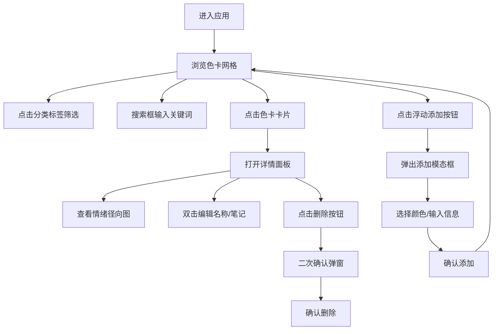

## 1. 产品概述

复古色卡收藏与情绪标签可视化应用，为平面设计爱好者提供动态数字方式收藏和回顾各类复古色卡，将传统色相环与情绪记忆结合，每种颜色配文字或缩略图记录灵感。

- 目标用户：平面设计爱好者、色彩研究者、复古文化收藏者
- 核心价值：以视觉化、可交互的方式管理色彩灵感，融合情绪标签与径向色环展示

## 2. 核心功能

### 2.1 功能模块

1. **色卡添加模块**：圆形浮动按钮 + 模态框，支持颜色选择器、名称输入、文本笔记、缩略图上传
2. **分类浏览与搜索**：标签栏过滤 + 搜索框防抖搜索
3. **色卡网格展示**：响应式网格布局，卡片展示色块、名称、日期、情绪标签
4. **详情面板**：大尺寸色块、情绪标签径向图、文字笔记、缩略图、编辑与删除
5. **情绪标签径向图**：Canvas绘制径向饼图，展示情绪关键词分布

### 2.2 页面详情

| 页面名称 | 模块名称 | 功能描述 |
|---------|---------|---------|
| 主页面 | 浮动添加按钮 | 圆形60px红色按钮，悬停变深，点击弹出添加模态框 |
| 主页面 | 分类标签栏 | 顶部深色导航栏，胶囊式标签，点击筛选色卡 |
| 主页面 | 搜索框 | 右侧圆角搜索框，0.3s防抖触发过滤 |
| 主页面 | 色卡网格 | 响应式网格展示色卡卡片，悬停上移阴影加深 |
| 详情面板 | 色块展示 | 大尺寸色块显示当前色卡颜色 |
| 详情面板 | 情绪径向图 | Canvas绘制情绪标签分布饼图，交互高亮 |
| 详情面板 | 笔记与缩略图 | 文字笔记展示与缩略图区域 |
| 详情面板 | 编辑与删除 | 双击内联编辑，删除二次确认 |

## 3. 核心流程

用户进入应用 → 浏览色卡网格 → 点击分类标签筛选 → 搜索关键词过滤 → 点击色卡查看详情 → 查看情绪分布 → 编辑标签/笔记 → 新增色卡 → 填写颜色/名称/笔记 → 确认添加

## 4. 用户界面设计

### 4.1 设计风格

- **主色调**：米白色 #FFFDF7（复古纸质档案感）
- **导航色**：深靛蓝 #2C3E50
- **点缀色**：暖橙色 #E67E22
- **危险色**：红色系 #E74C3C / #C0392B / #A93226
- **边框色**：浅棕 #E8D5B7
- **字体**：选择具有复古质感的衬线+无衬线组合
- **按钮**：圆角胶囊/圆角矩形，过渡动画0.2s-0.3s ease
- **卡片**：米色背景+浅棕边框+圆角，悬停上移阴影
- **图标**：线性简约风格

### 4.2 页面设计概述

| 页面名称 | 模块名称 | UI元素 |
|---------|---------|-------|
| 主页面 | 顶部标签栏 | 深色背景#2C3E50，高48px，胶囊标签#34495E，选中#E67E22 |
| 主页面 | 色卡网格 | minmax(200px,1fr)网格，卡片200x280px，米色背景圆角12px |
| 主页面 | 浮动按钮 | 直径60px圆形#C0392B，悬停#A93226，0.3s过渡 |
| 添加模态框 | 模态容器 | 420x480px，圆角16px，毛玻璃backdrop-filter:blur(4px) |
| 添加模态框 | 颜色选择器 | 直径240px圆形色相盘+明度滑条，中心预览块 |
| 详情面板 | 径向图 | 直径180px Canvas饼图，扇区悬停放大1.05倍 |
| 删除确认 | 确认弹窗 | 300x160px，圆角12px，毛玻璃背景 |

### 4.3 响应式

- 桌面端：多列网格布局 + 侧边详情面板
- 移动端：单列网格 + 详情面板堆叠展示
- 触摸优化：增大可点击区域，适配手势操作

### 4.4 动画效果

- 模态框：淡入缩放 0.3s ease-out，scale(0.85)→scale(1)
- 卡片：stagger动画，延迟0.05s依次出现，translateY(20px)→0，opacity 0→1
- 按钮/交互元素：0.2s ease过渡
- 卡片悬停：上移4px + 阴影加深 0.3s ease
- 径向图扇区：悬停放大1.05倍

