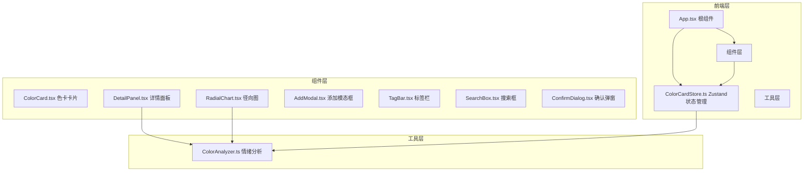

## 1. 架构设计



## 2. 技术描述

- **前端框架**：React 18 + TypeScript
- **构建工具**：Vite + @vitejs/plugin-react
- **状态管理**：Zustand
- **样式方案**：原生CSS + CSS Modules（内联样式处理动态值）
- **Canvas绑定**：原生Canvas 2D API绘制径向图
- **动画**：CSS transitions/animations + requestAnimationFrame

## 3. 数据模型

### 3.1 色卡数据结构

```typescript
interface ColorCard {
  id: string;
  name: string;
  hex: string;
  notes: string;
  thumbnail?: string;
  tags: string[];
  createdAt: string;
}
```

### 3.2 情绪标签统计

```typescript
interface TagFrequency {
  tag: string;
  count: number;
  color: string;
}
```

### 3.3 Store状态

```typescript
interface ColorCardState {
  cards: ColorCard[];
  currentCard: ColorCard | null;
  selectedTags: string[];
  filterKeyword: string;
  addCard: (card: Omit<ColorCard, 'id' | 'createdAt'>) => void;
  removeCard: (id: string) => void;
  setCurrentCard: (card: ColorCard | null) => void;
  setFilter: (keyword: string) => void;
  toggleTag: (tag: string) => void;
  updateCard: (id: string, updates: Partial<ColorCard>) => void;
}
```

## 4. 文件结构

```
src/
├── App.tsx                  # 根组件，布局与路由
├── store/
│   └── ColorCardStore.ts    # Zustand状态管理
├── components/
│   ├── ColorCard.tsx        # 色卡卡片组件
│   ├── DetailPanel.tsx      # 详情面板组件
│   ├── RadialChart.tsx      # 径向饼图Canvas组件
│   ├── AddModal.tsx         # 添加色卡模态框
│   ├── TagBar.tsx           # 分类标签栏
│   ├── SearchBox.tsx        # 搜索框组件
│   ├── ColorPicker.tsx      # 颜色选择器（色相盘）
│   └── ConfirmDialog.tsx    # 二次确认弹窗
├── utils/
│   └── ColorAnalyzer.ts     # 情绪标签聚合分析
├── types/
│   └── index.ts             # 类型定义
└── styles/
    └── global.css           # 全局样式
```

## 5. 调用关系与数据流向

1. **App.tsx** → 从 **ColorCardStore** 获取 cards、currentCard、selectedTags、filterKeyword
2. **App.tsx** → 传递数据给 **TagBar**、**SearchBox**、**ColorCard** 网格、**DetailPanel**
3. **ColorCard.tsx** → 点击调用 store.setCurrentCard → 更新 currentCard
4. **DetailPanel.tsx** → 接收 currentCard → 调用 ColorAnalyzer → 渲染 RadialChart
5. **AddModal.tsx** → 表单提交 → 调用 store.addCard → 更新 cards 列表
6. **TagBar.tsx** → 点击标签 → 调用 store.toggleTag → 更新 selectedTags
7. **SearchBox.tsx** → 输入防抖 → 调用 store.setFilter → 更新 filterKeyword
8. **ColorAnalyzer.ts** → 接收 cards 数组 → 统计 tagFrequency → 返回给 RadialChart/DetailPanel

## 6. 性能优化策略

- 色卡网格使用 CSS contain 和 will-change 优化滚动性能
- 搜索防抖 300ms 减少不必要的过滤计算
- Canvas 径向图使用 requestAnimationFrame 控制重绘
- 列表使用稳定 key 避免不必要的重渲染
- 模态框使用 transform GPU 加速动画
