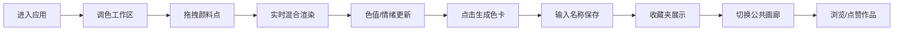

## 1. 产品概述

幻彩调色盘是一款沉浸式色彩创作Web应用，用户通过拖拽虚拟颜料液滴在圆形调色区实时混合生成独特渐变色，探索色彩美学。产品面向设计师、艺术爱好者与普通用户，旨在提供轻松治愈的色彩创作体验，激发视觉灵感与情绪共鸣。

核心价值：将抽象的色彩混合过程具象化、游戏化，赋予每张色卡情感标签与诗意表达，通过公共画廊建立色彩创作者社区。

## 2. 核心功能

### 2.1 用户角色
| 角色 | 注册方式 | 核心权限 |
|------|----------|----------|
| 普通用户 | 无需注册，使用本地存储 | 调色创作、保存色卡到收藏夹、浏览公共画廊、每日点赞一次 |

### 2.2 功能模块
1. **调色工作区**：圆形画布、五边形颜料点分布、拖拽交互、实时径向渐变混合、Canvas高性能渲染
2. **色卡信息面板**：HEX/RGB色值显示、情绪标签映射、生成色卡按钮、保存对话框
3. **收藏夹视图**：网格布局展示已保存色卡、卡片悬浮动效、色卡详情展示（名称/情绪/短诗）
4. **公共画廊视图**：全部作品展示、按点赞数排序、心形点赞按钮（每日限一次）
5. **诗歌生成器**：内置词库、根据主色情感自动生成短诗

### 2.3 页面详情
| 页面名称 | 模块名称 | 功能描述 |
|----------|----------|----------|
| 主应用页面 | 导航切换栏 | Tab切换「调色」「收藏夹」「公共画廊」三视图，淡入淡出过渡 |
| 调色视图 | 圆形调色工作区 | 直径600px圆形画布，5种颜料五边形分布，拖拽实时混合 |
| 调色视图 | 右侧信息面板 | 宽280px，显示HEX/RGB/情绪标签，底部固定生成色卡按钮 |
| 调色视图 | 保存色卡对话框 | 宽400px，输入名称（≤12字）、缩略图预览、确认保存 |
| 收藏夹视图 | 色卡网格 | 每张220×300px卡片，渐变色块+名称+情绪+短诗，悬浮上浮6px |
| 公共画廊视图 | 作品列表 | 按点赞数降序排列，心形点赞按钮，每日限赞一次 |

## 3. 核心流程

用户进入应用 → 查看圆形调色区与颜料点 → 拖拽颜料产生实时混合 → 观察右侧色值与情绪变化 → 点击「生成色卡」→ 输入名称确认保存 → 切换至收藏夹查看作品 → 进入公共画廊浏览他人作品并点赞

## 4. 用户界面设计

### 4.1 设计风格
- **主色调**：暖白色 #FDF8F5（背景）、米白 #FFFEFC（画布）、低饱和米灰 #F4F1EA（面板）
- **辅色调**：浅青点缀、深靛蓝 #2C3E50（按钮）、虚线边框 #D4C9B8
- **颜料色**：红 #E74C3C、黄 #F1C40F、蓝 #3498DB、紫 #9B59B6、绿 #2ECC71
- **按钮风格**：圆角32px胶囊形，hover过渡0.25s ease
- **字体**：优雅衬线体（标题）+ 现代无衬线体（正文），14px正文字重300
- **布局风格**：卡片式布局，轻微圆角（12-16px），细腻阴影（0 8px 24px rgba(0,0,0,0.08)）
- **纹理细节**：背景叠加0.03透明度噪点纹理，营造复古纸张质感
- **动效**：视图切换0.3s opacity淡入淡出，卡片悬浮translateY(-6px) + 阴影加深，点赞按钮0.2s缩放

### 4.2 页面设计概述
| 页面名称 | 模块名称 | UI元素 |
|----------|----------|--------|
| 调色视图 | 背景层 | #FDF8F5 + 噪点叠加（透明度0.03），朦胧米白纹理 |
| 调色视图 | 圆形画布 | 直径600px，2px虚线边框 #D4C9B8，背景 #FFFEFC |
| 调色视图 | 颜料点 | 直径30px圆形，五边形顶点分布，cursor: grab |
| 调色视图 | 信息面板 | 宽280px，背景 #F4F1EA，内边距统一间距系统 |
| 调色视图 | 生成按钮 | 圆角32px，#2C3E50→#34495E hover过渡0.25s |
| 调色视图 | 保存对话框 | 宽400px，圆角16px，#FFFEF9，阴影柔和 |
| 收藏夹/画廊 | 色卡卡片 | 220×300px，圆角12px，上160px渐变色块，hover上浮6px |
| 收藏夹/画廊 | 点赞按钮 | 心形图标，未点赞#CCC / 已点赞#E74C3C，0.2s缩放 |

### 4.3 响应式设计
- 桌面优先（Desktop-first）设计
- 断点 < 768px：
  - 调色区圆形直径改为 100vw - 40px，全宽展示
  - 右侧信息面板折叠至调色区下方，宽度自适应
  - 色卡网格列数自适应减少
  - 触摸手势优化（增大触控热区）

### 4.4 性能要求
- 调色混合Canvas重绘帧率 ≥ 50fps
- 色卡网格 > 100张时首屏加载 ≤ 1秒
- 使用requestAnimationFrame + 离屏渲染优化
- 列表虚拟滚动（如需要）
