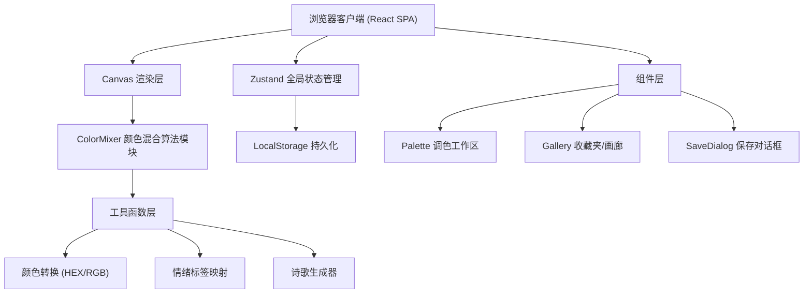
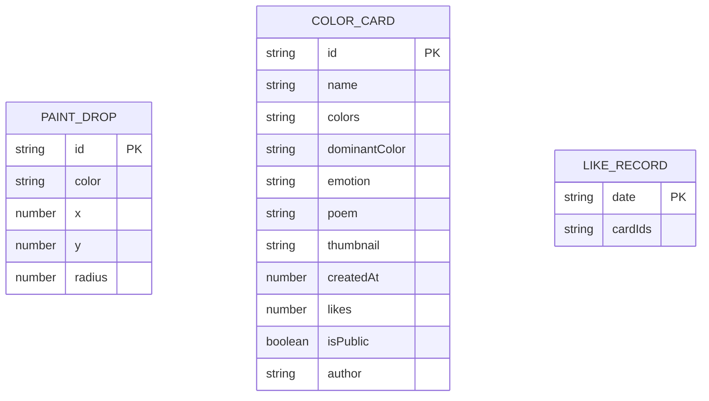

## 1. 架构设计



## 2. 技术描述

- **前端框架**：React 18 + TypeScript 5
- **构建工具**：Vite 5 + @vitejs/plugin-react
- **状态管理**：Zustand 4（轻量级store，支持persist中间件持久化到LocalStorage）
- **样式方案**：原生CSS（不使用Tailwind，保持精细的复古美学控制），通过CSS变量管理设计令牌
- **渲染方案**：HTML5 Canvas 2D API（颜料混合渲染）+ React DOM（UI界面）
- **后端服务**：无后端，使用Mock数据模拟公共画廊
- **数据持久化**：LocalStorage（收藏夹色卡、点赞记录）

## 3. 路由与视图定义

| 视图 | 触发方式 | 说明 |
|------|----------|------|
| 调色视图 | 默认/点击「调色」Tab | 主工作区，圆形调色盘+颜料拖拽+信息面板 |
| 收藏夹视图 | 点击「收藏夹」Tab | 网格展示用户已保存的色卡 |
| 公共画廊视图 | 点击「公共画廊」Tab | 展示Mock的公共作品，按点赞排序 |

不使用react-router，通过组件内部状态切换三视图，实现0.3s淡入淡出过渡。

## 4. API定义（Mock数据层）

```typescript
interface ColorCard {
  id: string;
  name: string;
  colors: string[];
  dominantColor: string;
  emotion: string;
  poem: string;
  thumbnail: string;
  createdAt: number;
  likes: number;
  isPublic: boolean;
  author?: string;
}

interface PaintDrop {
  id: string;
  color: string;
  x: number;
  y: number;
  radius: number;
}

interface AppState {
  currentView: 'palette' | 'favorites' | 'gallery';
  paintDrops: PaintDrop[];
  savedCards: ColorCard[];
  galleryCards: ColorCard[];
  likedToday: Record<string, string[]>;
  activeColor: {
    hex: string;
    rgb: { r: number; g: number; b: number };
    emotion: string;
  };
  showSaveDialog: boolean;
}
```

## 5. 数据模型与存储

### 5.1 数据模型ER图



### 5.2 LocalStorage Schema

| Key | 数据结构 | 说明 |
|-----|----------|------|
| `palette_favorites` | `ColorCard[]` | 用户收藏夹色卡列表 |
| `palette_likes` | `Record<string, string[]>` | 每日点赞记录，key为日期YYYY-MM-DD |
| `palette_drops` | `PaintDrop[]` | 颜料位置（可选持久化） |

## 6. 核心模块职责

| 模块 | 文件路径 | 职责 |
|------|----------|------|
| ColorMixer | `src/utils/ColorMixer.ts` | 独立算法模块，输入颜料位置颜色，输出像素级混合色值与主色检测 |
| 颜色工具 | `src/utils/colorUtils.ts` | HEX↔RGB转换、情绪映射、诗歌生成词库 |
| Zustand Store | `src/store/useStore.ts` | 全局状态：颜料位置、色卡列表、当前视图、点赞记录 |
| Palette组件 | `src/components/Palette.tsx` | Canvas渲染、拖拽事件绑定、实时混合计算调度 |
| Gallery组件 | `src/components/Gallery.tsx` | 网格布局、卡片渲染、点赞处理、排序逻辑 |
| App根组件 | `src/App.tsx` | 视图切换、全局布局、SaveDialog整合 |

## 7. 性能优化策略

1. **Canvas渲染优化**：使用requestAnimationFrame调度，每帧仅重绘变化区域，颜料点半径控制混合扩散范围
2. **ColorMixer算法**：预先计算采样点网格（非逐像素），使用双线性插值平滑，羽化区域使用高斯衰减函数
3. **列表性能**：色卡网格超过50张时考虑CSS contain: layout paint，首屏仅渲染可视区域
4. **状态更新**：Zustand使用selector避免不必要重渲染，拖拽位置更新使用ref直接读写而非setState
5. **缩略图**：Canvas快照压缩为DataURL，限制分辨率100×100px，避免大图存储
